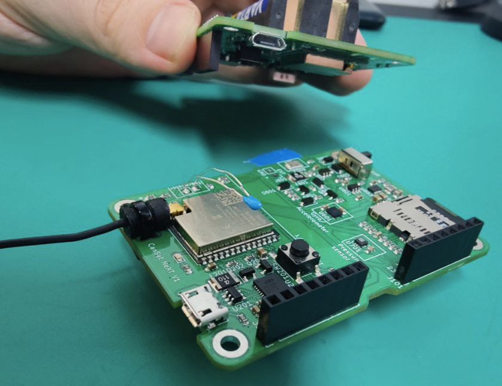

In this first project, I'll be using CanSat NeXT board to add a real-time remote reading feature to the the electricity meter in my house. Most modern electricity meters have a pulse LED, which blinks once per measured watt-hour of electricity. My idea is to use the light-dependant resistor (LDR) on the CanSat NeXT board to monitor this LED, and use that to calculate the real time power consumption of my home.

<!-- truncate -->

The basic concept is that the resistance of the LDR will change depending on the intensity of light hitting it, and by mounting the board so that most variability comes from the indicator LED itself, we could try to detect when it is on and when it is off based on the LDR voltage.

The indicator LED is mounted on a panel inside the electricity meter, which makes reading it with a CanSat NeXT shaped board slightly difficult. To mitigate this, I designed a support structure with a baffel built in, which can be used to mount the board to the electricity meter, so that only the light from the indicator LED can reach the LDR. 


The structure is designed so that the distance to the board is 12 mm, which is the same distance as with the breakout boards. This way, I can use the basic standoffs to directly mount the baffle to the PCB. The baffle will be mounted to the electricity meter with the help of some two-sided tape. Keep it simple, stupid!

After some 3d-printing, this is what it looks like. Some light was able to leak through the PCB from the side, so I added a piece of electric tape to mitigate that.


## Reading with LDR

Next, I'd like to test if we are able to see the pulses in the data. We can use the plotting tool in Arduino IDE to see the pulses, however there is a small problem - it can only display 50 values on the x-axis, which means that if we want to see even 5 seconds of data, we need to print only once every 100 ms. This means that the pulses might happen between the readings. So, instead of just reading the data every 100 ms and printing the value, I actually read the data as fast as the MCU can read the analog input - roughly 10 times per millisecond. Finally, it keeps track of the lowest value (highest brightness) and prints this lowest value every 100 milliseconds.


```Cpp title="Brightness plotter"
#include "CanSatNeXT.h"

unsigned long previousMillis = 0; // Stores last time the LDR value was updated
const long interval = 100;        // Interval at which to print the LDR value (100ms)
int minValue = 4095;              // Initialize with the highest possible value from analogRead

void setup() {
  Serial.begin(115200);
  CanSatInit();
}

void loop() {
  unsigned long currentMillis = millis();

  int value = analogRead(LDR);
  // Update minValue if the current reading is lower than the previous minValue
  if (value < minValue) {
    minValue = value;
  }

  // Check if 100ms have passed
  if (currentMillis - previousMillis >= interval) {
    // Save the last time the LDR value was updated
    previousMillis = currentMillis;

    // Print the lowest LDR value
    Serial.print("LDR:");
    Serial.println(minValue);

    // Reset minValue for the next interval
    minValue = 4095;
  }
}
```

With this code, it seems to detect all fast light changes very reliably. Time to mount it to the meter!


Looking at the data, it looks like we can read the pulses quite clearly. They are very visible in the data in dark conditions.


## Pulse detection

Next, we need write some software to automatically detect the pulses from the data stream. Some relatively simple solution would probably work when the device is in a dark box and the LED is bright, however a solution based on fixed limits or other really simple method might struggle if there is some light leaking through the PCB, or if it is used in different conditions. It would be more fun to create some kind of self-adjusting mechanism for detecting the pulses. 

I decided to go with a statistical method. I keep track of 1000 last readings, and calculate the **median** and **standard deviation** from these. Also, I maintain a running average of the current value in order to reduce noise in the readings. Then, I can make the decision that we are currently seeing a pulse based on the deviation from the mean. I am currently using quite sensitive 3 * **standard deviation**, where as a more would probably make it more robust while being less sensitive. This current setting seems to be enough so that we can actually detect the on-board LED of another CanSat from 5 cm away in a brightly lit room, without a baffle or anything else to help us.



Now that it is based on statistics rather than a fixed value, the detection works nicely even if a change the lights in the room or move the blinking LED closer or further away.  To make the detection more challenging, the LED was on only 10 ms, then off 200 ms.

Additionally, we need some additional statistical tracking to calculate the average power consumption. I decided to keep track of the latest delay between two detected pulses, which corresponds to one Wh of consumed energy. Additionally, I'll keep track of an average over the last minute, as well as average over one hour. These statistics can then be transmitted to a receiver outside the electricity meter.

## First Tests

Now that we are able to detect pulses in various lighting conditions, we can send the data from the CanSat NeXT in the electricity meter to another ESP32. We can use the sendData functionality of the CanSat NeXT library. I'll send three values - the latest reading, minute average and hour average. These are tranmsitted once every pulse, or once a second if the pulses are more frequent than that. The data is sent as binary - timeBetweenLastPulses is just the time between pulses as uint milliseconds, while the average values are floating point values. These are written to a buffer as binary, and then transmitted with command sendData.

```Cpp title="Sending measurements"
char msg[12];
// Copy the memory content of each variable into the packedData array
memcpy(msg, &timeBetweenLastPulses, sizeof(timeBetweenLastPulses));
memcpy(msg + 4, &minuteAverage, sizeof(minuteAverage)); // Offset by 4 bytes for the next position
memcpy(msg + 8, &hourAverage, sizeof(hourAverage)); // Offset by 8 bytes for the last position

sendData(msg, sizeof(msg));
```

And this worked beautifully! I am now able to read the pulse from outside the electricity meter... unless I walk too far. The signal is rather weak, which makes sense, as the electricity meter is inside a metal box - it's almost a faraday cage. We'll need to get an antenna outside the box to send the data any meaningful distances.

## New Antenna

I decided to build an antenna out of coaxial cable, a bit like with the standard monopole antenna with CanSat NeXT. However, usually the PCB of the CanSat NeXT itself acts as part of the antenna, but now I need a longer cable. Therefore, I made a simple dipole antenna, where both the shield and inner conductor have length of quarter the wavelength.


It would be much better to create a structure where the dipole elements are perpendicular to the coaxial cable, however for us, it is sufficient to simply bend the shield backwards, and add some heat shrink tubing for weather protection.

The connector on CanSat NeXT is U.FL type, which I did not have at hand. I however had SMA connectors, so I added one of them at the other end of the coaxial cable, and used an SMA-U.FL adapter to connect the antenna to CanSat NeXT. Again, not quite ideal, but the adapters actually don't affect the signal all that much.


## Final Setup

All remaining now is to add old phone charger for USB power so that we don't need to keep changing batteries, and the device is ready to be installed!


The antenna cable is routed through a pass-through in the meter box, and then placed between the spruce branches so that it stays in pretty free-space for good signal strength.

With this updated setup, I'm able to now read the output in my lab from the ESP32. I'm still not sure how I'll use the data, perhaps by making a nice online GUI so that I can monitor it. Let's see!

Finally, here are the codes that the MCU's are running. First, the groundstation:

```Cpp title="Receiver code"
#include "CanSatNeXT.h"

uint8_t groundsationMAC[] = {0xA8, 0x42, 0xE3, 0xDA, 0x86, 0x48};

void setup() {
  Serial.begin(115200);
  GroundStationInit(groundsationMAC);
}

void loop() {
}

void onBinaryDataReceived(const uint8_t *data, int len) {
  // Ensure the length of the data received is at least 12 bytes 
  // (4 bytes for uint32_t and 4 bytes for each float)
  if (len < 12) {
    // Handle the error case where data is not of expected length
    Serial.println("Received data is of incorrect length.");
  }

  uint32_t timeBetweenLastPulses;
  float minuteAverage;
  float hourAverage;

  // Copy the binary data into the variables
  memcpy(&timeBetweenLastPulses, data, sizeof(timeBetweenLastPulses));
  memcpy(&minuteAverage, data + 4, sizeof(minuteAverage)); // Offset by 4 bytes for the float
  memcpy(&hourAverage, data + 8, sizeof(hourAverage)); // Offset by 8 bytes for the second float

  // Print the extracted values
  Serial.print("Time between last pulses: ");
  Serial.println(timeBetweenLastPulses);

  Serial.print("Average time between pulses in the last minute: ");
  Serial.println(minuteAverage, 2); // '2' specifies the number of decimal places

  Serial.print("Average time between pulses in the last hour: ");
  Serial.println(hourAverage, 2); // '2' specifies the number of decimal places
  
}
```

And then the program used to read the pulse and transmit the data.

```Cpp title="Electricity Meter"
#include "CanSatNeXT.h"
#include <algorithm>


// Buffer size for the measurements
const int bufferSize = 1000;
// Running average size
const int runningAvgSize = 10;
// Array to store last 1000 measurements
int measurements[bufferSize];
// Array for running average
int runningAvgBuffer[runningAvgSize];
// Variables to keep track of indices
int bufferIndex = 0;
int runningAvgIndex = 0;
// Variables for statistics
float median = 0;
float runningAverage = 0;
float standardDeviation = 0;
bool pulseActive = false;

unsigned long lastPulseTime = 0;  // To store the timestamp of the last pulse
unsigned long secondLastPulseTime = 0;  // To store the timestamp of the second last pulse


const int minutePulseCount = 60;  // Assuming at most 60 pulses can be detected in a minute for averaging
const int hourPulseCount = 3600;  // Assuming at most 3600 pulses can be detected in an hour for averaging
unsigned long pulseIntervalsMinute[minutePulseCount];  // Circular buffer for last minute
unsigned long pulseIntervalsHour[hourPulseCount];  // Circular buffer for last hour
int minuteIndex = 0, hourIndex = 0;  // Indices for circular buffers
unsigned long lastPrintTime = 0;  // Last time statistics were printed
bool readingUpdated = false;

uint8_t groundsationMAC[] = {0xA8, 0x42, 0xE3, 0xDA, 0x86, 0x48};

void setup() {
  Serial.begin(115200);
  CanSatInit(groundsationMAC);
  pinMode(LED, OUTPUT); // Initialize the LED pin as an output
  digitalWrite(LED, LOW);
  // Initialize the measurements array
  for (int i = 0; i < bufferSize; i++) {
    measurements[i] = 0;
  }
  // Initialize the running average buffer
  for (int i = 0; i < runningAvgSize; i++) {
    runningAvgBuffer[i] = 0;
  }
}


void loop() {
  unsigned long currentTime = millis();  // Current time in milliseconds
  int value = analogRead(LDR);

  // Update the running average buffer
  runningAvgBuffer[runningAvgIndex] = value;
  runningAvgIndex = (runningAvgIndex + 1) % runningAvgSize;

  // Calculate the running average
  updateRunningAverage();

  // Update the measurements buffer
  measurements[bufferIndex] = value;
  bufferIndex = (bufferIndex + 1) % bufferSize;

  // Periodically update median and standard deviation
  if (bufferIndex == 0) {
    updateMedianAndStdDev();
  }

  if (!pulseActive && runningAverage < median - 3 * standardDeviation) {
    pulseActive = true;
    readingUpdated = true;
    digitalWrite(LED, HIGH); 

    // Time tracking
    secondLastPulseTime = lastPulseTime;
    lastPulseTime = currentTime;
    unsigned long interval = lastPulseTime - secondLastPulseTime;

    // Update minute and hour circular buffers
    pulseIntervalsMinute[minuteIndex++] = interval;
    if (minuteIndex >= minutePulseCount) minuteIndex = 0;  // Reset index if it exceeds the buffer size

    pulseIntervalsHour[hourIndex++] = interval;
    if (hourIndex >= hourPulseCount) hourIndex = 0;  // Reset index if it exceeds the buffer size

  } else if (pulseActive && runningAverage > median - standardDeviation) {
    pulseActive = false;
    digitalWrite(LED, LOW);  // Turn off the LED
  }

  // Print time statistics every second
  if (readingUpdated && currentTime - lastPrintTime >= 1000) {
    readingUpdated = false;
    lastPrintTime = currentTime;

    // Calculate and print statistics
    uint timeBetweenLastPulses = lastPulseTime - secondLastPulseTime;
    Serial.print("Time between last pulses: ");
    Serial.println(timeBetweenLastPulses);
    float minuteAverage = calculateAverageTime(pulseIntervalsMinute, minutePulseCount);
    float hourAverage = calculateAverageTime(pulseIntervalsHour, hourPulseCount);
    // Calculate and print averages for the last minute and last hour
    // You need to implement calculateAverageTime which calculates the average of intervals in a buffer
    Serial.print("Average time between pulses in the last minute: ");
    Serial.println(minuteAverage);

    Serial.print("Average time between pulses in the last hour: ");
    Serial.println(hourAverage);
    
    //Let's transmit the data to GS as binary data.
    // 4 bytes for uint32_t and 4 bytes for each float
    char msg[12];
    // Copy the memory content of each variable into the packedData array
    memcpy(msg, &timeBetweenLastPulses, sizeof(timeBetweenLastPulses));
    memcpy(msg + 4, &minuteAverage, sizeof(minuteAverage)); // Offset by 4 bytes for the next position
    memcpy(msg + 8, &hourAverage, sizeof(hourAverage)); // Offset by 8 bytes for the last position
    
    sendData(msg, sizeof(msg));

  }
}

void updateRunningAverage() {
  long sum = 0;
  for (int i = 0; i < runningAvgSize; i++) {
    sum += runningAvgBuffer[i];
  }
  runningAverage = sum / (float)runningAvgSize;
}

void updateMedianAndStdDev() {
  
  std::nth_element(measurements, measurements + 499, measurements + 1000); // For the 500th element
  std::nth_element(measurements, measurements + 500, measurements + 1000); // For the 501st element

  // Calculate the median for an even number of elements
  median = (measurements[499] + measurements[500]) / 2.0;


  // Calculate standard deviation
  float sum = 0;
  for (int i = 0; i < bufferSize; i++) {
    sum += pow(measurements[i] - median, 2);
  }
  standardDeviation = sqrt(sum / bufferSize);
}

float calculateAverageTime(unsigned long intervals[], int count) {
  unsigned long sum = 0;
  int nonzero_count = 0;
  for (int i = 0; i < count; i++) {
    if (intervals[i] != 0) {
      nonzero_count++;
      sum += intervals[i];
    }
  }
  if (nonzero_count == 0) return 0.0; // Avoid division by zero
  return (float)sum / nonzero_count; // Cast to float to ensure floating-point division
}


```