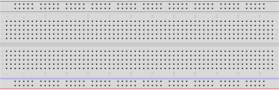

*Plant cultivation system built with CanSat NeXT*

Did you know that you can grow plants hydroponically all year long?

With this project, you can start your own journey of sustainable farming.
The project is easy to set up and provides you with basic knowledge to grow locally sourced products indoors.

The role of the CanSat NeXT kit is to operate as a controller unit and provide an easy hardware and software platform to integrate the sensors and functionalities to.

### Project specification

The goal is to build an indoor plant cultivation system that:

* provides optimal light conditions around the clock
* monitors plant health by measuring growth medium temperature and humidity
* optimizes energy consumption (extra)


*The selected LEDs are designed to produce blue and green light, chosen specifically for cultivation applications. Blue light enhances leaf growth and is crucial in the seeding phase and root development, while green light enhances light penetration into the deeper layers of the plant's leaves, which is beneficial in dense canopies. The LED technology featured in the project is engineered to replace traditional white LEDs in dual-channel (white + red) horticultural lighting systems. The result is a more energy-efficient solution when the goal of the system is to increase growth rather than blooming.*

### What you will need

|  Part name       |      Image     |             Description        |   Amount   |    Used in |
|------------------|----------------|--------------------------------|------------|------------|
|  CanSat NeXT     |          | The "brain" of the system      | 1 | Controller |
|  Breadboard     |          | Protoboard to construct the project on      | 1 | Controller |
|  Debug LED(s)   |          | Any     | 1-3 | Illuminating unit |
|  NMOS transistor   |          | Ie. SI2318DS     | 1-4 | Illuminating unit |
|  18V DC Power supply     |          | Providing power to the LEDs      | 1 | Power unit |
|  Jumper wires    |          | For prototyping      | As many as you need | All  |
|  Resistors   |          | 1k, 10k, and 100 Ohm     | 10 | All |
|  Botanical LEDs   |          | Ie. JB2835BWT     | 12 | Illuminating unit |
|  LDO regulator   |          | Ie. LDL1117S33R     | 1 | Power unit |
|  Capacitor   |          |      | 4 | Power unit |
|  Polyfuse   |          | Ie. 30R400UMR     | 1 | Power unit |
|  TVS diode   |          | Ie. ESDALC12-1T2     | 1 | Power unit |

### Modules of the device

The device consists of five modules: illuminating unit with botanical LEDs, a sensor suite, a browser-based user interface, a power module, and controller unit (CanSat NeXT).

|  Feature  |       Description     |
|-----------|-----------------------|
|  LED illuminating unit  |  Built from botanical LEDs that are specifically designed for plant growth
|  Humidity sensor, temperature sensor     |  A sensor suite designed for monitoring growth conditions
|  Remote UI              |  A browser-based remote interface designed for monitoring sensor data and controlling illuminating units. The remote interface can be accessed with any network-capable device, such as a smartphone, tablet or PC, as long as the user is logged in to the same WiFi network as the CanSat device.
| LDR sensor |  A sensor which, based on the sensor data it provides, allows the product to be remotely controlled via a user interface to turn it on or off |
| CanSat NeXT |  Acts as a controller and provides a server to the browser UI |

## Electrical interface


*Illuminating unit prototype with CanSat NeXT.*

The design of the illuminating unit consists of 1-4 LED strips connected in parallel. See below for the circuit diagrams.

*Individual LED string in the illuminating unit showing NMOS transistor, a 10K pull-down resistor, and LEDs connected in serial, controlled by a DIN/CTRL pin connected to CanSat NeXT GPIO.* 

When choosing the NMOS transistor (in this case, SI2318DS), remember to go with one that can withstand the Drain-Source voltage (>18 V) coming from the power unit.

Please also bear in mind that the botanical LEDs have internal resistance and a max forward current. In case you are using some other LED model besides JB2835BWT, remember to calculate the resistor value between ground and the LED string (in this case, 5 Ohms).


*The illuminating unit in the parallel circuit context. **DIN** is connected to a I/O pin controlled by CanSat NeXT.* 

## Software

The software will have the following components:

* Web server for remote control
* GPIO control for the NMOS transistor
* Reading local time from NTP server, and
* taking environmental measurements from the plant to monitor growth.

While still setting up the hardware, writing and testing some software components in parallel can feel like a good idea.

Setting up the server for remote control is straightforward. To see your local IP address, flash CanSat NeXT with the following code:

```cpp
// Load Wi-Fi library
#include <WiFi.h>

// Replace with your network credentials
const char* ssid = "REPLACE_WITH_YOUR_SSID";
const char* password = "REPLACE_WITH_YOUR_PASSWORD";

// Set web server port number to 80
WiFiServer server(80);

void setup() {
  Serial.begin(115200);
  // Connect to Wi-Fi network with SSID and password
  Serial.print("Connecting to ");
  Serial.println(ssid);
  WiFi.begin(ssid, password);
  while (WiFi.status() != WL_CONNECTED) {
    delay(500);
    Serial.print(".");
  }
  // Print local IP address and start web server
  Serial.println("");
  Serial.println("WiFi connected.");
  Serial.println("IP address: ");
  Serial.println(WiFi.localIP());
}
```

In my case, this was `192.168.1.7`. This is the address where you will be navigating to when controlling the system remotely.

## Setting up the web server


*Test circuit for validating the web server, adapted from [https://randomnerdtutorials.com/esp32-web-server-arduino-ide/](https://randomnerdtutorials.com/esp32-web-server-arduino-ide/). Later on we will migrate to using GPIO26 as the NMOS control pin.*

To test the web server for remote control, build a test circuit and flash your CanSat NeXT with this server code (from [https://randomnerdtutorials.com/esp32-web-server-arduino-ide/](https://randomnerdtutorials.com/esp32-web-server-arduino-ide/)):

```cpp
/*********
  Rui Santos
  Complete project details at http://randomnerdtutorials.com  
*********/

// Load Wi-Fi library
#include <WiFi.h>

// Replace with your network credentials
const char* ssid = "REPLACE_WITH_YOUR_SSID";
const char* password = "REPLACE_WITH_YOUR_PASSWORD";

// Set web server port number to 80
WiFiServer server(80);

// Variable to store the HTTP request
String header;

// Auxiliar variables to store the current output state
String output26State = "off";
String output27State = "off";

// Assign output variables to GPIO pins
const int output26 = 26;
const int output27 = 27;

// Current time
unsigned long currentTime = millis();
// Previous time
unsigned long previousTime = 0; 
// Define timeout time in milliseconds (example: 2000ms = 2s)
const long timeoutTime = 2000;

void setup() {
  Serial.begin(115200);
  // Initialize the output variables as outputs
  pinMode(output26, OUTPUT);
  pinMode(output27, OUTPUT);
  // Set outputs to LOW
  digitalWrite(output26, LOW);
  digitalWrite(output27, LOW);

  // Connect to Wi-Fi network with SSID and password
  Serial.print("Connecting to ");
  Serial.println(ssid);
  WiFi.begin(ssid, password);
  while (WiFi.status() != WL_CONNECTED) {
    delay(500);
    Serial.print(".");
  }
  // Print local IP address and start web server
  Serial.println("");
  Serial.println("WiFi connected.");
  Serial.println("IP address: ");
  Serial.println(WiFi.localIP());
  server.begin();
}

void loop(){
  WiFiClient client = server.available();   // Listen for incoming clients

  if (client) {                             // If a new client connects,
    currentTime = millis();
    previousTime = currentTime;
    Serial.println("New Client.");          // print a message out in the serial port
    String currentLine = "";                // make a String to hold incoming data from the client
    while (client.connected() && currentTime - previousTime <= timeoutTime) {  // loop while the client's connected
      currentTime = millis();
      if (client.available()) {             // if there's bytes to read from the client,
        char c = client.read();             // read a byte, then
        Serial.write(c);                    // print it out the serial monitor
        header += c;
        if (c == '\n') {                    // if the byte is a newline character
          // if the current line is blank, you got two newline characters in a row.
          // that's the end of the client HTTP request, so send a response:
          if (currentLine.length() == 0) {
            // HTTP headers always start with a response code (e.g. HTTP/1.1 200 OK)
            // and a content-type so the client knows what's coming, then a blank line:
            client.println("HTTP/1.1 200 OK");
            client.println("Content-type:text/html");
            client.println("Connection: close");
            client.println();
            
            // turns the GPIOs on and off
            if (header.indexOf("GET /26/on") >= 0) {
              Serial.println("GPIO 26 on");
              output26State = "on";
              digitalWrite(output26, HIGH);
            } else if (header.indexOf("GET /26/off") >= 0) {
              Serial.println("GPIO 26 off");
              output26State = "off";
              digitalWrite(output26, LOW);
            } else if (header.indexOf("GET /27/on") >= 0) {
              Serial.println("GPIO 27 on");
              output27State = "on";
              digitalWrite(output27, HIGH);
            } else if (header.indexOf("GET /27/off") >= 0) {
              Serial.println("GPIO 27 off");
              output27State = "off";
              digitalWrite(output27, LOW);
            }
            
            // Display the HTML web page
            client.println("<!DOCTYPE html><html>");
            client.println("<head><meta name=\"viewport\" content=\"width=device-width, initial-scale=1\">");
            client.println("<link rel=\"icon\" href=\"data:,\">");
            // CSS to style the on/off buttons 
            // Feel free to change the background-color and font-size attributes to fit your preferences
            client.println("<style>html { font-family: Helvetica; display: inline-block; margin: 0px auto; text-align: center;}");
            client.println(".button { background-color: #4CAF50; border: none; color: white; padding: 16px 40px;");
            client.println("text-decoration: none; font-size: 30px; margin: 2px; cursor: pointer;}");
            client.println(".button2 {background-color: #555555;}</style></head>");
            
            // Web Page Heading
            client.println("<body><h1>ESP32 Web Server</h1>");
            
            // Display current state, and ON/OFF buttons for GPIO 26  
            client.println("<p>GPIO 26 - State " + output26State + "</p>");
            // If the output26State is off, it displays the ON button       
            if (output26State=="off") {
              client.println("<p><a href=\"/26/on\"><button class=\"button\">ON</button></a></p>");
            } else {
              client.println("<p><a href=\"/26/off\"><button class=\"button button2\">OFF</button></a></p>");
            } 
               
            // Display current state, and ON/OFF buttons for GPIO 27  
            client.println("<p>GPIO 27 - State " + output27State + "</p>");
            // If the output27State is off, it displays the ON button       
            if (output27State=="off") {
              client.println("<p><a href=\"/27/on\"><button class=\"button\">ON</button></a></p>");
            } else {
              client.println("<p><a href=\"/27/off\"><button class=\"button button2\">OFF</button></a></p>");
            }
            client.println("</body></html>");
            
            // The HTTP response ends with another blank line
            client.println();
            // Break out of the while loop
            break;
          } else { // if you got a newline, then clear currentLine
            currentLine = "";
          }
        } else if (c != '\r') {  // if you got anything else but a carriage return character,
          currentLine += c;      // add it to the end of the currentLine
        }
      }
    }
    // Clear the header variable
    header = "";
    // Close the connection
    client.stop();
    Serial.println("Client disconnected.");
    Serial.println("");
  }
}
```

Upload the sketch on your CanSat NeXT device and test if you can access the web address on another device by typing the value of `WiFi.localIP()` into the address bar. Remember to make sure that both CanSat NeXT and your reader device (phone, tablet, pc etc.) have to be uring the same WiFi network. After confirming the server functionality, test the circuit debug LEDs to see if your GPIO configuration is correct. Pretty intuitive, right?

## Next steps

In Part 2, we will do the following:

1. Update the web server code to run custom javascript for controlling the LED strings
2. Implement time reading from NTP server
3. Read environmental sensor measurements and print them to the remote UI with dynamic refresh
4. Build the custom power unit and integrate it all together.

Until next time! 👋