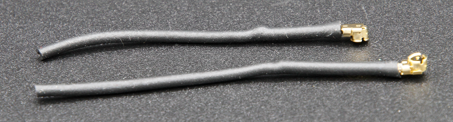

# Communication and Antennas

This article introduces the key concepts needed for wireless data transmission with CanSat NeXT. First, the communication system is discussed on a general level, next some different options are presented for antenna selection when using CanSat NeXT. Finally, the last part of article presents a simple tutorial for building a quarter-wave monopole antenna from the parts included in the kit.

## Getting Started

CanSat NeXT is almost ready to start wireless communication straight out of the box. Only thing that is needed is the proper software, and an antenna for both the transmitter and the receiver. For the first one, refer to the software materials on this page. For the latter one, this page includes instructions on how to select an external antenna, and to how construct a simple monopole antenna from the materials included with the CanSat NeXT.

While the board is quite resilient to such things thanks to software checks, you should never attempt to transmit anything from a radio without an antenna. Although unlikely due to the low powers involved with this system, the reflected radiowave can cause real harm to the electronics.

## CanSat NeXT Communication System

CanSat NeXT handles the wireless data transfer a bit differently to the older CanSat kits. Instead of a separate radio module, CanSat NeXT uses the MCU’s integrated WiFi-radio for the communication. The WiFi-radio is normally used to transfer data between an ESP32 and the internet, enable the use of ESP32 as a simple server, or even connect ESP32 to a bluetooth device, but with certain clever TCP-IP configuration tricks, we can enable direct peer-to-peer communication between ESP32 devices. The system is called ESP-NOW, and it is developed and maintained by EspressIf, who are the developers of ESP32 hardware. Furthermore, there are special low-rate communication schemes, which by increasing the energy-per-bit of the transmission, significantly increase the possible range of the wifi-radio over the usual few tens of meters. 

The data rate of ESP-NOW is significantly faster than what would be possible with the old radio. Even with simply decreasing the time between packets in the example code, CanSat NeXT is able to transmit ~20 full packets to the GS in a second. Theoretically the data rate can be up to 250 kbit/s in the long range mode, but this can be hard to achieve in the software. That being said, transmission of for example full pictures from a camera during the flight should be entirely feasible with correct software. 

Even with simple quarter-wavelength monopole antennas (a 31 mm piece of wire) at both ends, CanSat NeXT was able to send data to the ground station from 1.3 km away, at which point the line of sight was lost. When testing with a drone, the range was limited to roughly 1 km. It is possible that the drone interfered with the radio enough to somewhat limit the range. However, with a better antenna, the range could be increased even more. A small yagi antenna would have theoretically increased the operational range 10-fold.

There are a couple practical details that differ from the older radio communication system. First, the “pairing” of satellites to ground station receivers happens with Media Access Control (MAC) addresses, which are set in the code. The WiFi system is clever enough to handle the timing, collision and frequency issues behind the scenes. The user simply needs to ensure that the GS is listening to the MAC address the satellite is transmitting with.
Secondly, the frequency of the radio is different. The WiFi radio operates at 2.4 GHz band (center frequency is 2.445 GHz), which means that both the propagation characteristics and requirements for antenna design are different than before. The signal is somewhat more sensitive to rain, and line-of-sight issues, and might not be able to transmit in some cases where the old system would have worked. 

The wavelength of the radio signal is also different. Since

$$\lambda = \frac{c}{f} \approx \frac{3*10^8 \text{ m/s}}{2.445 * 10^9 \text {Hz}} = 0.12261 \text{ m,}$$

a quarter wavelength monopole antenna should have a length of 0.03065 m or 30.65 mm. This length is also marked on the CanSat NeXT PCB to make cutting of the cable a bit easier. The antenna should be cut precisely, but within ~0.5 mm is still fine.

A quarter wavelength antenna has sufficient RF performance for the CanSat competitions. That being said, it might be of interest to some users to get even better range. One possible place of improvement is in the length of the monopole antenna. In practice the quarter-wavelength resonance might not be exactly at the right frequency, since other parameters such as environment, surrounding metal elements or the portion of the wire still covered with grounded metal might affect the resonance a bit. The antenna could be tuned with the use of a vector network analyzer (VNA). I think I should do this at some point, and correct the materials accordingly. 

A more robust solution would be to use a different style of antenna. At 2.4 GHz, there are loads of fun antenna ideas on the internet. These include a helix antenna, yagi antenna, pringles antenna, and many others. Many of these, if well constructed, will outperform the simple monopole easily. Even just a dipole would be an improvement over a simple wire.

The connector used on most ESP32 modules is a Hirose U.FL connector. This is a good quality miniature RF connector, which provides good RF performance for weak signals. One problem with this connector however is that the cable is quite thin making it a bit impractical in some cases. It also leads to larger-than-desired RF losses if the cable is long, as it might be when using an external antenna. In these cases, a U.FL to SMA adapter cable could be used. I’ll look to see if we could provide these in our webshop. This would enable teams to use a more familiar SMA connector. That being said, it is completely possible to build good antennas with just using U.FL. 

Unlike SMA however, U.FL relies mechanically on snap-on retaining features to hold the connector in place. This is usually sufficient, however for extra safety it is a good idea to add a zip tie for extra security. The CanSat NeXT PCB has slots next to the antenna connector to accommodate a small zip tie. Ideally, a 3d-printed or otherwise constructed support sleeve would be added for the cable before the zip tie. A file for the 3d-printed support is available from the GitHub page.

## Antenna Options

An antenna is essentially a device that transforms unguided electromagnetic waves into guided ones, and vice versa. Due to the simple nature of the device, there are a multitude of options from which to select the antenna for your device. From a practical point of view, the antenna selection has a lot of freedom, and quite many things to consider. You need to consider at least

1. Operating frequency of the antenna (should include 2.45 GHz)
2. Bandwidth of the antenna (At very least 35 MHz)
3. Impedance of the antenna (50 ohms)
4. Connector (U.FL or you can use adapters)
5. Physical size (Does it fit to the can)
6. Cost
7. Manufacturing methods, if you are making the antenna yourself.
8. Polarization of the antenna.

Antenna selection can seem overwhelming, and it often is, however in this case it is made much easier by the fact that we are in fact using a Wi-Fi-radio - we can actually use almost any 2.4 GHz Wi-Fi antenna with the system. Most of them however are too large, and also they tend to use connectors called RP-SMA, rather than U.FL. However, with a suitable adapter they can be good choices to use with the groundstation. There are even directive antennas available, meaning that you can get extra gain to improve the radio link. 

Wi-Fi antennas are a solid choice, however they have one significant drawback - polarization. They are almost always linearly polarized, which means that the signal strength varies significantly depending on the orientation of the transmitter and the receiver. In worst cases, the antennas being perpendicular to each other might even see the signal fade out completely. Therefore, an alternative option is to use drone antennas, which tend to be circularly polarized. In practice this means that we have some constant polarization losses, but they are less dramatic. An alternative clever solution to get around the polarization problem is to use two receivers, with antennas mounted perpendicular to each other. This way at least one of them will always have a suitable orientation for receiving the signal.

Of course, a true maker will always want to make their own antenna. Some interesting constructions that are suitable for DIY-manufacturing include a helix-antenna, "pringles" antenna, yagi, dipole, or a monopole antenna. There are a lot of instructions online for building most of these. The last part of this article shows how to make your own monopole antenna, suitable for CanSat competitions, from the materials shipped with CanSat NeXT.

## Building a quarter-wave monopole antenna

This section of article describes how to build a resonably effective quarter-wave monopole antenna from the materials included in the kit. The antenna is called that since it only has one pole (compare to a dipole), and its length is quarter of the wavelength that we are transmitting.

In addition to the coaxial cable and piece of heat shrink tubing, you'll need some type of wire strippers and wire cutters. Almost any type will work. Additionally you will need a heat source for the heat shrink, such as a hot air gun, soldering iron or even a lighter.

First, begin by cutting the cable roughly in half.

Next, we will build the actual antenna. This part should be done as precisely as you can. Within 0.2 mm or so will work fine, but try to get it as close to the correct length as possible, as that will help with the performance.

A coaxial cable consists of four parts - a center conductor, dielectric, shield, and an outer jacket. Usually, these cables are used to transmit radio frequency signals between devices, so that the currents on the center conductor are balanced by those in the shield. However, by removing the shield conductor, the currents on the inner conductor will create an antenna. The length of this exposed area will determine the wavelenght or operating frequency of the antenna, and we now want it to match our operating frequency of 2.445 GHz, so we need remove the shield from length of 30.65 mm.

Carefully strip the outer jacket from the cable. Ideally, try to remove only the jacket and the shield from the desired length. However, cutting the insulator is not a catastrophe. It is usually easier to remove the outer jacket in parts, rather than all at once. Furthermore, it might be easier to first remove too much, and then cut the inner conductor to the right length, rather than try to get it exactly right on the first try.

The image below shows the stripped cables. Try to make it like the upper one, but the lower one will work as well - it just might be more sensitive to moisture. If there are dangling pieces of the shield left, carefully cut them off. Make sure that there are no possibility that the inner conductor and the shield are touching each other - even a single strand would render the antenna unusable.

The antenna is now totally functional at this point, however it may be sensitive to moisture. Therefore, we want to now add a new jacket to this, which is what the heat shrink tubing is for. Cut two pieces, slightly longer than the antenna you have made, and place it over the antenna and use a heat source to shrink it in place. Be careful not to burn the heat shrink tubing, especially if using something else than a hot air gun.

After this, the antennas are ready. On the groundstation side, the antenna is probably fine like this. On the other hand, while the connector is fairly secure, it is a good idea to support the connector somehow on the CanSat side. A very robust way is to use a 3d-printed support and some ziptie, however many other methods will work as well. Remember to also consider how the antenna will be placed inside the can. Ideally, it should be in a location where the transmission is not blocked by any metal parts.

### Antenna support

Finally, here is a step-file of the support shown in the image. You can import this into most CAD software, and modify it, or print it with a 3d-printer.

[Download step-file](./../../static/assets/3d-files/uFl-support.step)
