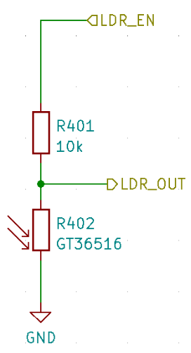
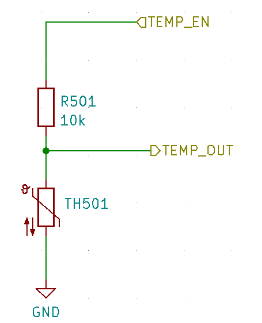

# On-Board Sensors

This article introduces the sensors integrated to the CanSat NeXT main board. The use of the sensors is covered in the software documentation, whereas this article provides more information about the sensors themselves.

There are three on-board sensors on the CanSat NeXT main board. These are the IMU LSM6DS3, pressure sensor LPS22HB and the LDR. Additionally, the board has a through-hole slot for adding an external thermistor. As the LPS22HB already has both pressure and temperature measuring capabilities, it theoretically suffices to fulfill the primary mission criteria of the CanSat competitions on its own. However, as it is measuring the internal junction temperature, or basically the temperature of the PCB on that spot, it is not a good atmospheric temperature measurement in most configurations. Additionally, the absolute measurement of the pressure sensor can be supported by the additional data from the IMU accelerometer. The LDR has been added first and foremost to help students learn the concepts regarding analog sensors as the response to stimuli is almost instant, whereas a thermistor takes time to heat up and cool down. That being said, it can also support the creative missions the student will come up with, just like the IMUs accelerometer and gyroscope. Furthermore, in addition to the on-board sensor, the CanSat NeXT encourages the use of additional sensors through the extension interface.

## Inertial Measurement Unit

The IMU, LSM6DS3 by STMicroelectronics is an SiP (system-in-package) style MEMS sensor device, integrating an accelerometer, gyroscope and the readout electronics into a small package. The sensor supports SPI and I2C serial interfaces, and also includes an internal temperature sensor. 

The LSM6DS3 has switchable acceleration measurement ranges of ±2/±4/±8/±16 G and angular rate measurement ranges of ±125/±250/±500/±1000/±2000 deg/s. The use of a higher range also decreases the resolution of the device.

In CanSat NeXT, the LSM6DS3 is used in I2C mode. The I2C address is 1101010b (0x6A), but the next version will add support for modifying the hardware to change the address to 1101011b (0x6B) if an advanced user has a need for using the original address for something else.

The measurement ranges will be set to maximum by default in the library in order to capture most data from the violent rocket launch. The data ranges are also modifiable by the user.

## Barometer

The pressure sensor LPS22HB by STMicroelectronics is another SiP MEMS device, designed for measurement of pressure from 260-1260 hPa. The range it reports data in is significantly larger, but the accuracy of measurements outside that range is questionable. The MEMS pressure sensors work by measuring piezoresistive changes in the sensor diaphragm. As temperature affects the resistance of the piezo element as well, it needs to be compensated. To enable this, the chip also has a relatively accurate junction-temperature sensor as well right next to the piezoresistive element. This temperature measurement can also be read from the sensor, but it has to be kept in mind that it is a measurement of the internal chip temperature, not of the surrounding air.

Similar to the IMU, the LPS22HB can also be communicated with using either SPI or I2C interface. In CanSat NeXT, it is connected to the same I2C interface as the IMU. The I2C address of the LPS22HB is 1011100b (0x5C), but we will add support to change it to 0x5D if desired.

## Analog to Digital Converter

This refers to the voltage measurement using the analogRead() command.

The 12 bit analog-to-digital converter (ADC) in ESP32 is notoriously nonlinear. This doesn’t matter for most applications, such as using it to detect temperature changes or changes in LDR resistance, however making absolute measurements of battery voltage or NTC resistance can be a bit tricky. One way around this is careful calibration, which would make for sufficiently accurate data for the temperature for example. However, the CanSat library also provides a calibrated correction function. The function implements a third order polynomial correction for the ADC, correlating the ADC reading with the actual voltage present on the ADC pin. The correction function is

$$V = -1.907217e \times 10^{-11} \times a^3 + 8.368612 \times 10^{-8} \times a^2 + 7.081732e \times 10^{-4} \times a + 0.1572375$$

Where V is the measured voltage and a is the 12-bit ADC reading from analogRead(). The function is included in the library, and is called adcToVoltage. Using this formula makes the ADC reading error less than 1% inside a voltage range 0.1 V - 3.2 V.

## Light Dependant Resistor

The CanSat NeXT main board incorporates an LDR to the sensor set as well. The LDR is a special kind of resistor, in that the resistance varies with illumination. The exact characteristics may vary, but with the LDR we are currently using, the resistance is 5-10 kΩ at 10 lux, and 300 kΩ in the dark.

The way this is used in CanSat NeXT, is that a voltage of 3.3 V is applied to a comparison resistor from the MCU. This causes the voltage at LDR_OUT to be

$$V_{LDR} = V_{EN} \frac{R402}{R401+R402} $$.

And as the R402 resistance changes, the voltage at the LDR_OUT will change as well. This voltage can be read with the ESP32 ADC, and then correlated to the resistance of the LDR. In practice however, usually with LDRs we are interested in the change rather than the absolute value. For example, it usually suffices to detect a large change in the voltage when the device is exposed to light after being deployed from the rocket, for example. The threshold values are usually set experimentally, rather than calculated analytically. Note that in CanSat NeXT, you need to enable the analog on-board sensors by writing MEAS_EN pin HIGH. This is shown in the example codes.

## Thermistor

The circuit used to read the external thermistor is very similar to the LDR readout circuit. The exact same logic applies, that when a voltage is applied to the comparison resistor, the voltage at TEMP_OUT changes according to

$$V_{TEMP} = V_{EN} \frac{TH501}{TH501+R501} $$.

In this case however, we are usually interested in the absolute value of the thermistor resistance. Therefore the VoltageConversion is useful, as it linearizes the ADC readings and also calculates the V_temp directly. This way, the user can calculate the resistance of the thermistor in the code. The value should still be correlated with temperature using measurements, although the thermistor datasheet might also include some clues as to how to calculate the temperature from the resistance. Note that if doing everything analytically, you should also take into account the resistance variance of R501. This is done most easily by measuring the resistance with a multimeter, instead of assuming it is 10 000 ohms.

The comparison resistor on the PCB is relatively stable over a temperature range, however it also changes slightly. If very accurate temperature readings are desired, this should be compensated for. The junction temperature measurement from the pressure sensor can be used for this. That being said, it is definitely not required for CanSat competitions. For those interested, the thermal coefficient of the R501 is reported by the manufacturer to be 100 PPM/°C.

