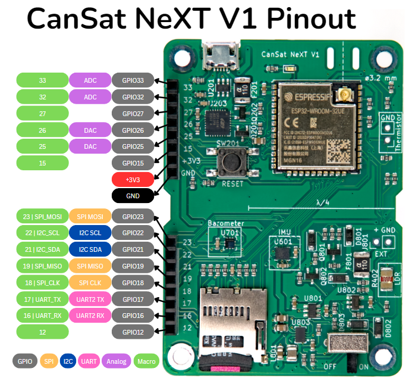

# Pinouts

This article shows the pin names used by the processor in CanSat NeXT, as well as shows what pins you can use to extend your project.

# Pinout

The picture below shows the pins for using the extension header for adding external electronics to the board.

Here is the full list of pins used by CanSat NeXT board. The internal use refers to the pin being used for the on-board resources, and extension refers to the pins having been routed to the extension interface. Some pins, those for I2C and SPI, are used both internally and externally. The library name refers to a macro name, which can be used instead of the pin number when CanSatNeXT library has been included.

| Pin Number | Library name | Note                                                    | Internal/External   |
|------------|--------------|---------------------------------------------------------|---------------------|
|          0 | BOOT         |                                                         | Used internally     |
|          1 | USB_UART_TX  | Used for USB                                            | Used internally     |
|          3 | USB_UART_RX  | Used for USB                                            | Used internally     |
|          4 | SD_CS        | SD card chip select                                     | Used internally     |
|          5 | LED          | Can be used to blink on-board LED                       | Used internally     |
|         12 | GPIO12       |                                                         | Extension interface |
|         13 | MEAS_EN      | Drive high to enable LDR and thermistor                 | Used internally     |
|         14 | GPIO14       | Can be used to read if SD-card is in place              | Used internally     |
|         15 | GPIO15       |                                                         | Extension interface |
|         16 | GPIO16       | UART2 RX                                                | Extension interface |
|         17 | GPIO17       | UART2 TX                                                | Extension interface |
|         18 | SPI_CLK      | Used by the SD-card, also available externally          | Both                |
|         19 | SPI_MISO     | Used by the SD-card, also available externally          | Both                |
|         21 | I2C_SDA      | Used by the on-board sensors, also available externally | Both                |
|         22 | I2C_SCL      | Used by the on-board sensors, also available externally | Both                |
|         23 | SPI_MOSI     | Used by the SD-card, also available externally          | Both                |
|         25 | GPIO25       |                                                         | Extension interface |
|         26 | GPIO26       |                                                         | Extension interface |
|         27 | GPIO27       |                                                         | Extension interface |
|         32 | GPIO32       | ADC                                                     | Extension interface |
|         33 | GPIO33       | ADC                                                     | Extension interface |
|         34 | LDR          | ADC for the on-board LDR                                | Used internally     |
|         35 | NTC          | ADC for the thermistor                                  | Used internally     |
|         36 | VDD          | ADC used to monitor supply voltage                      | Used internally     |
|         39 | BATT         | ADC used to monitor battery voltage                     | Used internally     |

