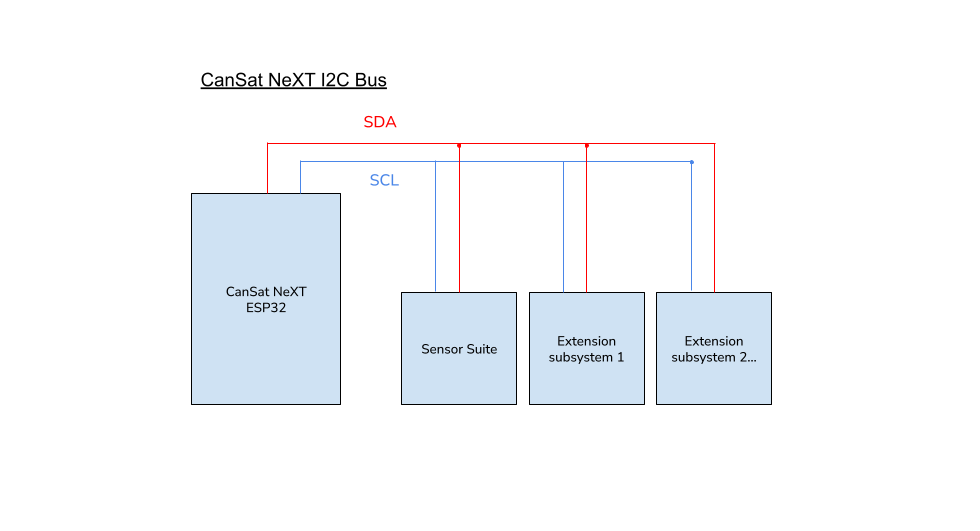

# Extension interface

Custom devices can be built and used together with CanSat. These can be used to make interesting projects, which you can find ideas for from our [Blog](/blog).

CanSat's extension interface features a free UART line, two ADC pins, and 5 free digital I/O pins. Additionally, SPI and I2C lines are available for the extension interface, although they are shared with SD card and the sensor suite, respectively.

The user can also choose to use the UART2 and ADC pins as digital I/O, in case serial communication or analog to digital conversion is not needed in their solution.

| Pin number | Pin name | Use as      | Notes                     |
|------------|----------|-------------|---------------------------|
| 12         | GPIO12   | Digital I/O | Free                      |
| 15         | GPIO15   | Digital I/O | Free                      |
| 16         | GPIO16   | UART2 RX    | Free                      |
| 17         | GPIO17   | UART2 TX    | Free                      |
| 18         | SPI_CLK  | SPI CLK     | Co-use with SD card       |
| 19         | SPI_MISO | SPI MISO    | Co-use with SD card       |
| 21         | I2C_SDA  | I2C SDA     | Co-use with sensor suite  |
| 22         | I2C_SCL  | I2C SCL     | Co-use with sensor suite  |
| 23         | SPI_MOSI | SPI MOSI    | Co-use with SD card       |
| 25         | GPIO25   | Digital I/O | Free                      |
| 26         | GPIO26   | Digital I/O | Free                      |
| 27         | GPIO27   | Digital I/O | Free                      |
| 32         | GPIO32   | ADC         | Free                      |
| 33         | GPIO33   | ADC         | Free                      |

*Table: Extension interface pin lookup table. Pin name refers to library pin name.*

# Communication options

The CanSat library does not include communication wrappers for the custom devices. For UART, I2C and SPI communication between CanSat NeXT and your custom payload device, refer to Arduino's default [UART](https://docs.arduino.cc/learn/communication/uart/), [Wire](https://docs.arduino.cc/learn/communication/wire/), and [SPI](https://docs.arduino.cc/learn/communication/spi/) libraries, respectively. 

## UART

The UART2 line is a good alternative as it serves as an unallocated communication interface for extended payloads.


For sending data through the UART line, please refer to the Arduino 

```
       CanSat NeXT
          ESP32                          User's device
   +----------------+                 +----------------+
   |                |   TX (Transmit) |                |
   |       TX  o----|---------------->| RX  (Receive)  |
   |                |                 |                |
   |       RX  o<---|<----------------| TX             |
   |                |   GND (Ground)  |                |
   |       GND  o---|-----------------| GND            |
   +----------------+                 +----------------+
```
*Image: UART protocol in ASCII*


## I2C

Use of I2C is supported, but the user must bear in mind that another subsystem exists on the line.

With multiple I2C slaves, the user code needs to specify which I2C slave the CanSat is using at a given time. This is distinguished with a slave address, which is unique hexadecimal code to each device and can be found from the subsystem device's data sheet.

## SPI

Use of SPI is supported as well, but the user must bear in mind that another subsystem exists on the line.

With SPI, the slave distinction is instead made by specifying a chip select pin. The user must dedicate one of the free GPIO pins to be a chip select for their custom extended payload device. The SD Card's chip select pin is defined in the ``CanSatPins.h`` library file as ``SD_CS``.



*Image: the CanSat NeXT I2C bus featuring several secondary, or "slave" subsystems. In this context, the Sensor suite is one of the slave subsystems.*


*Image: the CanSat NeXT SPI bus configuration when two secondary, or "slave" subsystems are present. In this context, the SD card is one of the slave subsystems.*