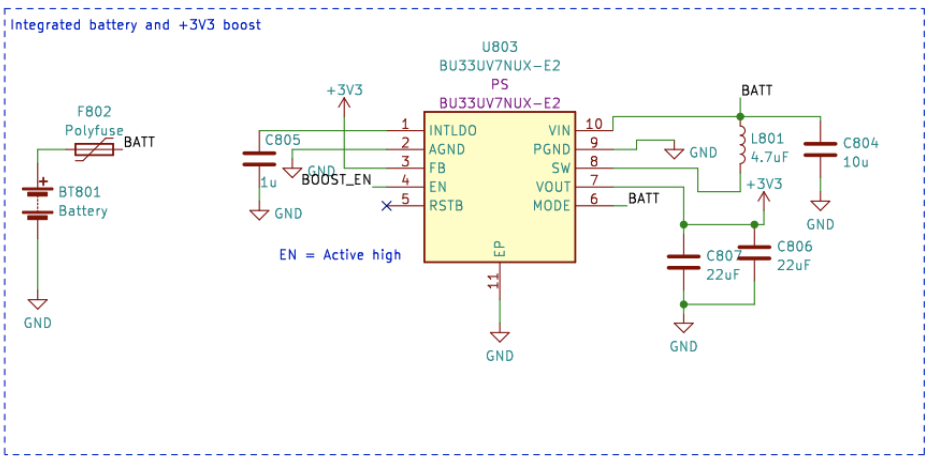
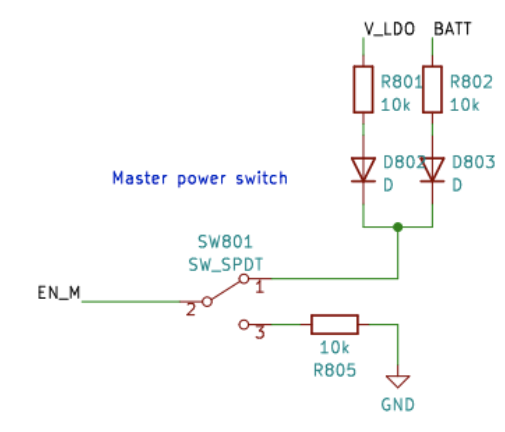

# Gestión de Energía Eléctrica

Este artículo explica cómo encender la placa CanSat NeXT, cómo conectar de manera segura dispositivos externos a la placa, y finalmente cómo funciona el sistema de energía.

## Comenzando

Para la mayoría de los usuarios, a menudo es suficiente simplemente agregar dos baterías AAA al soporte de baterías a bordo y asegurarlas en su lugar. Cuando el USB está conectado, CanSat NeXT cambia automáticamente para usar la energía del USB en lugar de las baterías, de modo que se extienda la vida útil de la batería. Recuerde cambiar a baterías nuevas antes de un vuelo.

## Sistema de Energía de CanSat NeXT

Hay tres formas de alimentar el CanSat NeXT. La forma predeterminada es alimentarlo con USB, de modo que cuando el usuario está desarrollando el software, la PC alimenta el dispositivo y no se requiere energía externa. La segunda forma es usar las baterías a bordo (OBB). Esto se hace insertando dos baterías AAA estándar de 1.5 V en el conector de baterías en la parte inferior de la placa principal. El USB sigue siendo la forma predeterminada incluso si se insertan baterías, es decir, la capacidad de la batería no se utiliza cuando el USB está conectado.

Estas son las opciones habituales y deberían cubrir la mayoría de los casos de uso. Sin embargo, adicionalmente, hay dos opciones "avanzadas" para alimentar CanSat NeXT si se necesita para un propósito especial. Primero, la placa tiene conectores de orificio pasante vacíos etiquetados como EXT, que se pueden usar para conectar una batería externa. El voltaje de la batería puede ser de 3.2-6V. La línea EXT se desconecta automáticamente cuando el USB no está presente para extender la vida útil de la batería y proteger la batería. Hay una característica de seguridad que desactiva el OBB si se conecta una batería, pero el OBB no debería estar presente cuando se usan baterías externas.

También hay una última opción que da toda la responsabilidad al usuario, y es introducir 3V3 al dispositivo a través de la interfaz de extensión. Esta no es una forma segura de alimentar el dispositivo, pero los usuarios avanzados que saben lo que están haciendo podrían encontrar que esta es la forma más fácil de lograr las funcionalidades deseadas.

En resumen, hay tres formas seguras de alimentar CanSat NeXT:

1. Usando USB - método principal usado para desarrollo
2. Usando baterías a bordo - método recomendado para vuelo
3. Usando una batería externa - Para usuarios avanzados

Usando baterías AAA regulares, se alcanzó una vida útil de la batería de 4 horas a temperatura ambiente, y 50 minutos a -40 grados Celsius. Durante la prueba, el dispositivo leía todos los sensores y transmitía sus datos 10 veces por segundo. Cabe señalar que las baterías alcalinas regulares no están diseñadas para funcionar a temperaturas tan bajas, y generalmente comienzan a filtrar potasio después de este tipo de pruebas de tortura. Esto no es peligroso, pero las baterías alcalinas siempre deben desecharse de manera segura después, especialmente si se usaron en un entorno poco común como frío extremo, o si se dejaron caer desde un cohete. O ambos.

Al usar USB, la corriente extraída de los pines de extensión no debe exceder los 300 mA. El OBB es un poco más indulgente, proporcionando como máximo 800 mA desde los pines de extensión. Si se requiere más energía, se debe considerar una batería externa. Esto probablemente no sea el caso a menos que esté ejecutando motores (los servos pequeños están bien) o calentadores, por ejemplo. Las cámaras pequeñas, etc., todavía están bien.

## Extra - cómo funciona el esquema de energía multisource adaptativo

Para lograr las funcionalidades deseadas de manera segura, necesitamos considerar bastantes cosas en el diseño del sistema de energía. Primero, para poder conectar de manera segura USB, EXT y OBB al mismo tiempo, el sistema de energía necesita encender y apagar las diversas fuentes de energía. Esto se complica aún más por el hecho de que no se puede hacer en software, ya que el usuario necesita poder tener cualquier software que desee sin poner en peligro las operaciones seguras. Además, el OBB tiene un rango de voltaje bastante diferente al USB y la batería externa. Esto requiere que el OBB use un regulador de impulso, mientras que el USB y EXT necesitan un regulador buck o un LDO. Para simplicidad y confiabilidad, se usa un LDO en esa línea. Finalmente, un interruptor de energía debería poder desconectar todas las fuentes de energía.

A continuación se muestra el esquema para el convertidor de impulso. El IC es BU33UV7NUX, un convertidor de impulso diseñado específicamente para dar +3.3V a partir de dos baterías alcalinas. Se habilita cuando la línea BOOST_EN está alta, o por encima de 0.6 V.

Todas las líneas OBB, USB y EXT están protegidas con un fusible, protección contra sobrecorriente, protección contra voltaje inverso y corriente y protección contra sobretemperatura. Además, el OBB está protegido con bloqueo por bajo voltaje y protección contra cortocircuitos, ya que esas situaciones deben evitarse con baterías alcalinas.

Tenga en cuenta en la siguiente sección, que el voltaje de la batería externa es V_EXT, el voltaje USB es VBUS y el voltaje OBB es BATT.

La línea BOOST_EN es controlada por un circuito de interruptor, que toma la entrada de la línea EN_MASTER (EN_M), o ignora eso si V_EXT o VBUS están presentes. Esto se hace para asegurar que el impulso esté siempre apagado cuando VBUS y V_EXT están presentes, y solo se habilita si tanto VBUS como V_EXT están a 0V y el EN_M está alto.

O como una tabla de verdad:

| V_EXT | VBUS | EN_M | BOOST_EN |
|-------|------|------|----------|
| 1     | 1    | 1    | 0        |
| 1     | 1    | 0    | 0        |
| 0     | 0    | 0    | 0        |
| 0     | 0    | 1    | 1        |

Así que BOOST_EN = EN_M ∧ !(V_EXT ∨ V_BUS).

A continuación, necesitamos desconectar V_EXT si VBUS está presente para prevenir una descarga no deseada o carga accidental. Esto se hace usando un IC de interruptor de energía con la ayuda de un circuito de transistor que baja la línea de habilitación del interruptor de energía si VBUS está presente. Esto desconecta la batería. La línea USB siempre se usa cuando está presente, por lo que se enruta al LDO con un simple diodo Schottky.

En general, este circuito lleva a una funcionalidad donde se usa la energía USB si está presente, y V_EXT se usa cuando USB no está presente. Finalmente, el EN_M se usa para habilitar o deshabilitar el LDO.

El EN_M es controlado por el usuario a través de un interruptor de energía. El interruptor conecta EN_M a USB o EXT, o al voltaje de la batería cuando solo se usa OBB. Cuando el interruptor está apagado, conecta EN_M a tierra, apagando tanto el LDO como el regulador de impulso.

Así que en la práctica, el interruptor de energía enciende/apaga el dispositivo, se usa USB si está presente, y V_EXT se prefiere sobre OBB. Finalmente, hay un detalle más a considerar. ¿Qué voltaje debería medir el ESP32 como el voltaje de la batería?

Esto se resolvió de una manera simple. El voltaje conectado al ADC del ESP32 es siempre el OBB, pero el usuario puede seleccionar V_EXT en su lugar cortando el puente con un bisturí y soldando el puente JP801 para acortar 2-3 en su lugar. Esto selecciona V_EXT para el BATT_MEAS en su lugar.

El puente se puede encontrar en la parte inferior de la placa principal de CanSat NeXT. El puente es bastante fácil de soldar, así que no tenga miedo de cortar la línea 1-2 si está usando una batería externa. Siempre se puede volver a soldar para usar 1-2 nuevamente.