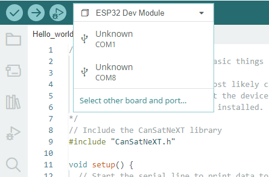
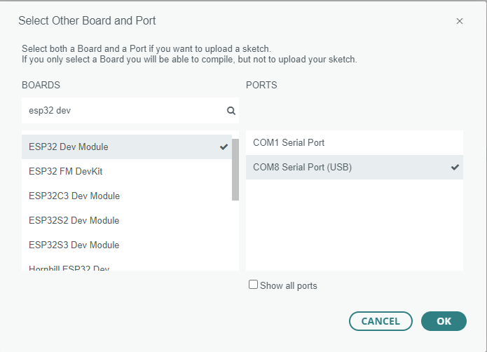

# Lección 1: ¡Hola Mundo!

Esta primera lección te inicia con CanSat NeXT mostrando cómo escribir y ejecutar tu primer programa en la placa.

Después de esta lección, tendrás las herramientas necesarias para comenzar a desarrollar software para tu CanSat.

## Instalación de las herramientas

Se recomienda usar CanSat NeXT con Arduino IDE, así que comencemos instalando eso y las bibliotecas y placas necesarias.

### Instalar Arduino IDE

Si aún no lo has hecho, descarga e instala el Arduino IDE desde el sitio web oficial https://www.arduino.cc/en/software.

### Agregar soporte para ESP32

CanSat NeXT está basado en el microcontrolador ESP32, que no está incluido en la instalación predeterminada de Arduino IDE. Si no has usado microcontroladores ESP32 con Arduino antes, primero se debe instalar el soporte para la placa. Esto se puede hacer en Arduino IDE desde *Herramientas->placa->Gestor de Placas* (o simplemente presiona (Ctrl+Shift+B) en cualquier lugar). En el gestor de placas, busca ESP32 e instala el esp32 de Espressif.

### Instalar la biblioteca CanSat NeXT

La biblioteca CanSat NeXT se puede descargar desde el Administrador de Bibliotecas de Arduino IDE desde *Sketch > Incluir Bibliotecas > Administrar Bibliotecas*.


*Fuente de la imagen: Arduino Docs, https://docs.arduino.cc/software/ide-v1/tutorials/installing-libraries*

En la barra de búsqueda del Administrador de Bibliotecas, escribe "CanSatNeXT" y elige "Instalar". Si el IDE pregunta si también deseas instalar las dependencias, haz clic en sí.

## Conexión al PC

Después de instalar la biblioteca de software CanSat NeXT, puedes conectar el CanSat NeXT a tu computadora. En caso de que no sea detectado, es posible que necesites instalar los controladores necesarios primero. La instalación del controlador se realiza automáticamente en la mayoría de los casos, sin embargo, en algunas PC debe hacerse manualmente. Los controladores se pueden encontrar en el sitio web de Silicon Labs: https://www.silabs.com/developers/usb-to-uart-bridge-vcp-drivers
Para obtener ayuda adicional con la configuración del ESP32, consulta el siguiente tutorial: https://docs.espressif.com/projects/esp-idf/en/latest/esp32/get-started/establish-serial-connection.html

## Ejecutando tu primer programa

Ahora, usemos las bibliotecas recién instaladas para comenzar a ejecutar algo de código en el CanSat NeXT. Como es tradición, comencemos haciendo parpadear el LED y escribiendo "¡Hola Mundo!" en la computadora.

### Seleccionando el puerto correcto

Después de conectar el CanSat NeXT a tu computadora (y encenderlo), necesitas seleccionar el puerto correcto. Si no sabes cuál es el correcto, simplemente desconecta el dispositivo y ve qué puerto desaparece.



Arduino IDE ahora te pide el tipo de dispositivo. Selecciona ESP32 Dev Module.



### Eligiendo un ejemplo

La biblioteca CanSat NeXT tiene varios códigos de ejemplo que muestran cómo usar las diversas características de la placa. Puedes encontrar estos sketches de ejemplo en Archivo -> Ejemplos -> CanSat NeXT. Elige "Hello_world".

Después de abrir el nuevo sketch, puedes cargarlo en la placa presionando el botón de carga.


Después de un tiempo, el LED en la placa debería comenzar a parpadear. Además, el dispositivo está enviando un mensaje a la PC. Puedes ver esto abriendo el monitor serial y eligiendo la tasa de baudios 115200.

Intenta también presionar el botón en la placa. Debería reiniciar el procesador, o en otras palabras, reiniciar el código desde el principio.

### Explicación de Hola Mundo

Veamos qué sucede realmente en este código repasándolo línea por línea. Primero, el código comienza **incluyendo** la biblioteca CanSat. Esta línea debería estar al principio de casi todos los programas escritos para CanSat NeXT, ya que le dice al compilador que queremos usar las características de la biblioteca CanSat NeXT.

```Cpp title="Incluir CanSat NeXT"
#include "CanSatNeXT.h"
```
Después de esto, el código salta a la función de configuración. Allí tenemos dos llamadas: primero, serial es la interfaz que usamos para enviar mensajes a la PC a través de USB. El número dentro de la llamada de función, 115200, se refiere a la tasa de baudios, es decir, cuántos unos y ceros se envían cada segundo. La siguiente llamada, `CanSatInit()`, es de la biblioteca CanSat NeXT e inicia todos los sensores y otras características a bordo. Similar al comando `#include`, esto generalmente se encuentra en los sketches para CanSat NeXT. Cualquier cosa que te gustaría que se ejecute solo una vez al inicio debe incluirse en la función de configuración.

```Cpp title="Configuración"
void setup() {
  // Iniciar la línea serial para imprimir datos en el terminal
  Serial.begin(115200);
  // Iniciar todos los sistemas a bordo de CanSatNeXT.
  CanSatInit();
}
```

Después de la configuración, el código comienza a repetir la función de bucle infinitamente. Primero, el programa escribe el pin de salida LED para que esté alto, es decir, tenga un voltaje de 3.3 voltios. Esto enciende el LED a bordo. Después de 100 milisegundos, el voltaje en ese pin de salida se vuelve a cero. Ahora el programa espera 400 ms y luego envía un mensaje a la PC. Después de que se envía el mensaje, la función de bucle comienza nuevamente desde el principio.

```Cpp title="Bucle"
void loop() {
  // Hagamos parpadear el LED
  digitalWrite(LED, HIGH);
  delay(100);
  digitalWrite(LED, LOW);
  delay(400);
  Serial.println("¡Este es un mensaje!");
}
```

También puedes intentar cambiar los valores de demora o el mensaje para ver qué sucede. ¡Felicitaciones por llegar hasta aquí! Configurar las herramientas puede ser complicado, pero debería ser más divertido a partir de este punto.

---

En la próxima lección, comenzaremos a leer datos de los sensores a bordo.

[¡Haz clic aquí para la segunda lección!](./lesson2)