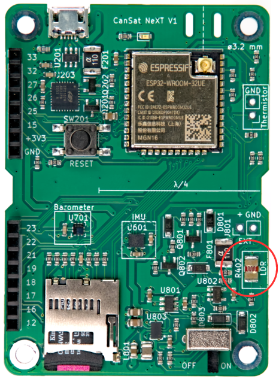

# Õppetund 4: Vastupanu ei ole asjatu

Siiani oleme keskendunud digitaalsete sensorseadmete kasutamisele, et saada väärtusi otse SI-ühikutes. Kuid elektriseadmed teevad mõõtmise tavaliselt kaudselt ja teisendamine soovitud ühikutesse toimub hiljem. Varem tegid seda sensorseadmed ise (ja CanSat NeXT teek), kuid paljud meie kasutatavad sensorid on palju lihtsamad. Üks analoogandurite tüüp on takistusandurid, kus andurielemendi takistus muutub sõltuvalt mingist nähtusest. Takistusandureid on olemas mitmesuguste suuruste jaoks - sealhulgas jõud, temperatuur, valguse intensiivsus, keemilised kontsentratsioonid, pH ja paljud teised.

Selles õppetunnis kasutame CanSat NeXT plaadil asuvat valgusest sõltuvat takistit (LDR), et mõõta ümbritseva valguse intensiivsust. Kuigi termistori kasutatakse väga sarnaselt, keskendume sellele tulevases õppetunnis. Samad oskused kehtivad otse LDR-i ja termistori kasutamisel, samuti paljude teiste takistusandurite puhul.



## Takistusandurite füüsika

Enne kui hüppame otse tarkvarasse, võtame sammu tagasi ja arutame, kuidas takistusanduri lugemine üldiselt töötab. Vaatleme allolevat skeemi. Pinge LDR_EN juures on 3,3 volti (protsessori tööpinge) ja sellel teel on kaks takistit, mis on ühendatud jadamisi. Üks neist on **LDR** (R402), samas kui teine on **viitetakisti** (R402). Viitetakisti takistus on 10 kilo-oomi, samas kui LDR-i takistus varieerub valguse tingimustest sõltuvalt 5-300 kilo-oomi vahel.


Kuna takistid on ühendatud jadamisi, on kogutakistus

$$
R = R_{401} + R_{LDR},
$$

ja vool läbi takistite on

$$
I_{LDR} = \frac{V_{OP}}{R},
$$

kus $V_{OP}$ on MCU tööpinge. Pea meeles, et vool peab olema sama mõlema takisti kaudu. Seetõttu saame arvutada LDR-i ülepingelanguse kui

$$
V_{LDR} = R_{LDR} * I_{LDR} =  V_{OP} \frac{R_{LDR}}{R_{401} + R_{LDR}}.
$$

Ja see pingelangus on LDR-i pinge, mida saame mõõta analoog-digitaalmuunduriga. Tavaliselt saab seda pinget otseselt korreleerida või kalibreerida, et see vastaks mõõdetud väärtustele, näiteks pingest temperatuuriks või heleduseks. Kuid mõnikord on soovitav esmalt arvutada mõõdetud takistus. Vajadusel saab seda arvutada järgmiselt:

$$
R_{LDR} = \frac{V_{LDR}}{I_{LDR}} = \frac{V_{LDR}}{V_{OP}} (R_{401} + R_{LDR}) = R_{401} \frac{\frac{V_{LDR}}{V_{OP}}}{1-\frac{V_{LDR}}{V_{OP}}}
$$

## LDR-i lugemine praktikas

LDR-i või teiste takistusandurite lugemine on väga lihtne, kuna peame lihtsalt küsima analoog-digitaalmuundurilt pinget. Alustame seekord uut Arduino Sketchi nullist. Fail -> Uus Sketch.

Kõigepealt alustame sketchi nagu varem, lisades teegi. See tehakse sketchi alguses. Seadistuses alustame seriali ja initsialiseerime CanSat, nagu varem.

```Cpp title="Põhiseadistus"
#include "CanSatNeXT.h"

void setup() {
  Serial.begin(115200);
  CanSatInit();
}
```

Põhiline tsükkel LDR-i lugemiseks pole palju keerulisem. Takistid R401 ja R402 on juba plaadil ja peame lihtsalt lugema nende ühise sõlme pinget. Loeme ADC väärtuse ja prindime selle.

```Cpp title="Põhiline LDR-i tsükkel"
void loop() {
    int value = analogRead(LDR);
    Serial.print("LDR väärtus:");
    Serial.println(value);
    delay(200);
}
```

Selle programmiga reageerivad väärtused selgelt valgustingimustele. Saame madalamaid väärtusi, kui LDR on valguse käes, ja kõrgemaid väärtusi, kui on pimedam. Kuid väärtused on sadades ja tuhandetes, mitte oodatud pingevahemikus. See on sellepärast, et loeme nüüd ADC otsest väljundit. Iga bitt esindab pingevõrdlusredelit, mis on üks või null sõltuvalt pingest. Väärtused on nüüd 0-4095 (2^12-1) sõltuvalt sisendpingest. Jällegi, see otsene mõõtmine on tõenäoliselt see, mida soovite kasutada, kui teete midagi sellist nagu [impulsside tuvastamine LDR-iga](./../../blog/first-project#pulse-detection), kuid sageli on tavalised voldid mugavad töötamiseks. Kuigi pinge ise arvutamine on hea harjutus, sisaldab teek teisendusfunktsiooni, mis arvestab ka ADC mittelineaarsust, mis tähendab, et väljund on täpsem kui lihtsast lineaarsest teisendusest.

```Cpp title="LDR-i pinge lugemine"
void loop() {
    float LDR_voltage = analogReadVoltage(LDR);
    Serial.print("LDR väärtus:");
    Serial.println(LDR_voltage);
    delay(200);
}
```

:::note

See kood on ühilduv Arduino Code'i seerialiseerija plotteriga. Proovi seda!

:::

:::tip[Harjutus]

Võiks olla kasulik tuvastada CanSati raketist väljumine, et näiteks langevari saaks õigel ajal avaneda. Kas saate kirjutada programmi, mis tuvastab simuleeritud väljumise? Simuleerige starti, kattes esmalt LDR (raketi integreerimine) ja seejärel avades selle (väljumine). Programm võiks väljumise terminali väljundisse saata või LED-i vilgutada, et näidata, et väljumine toimus.

:::

---

Järgmine õppetund käsitleb SD-kaardi kasutamist mõõtmiste, seadete ja muu salvestamiseks!

[Klõpsa siia, et minna järgmisele õppetunnile!](./lesson5)