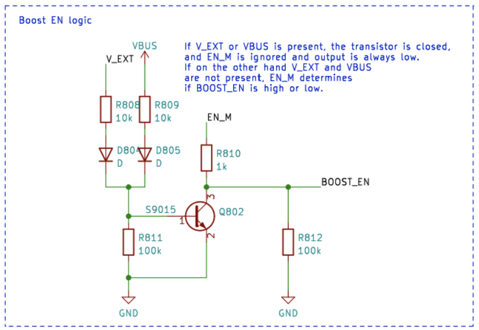

# Sähkönhallinta

Tässä artikkelissa selitetään, kuinka CanSat NeXT -kortti kytketään päälle, kuinka ulkoiset laitteet liitetään turvallisesti korttiin ja lopuksi, miten virtajärjestelmä toimii.

## Aloittaminen

Useimmille käyttäjille riittää, että lisätään kaksi AAA-paristoa kortin sisäiseen paristotelineeseen ja kiinnitetään ne paikoilleen. Kun USB on kytketty, CanSat NeXT vaihtaa automaattisesti käyttämään USB-virtaa paristojen sijaan, jotta paristojen käyttöikä pitenee. Muista vaihtaa tuoreet paristot ennen lentoa.

## CanSat NeXT -virtajärjestelmä

CanSat NeXT voidaan kytkeä päälle kolmella tavalla. Oletustapa on käyttää USB:tä, jolloin käyttäjän kehittäessä ohjelmistoa PC syöttää virtaa laitteeseen eikä ulkoista virtaa tarvita. Toinen tapa on käyttää sisäisiä paristoja (OBB). Tämä tehdään asettamalla kaksi tavallista 1,5 V AAA-paristoa pääkortin alapuolella olevaan paristoliittimeen. USB on edelleen oletustapa, vaikka paristot olisivatkin paikallaan, eli paristojen kapasiteettia ei käytetä, kun USB on kytketty.

Nämä ovat tavallisia vaihtoehtoja ja kattavat useimmat käyttötapaukset. Lisäksi on kuitenkin kaksi "edistynyttä" vaihtoehtoa CanSat NeXT:n virransyöttöön, jos tarvitaan erityistä tarkoitusta varten. Ensinnäkin, kortissa on tyhjät läpivientiliittimet merkittynä EXT, joita voidaan käyttää ulkoisen pariston liittämiseen. Pariston jännite voi olla 3,2-6V. EXT-linja katkaistaan automaattisesti, kun USB ei ole kytkettynä, jotta pariston käyttöikä pitenee ja paristo suojataan. Turvaominaisuus on, että OBB on pois käytöstä, jos paristo on kytketty, mutta OBB:tä ei silti pitäisi olla paikallaan, kun käytetään ulkoisia paristoja.

On myös yksi viimeinen vaihtoehto, joka antaa kaiken vastuun käyttäjälle, ja se on syöttää 3V3 laitteeseen laajennusliitännän kautta. Tämä ei ole turvallinen tapa syöttää virtaa laitteeseen, mutta edistyneet käyttäjät, jotka tietävät mitä tekevät, saattavat löytää tämän helpoimmaksi tavaksi saavuttaa halutut toiminnot.

Yhteenvetona, CanSat NeXT voidaan syöttää turvallisesti kolmella tavalla:

1. Käyttämällä USB:tä - pääasiallinen kehitystapa
2. Käyttämällä sisäisiä paristoja - suositeltu tapa lennolle
3. Käyttämällä ulkoista paristoa - edistyneille käyttäjille

Tavallisilla AAA-paristoilla saavutettiin 4 tunnin käyttöikä huoneenlämmössä ja 50 minuuttia -40 asteen lämpötilassa. Testin aikana laite luki kaikki anturit ja lähetti niiden tiedot 10 kertaa sekunnissa. On huomattava, että tavalliset alkaliparistot eivät ole suunniteltu toimimaan näin alhaisissa lämpötiloissa, ja ne alkavat yleensä vuotaa kaliumia tällaisen rasitustestin jälkeen. Tämä ei ole vaarallista, mutta alkaliparistot tulisi aina hävittää turvallisesti tämän jälkeen, erityisesti jos niitä on käytetty epätavallisessa ympäristössä, kuten äärimmäisessä kylmyydessä tai pudotettu raketista. Tai molemmat.

Kun käytetään USB:tä, laajennusliittimien virrankulutus ei saisi ylittää 300 mA. OBB:t ovat hieman anteeksiantavampia, antaen enintään 800 mA laajennusliittimistä. Jos tarvitaan enemmän virtaa, tulisi harkita ulkoista paristoa. Tämä ei todennäköisesti ole tarpeen, ellei käytetä moottoreita (pienet servot ovat ok) tai lämmittimiä, esimerkiksi. Pienet kamerat jne. ovat silti ok.

## Extra - kuinka mukautuva monilähdevirtajärjestelmä toimii

Haluttujen toimintojen saavuttamiseksi turvallisesti, meidän on otettava huomioon melko monta asiaa virtajärjestelmän suunnittelussa. Ensinnäkin, jotta USB, EXT ja OBB voidaan kytkeä turvallisesti samanaikaisesti, virtajärjestelmän on kytkettävä eri virtalähteet päälle ja pois. Tätä monimutkaistaa se, että sitä ei voida tehdä ohjelmistossa, koska käyttäjän on voitava käyttää mitä tahansa ohjelmistoa vaarantamatta turvallista toimintaa. Lisäksi OBB:llä on melko erilainen jännitealue verrattuna USB:hen ja ulkoiseen paristoon. Tämä edellyttää, että OBB käyttää boost-säädintä, kun taas USB ja EXT tarvitsevat joko buck-säädintä tai LDO:ta. Yksinkertaisuuden ja luotettavuuden vuoksi LDO:ta käytetään siinä linjassa. Lopuksi, yhden virtakytkimen tulisi pystyä katkaisemaan kaikki virtalähteet.

Alla on kaavio boost-muuntimesta. IC on BU33UV7NUX, boost-muunnin, joka on erityisesti suunniteltu antamaan +3.3V kahdesta alkaliparistosta. Se aktivoituu, kun BOOST_EN-linja on korkea tai yli 0.6 V.

Kaikki OBB, USB ja EXT-linjat on suojattu sulakkeella, ylivirtasuojauksella, käänteisjännitteen ja virran suojauksella sekä ylikuumenemissuojauksella. Lisäksi OBB on suojattu alijännitelukituksella ja oikosulkusuojauksella, koska näitä tilanteita tulisi välttää alkaliparistojen kanssa.

Huomaa seuraavassa osiossa, että ulkoisen pariston jännite on V_EXT, USB-jännite on VBUS ja OBB-jännite on BATT.

BOOST_EN-linjaa ohjataan kytkinpiirillä, joka joko ottaa syötteen EN_MASTER (EN_M) -linjalta tai ohittaa sen, jos V_EXT tai VBUS on läsnä. Tämä on tehty varmistamaan, että boost on aina pois päältä, kun VBUS ja V_EXT ovat läsnä, ja se aktivoituu vain, jos sekä VBUS että V_EXT ovat 0V ja EN_M on korkea.

Tai totuustaulukkona:

| V_EXT | VBUS | EN_M | BOOST_EN |
|-------|------|------|----------|
| 1     | 1    | 1    | 0        |
| 1     | 1    | 0    | 0        |
| 0     | 0    | 0    | 0        |
| 0     | 0    | 1    | 1        |

Joten BOOST_EN = EN_M ∧ !(V_EXT ∨ V_BUS).

Seuraavaksi meidän on katkaistava V_EXT, jos VBUS on läsnä, estääksemme ei-toivotun purkautumisen tai vahingossa tapahtuvan latauksen. Tämä tehdään käyttämällä virtakytkin-IC:tä yhdessä transistori-piirin kanssa, joka vie virtakytkimen enable-linjan alas, jos VBUS on läsnä. Tämä katkaisee pariston. USB-linjaa käytetään aina, kun se on läsnä, joten se ohjataan LDO:lle yksinkertaisella schottky-diodilla.

Kaiken kaikkiaan tämä piiri johtaa toiminnallisuuteen, jossa USB-virtaa käytetään, jos se on läsnä, ja V_EXT käytetään, kun USB ei ole läsnä. Lopuksi, EN_M:ää käytetään LDO:n aktivoimiseen tai deaktivointiin.

EN_M:ää ohjaa käyttäjä virtakytkimen kautta. Kytkin yhdistää EN_M:n joko USB:hen tai EXT:hen, tai paristojännitteeseen, kun vain OBB:tä käytetään. Kun kytkin on pois päältä, se yhdistää EN_M:n maahan, kytkien pois päältä sekä LDO:n että boost-säätimen.

Joten käytännössä virtakytkin kytkee laitteen päälle/pois, USB:tä käytetään, jos se on läsnä, ja V_EXT on etusijalla OBB:hen nähden. Lopuksi on vielä yksi yksityiskohta, joka on otettava huomioon. Minkä jännitteen ESP32:n tulisi mitata paristojännitteenä?

Tämä ratkaistiin yksinkertaisella tavalla. ESP32 ADC:hen kytketty jännite on aina OBB, mutta käyttäjä voi valita V_EXT:n sen sijaan leikkaamalla hyppylangan skalpellilla ja juottamalla hyppylangan JP801 lyhyeksi 2-3 sen sijaan. Tämä valitsee V_EXT:n BATT_MEAS:lle.

Hyppylanka löytyy CanSat NeXT -pääkortin alapuolelta. Hyppylanka on melko helppo juottaa, joten älä pelkää leikata 1-2 linjaa, jos käytät ulkoista paristoa. Se voidaan aina uudelleen juottaa käyttämään 1-2 sen sijaan.