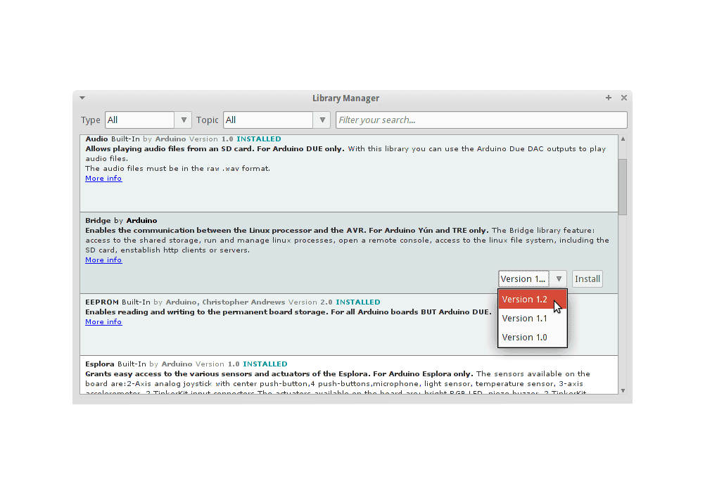

# CanSat NeXT -ohjelmisto

Suositeltu tapa käyttää CanSat NeXT:ä on CanSat NeXT Arduino -kirjaston avulla, joka on saatavilla Arduino-kirjastonhallinnasta ja GitHubista. Ennen kuin asennat CanSat NeXT -kirjaston, sinun on asennettava Arduino IDE ja ESP32-lautatuen.

## Aloittaminen

### Asenna Arduino IDE

Jos et ole vielä tehnyt niin, lataa ja asenna Arduino IDE viralliselta verkkosivustolta https://www.arduino.cc/en/software.

### Lisää ESP32-tuki

CanSat NeXT perustuu ESP32-mikrokontrolleriin, joka ei sisälly Arduino IDE:n oletusasennukseen. Jos et ole aiemmin käyttänyt ESP32-mikrokontrollereita Arduinon kanssa, laudan tuki on ensin asennettava. Tämä voidaan tehdä Arduino IDE:ssä kohdasta *Tools->board->Board Manager* (tai painamalla (Ctrl+Shift+B) missä tahansa). Laudanhallinnassa etsi ESP32 ja asenna esp32 Espressifiltä.

### Asenna Cansat NeXT -kirjasto

CanSat NeXT -kirjasto voidaan ladata Arduino IDE:n kirjastonhallinnasta kohdasta *Sketch > Include Libraries > Manage Libraries*.

*Kuvan lähde: Arduino Docs, https://docs.arduino.cc/software/ide-v1/tutorials/installing-libraries*

Kirjastonhallinnan hakupalkkiin kirjoita "CanSatNeXT" ja valitse "Install". Jos IDE kysyy, haluatko asentaa myös riippuvuudet, klikkaa kyllä.

## Manuaalinen asennus

Kirjasto on myös isännöity omassa [GitHub-repositoriossaan](https://github.com/netnspace/CanSatNeXT_library) ja sen voi kloonata tai ladata ja asentaa lähteestä.

Tässä tapauksessa sinun on purettava kirjasto ja siirrettävä se hakemistoon, josta Arduino IDE löytää sen. Tarkka sijainti löytyy kohdasta *File > Preferences > Sketchbook*.

*Kuvan lähde: Arduino Docs, https://docs.arduino.cc/software/ide-v1/tutorials/installing-libraries*

# Yhdistäminen tietokoneeseen

Kun olet asentanut CanSat NeXT -ohjelmistokirjaston, voit liittää CanSat NeXT:n tietokoneeseesi. Jos sitä ei havaita, sinun on ehkä asennettava tarvittavat ajurit ensin. Ajurien asennus tapahtuu automaattisesti useimmissa tapauksissa, mutta joillakin tietokoneilla se on tehtävä manuaalisesti. Ajurit löytyvät Silicon Labsin verkkosivustolta: https://www.silabs.com/developers/usb-to-uart-bridge-vcp-drivers
Lisäapua ESP32:n asennukseen löytyy seuraavasta oppaasta: https://docs.espressif.com/projects/esp-idf/en/latest/esp32/get-started/establish-serial-connection.html

# Olet valmis aloittamaan!

Voit nyt löytää CanSatNeXT-esimerkkejä Arduino IDE:stä kohdasta *File->Examples->CanSatNeXT*.