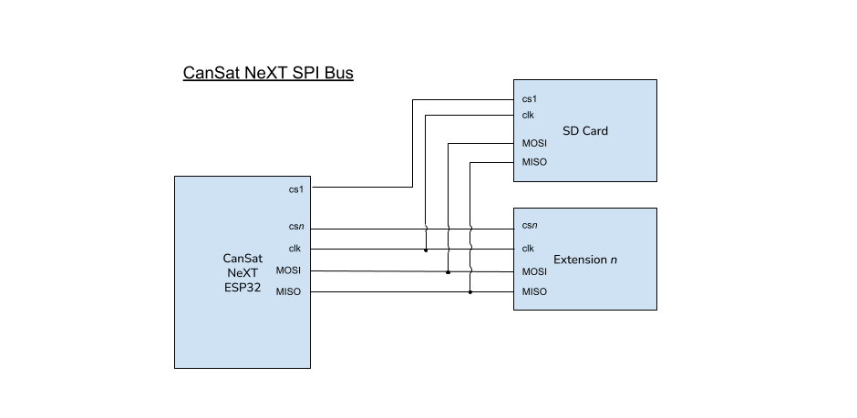

# Laajennusliitäntä

Mukautettuja laitteita voidaan rakentaa ja käyttää yhdessä CanSatin kanssa. Näitä voidaan käyttää mielenkiintoisten projektien toteuttamiseen, joihin voit löytää ideoita [Blogistamme](/blog).

CanSatin laajennusliitännässä on vapaa UART-linja, kaksi ADC-pinniä ja 5 vapaata digitaalista I/O-pinniä. Lisäksi SPI- ja I2C-linjat ovat saatavilla laajennusliitännässä, vaikka ne ovatkin jaettu SD-kortin ja anturipaketin kanssa.

Käyttäjä voi myös valita käyttää UART2- ja ADC-pinnejä digitaalisina I/O-pinneinä, jos sarjaviestintää tai analogia-digitaalimuunnosta ei tarvita heidän ratkaisussaan.

| Pinnin numero | Pinnin nimi | Käyttö        | Huomautuksia               |
|---------------|-------------|---------------|----------------------------|
| 12            | GPIO12      | Digitaalinen I/O | Vapaa                     |
| 15            | GPIO15      | Digitaalinen I/O | Vapaa                     |
| 16            | GPIO16      | UART2 RX      | Vapaa                     |
| 17            | GPIO17      | UART2 TX      | Vapaa                     |
| 18            | SPI_CLK     | SPI CLK       | Yhteiskäyttö SD-kortin kanssa |
| 19            | SPI_MISO    | SPI MISO      | Yhteiskäyttö SD-kortin kanssa |
| 21            | I2C_SDA     | I2C SDA       | Yhteiskäyttö anturipaketin kanssa |
| 22            | I2C_SCL     | I2C SCL       | Yhteiskäyttö anturipaketin kanssa |
| 23            | SPI_MOSI    | SPI MOSI      | Yhteiskäyttö SD-kortin kanssa |
| 25            | GPIO25      | Digitaalinen I/O | Vapaa                     |
| 26            | GPIO26      | Digitaalinen I/O | Vapaa                     |
| 27            | GPIO27      | Digitaalinen I/O | Vapaa                     |
| 32            | GPIO32      | ADC           | Vapaa                     |
| 33            | GPIO33      | ADC           | Vapaa                     |

*Taulukko: Laajennusliitännän pinnien hakutaulukko. Pinnin nimi viittaa kirjaston pinnin nimeen.*

# Viestintävaihtoehdot

CanSat-kirjasto ei sisällä viestintäkääreitä mukautetuille laitteille. UART-, I2C- ja SPI-viestintään CanSat NeXT:n ja mukautetun hyötykuormalaitteen välillä, viittaa Arduinon oletus [UART](https://docs.arduino.cc/learn/communication/uart/), [Wire](https://docs.arduino.cc/learn/communication/wire/), ja [SPI](https://docs.arduino.cc/learn/communication/spi/) kirjastoihin.

## UART

UART2-linja on hyvä vaihtoehto, koska se toimii varaamattomana viestintäliitäntänä laajennetuille hyötykuormille.

Tietojen lähettämiseen UART-linjan kautta, viittaa Arduinon

```
       CanSat NeXT
          ESP32                          Käyttäjän laite
   +----------------+                 +----------------+
   |                |   TX (Lähetä)   |                |
   |       TX  o----|---------------->| RX  (Vastaanota)|
   |                |                 |                |
   |       RX  o<---|<----------------| TX             |
   |                |   GND (Maa)     |                |
   |       GND  o---|-----------------| GND            |
   +----------------+                 +----------------+
```
*Kuva: UART-protokolla ASCII-muodossa*


## I2C

I2C:n käyttöä tuetaan, mutta käyttäjän on pidettävä mielessä, että linjalla on toinen alijärjestelmä.

Useiden I2C-orjien kanssa käyttäjäkoodin on määritettävä, mitä I2C-orjaa CanSat käyttää tietyllä hetkellä. Tämä erotetaan orjaosoitteella, joka on jokaiselle laitteelle ainutlaatuinen heksadesimaalikoodi ja se löytyy alijärjestelmän laitteen tietolehdestä.

## SPI

SPI:n käyttöä tuetaan myös, mutta käyttäjän on pidettävä mielessä, että linjalla on toinen alijärjestelmä.

SPI:ssä orjan erottelu tehdään määrittämällä siruvalintapinni. Käyttäjän on omistettava yksi vapaista GPIO-pinneistä siruvalinnaksi mukautetulle laajennetulle hyötykuormalaitteelleen. SD-kortin siruvalintapinni on määritelty ``CanSatPins.h`` kirjastotiedostossa nimellä ``SD_CS``.


*Kuva: CanSat NeXT I2C-väylä, jossa on useita toissijaisia tai "orja" alijärjestelmiä. Tässä yhteydessä anturipaketti on yksi orja-alijärjestelmistä.*



*Kuva: CanSat NeXT SPI-väylän kokoonpano, kun kaksi toissijaista tai "orja" alijärjestelmää on läsnä. Tässä yhteydessä SD-kortti on yksi orja-alijärjestelmistä.*