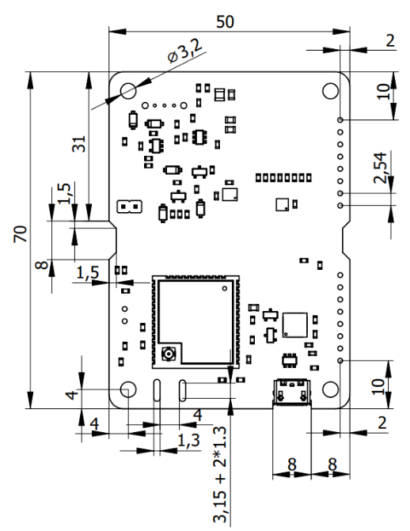

# Mechanikai tervezés

## PCB méretek

A CanSat NeXT fő panel egy 70 x 50 x 1.6 mm-es PCB-re épül, az elektronika a felső oldalon, az akkumulátor pedig az alsó oldalon található. A PCB minden sarkában rögzítési pontok vannak, 4 mm-re az oldalaktól. A rögzítési pontok átmérője 3.2 mm, földelt pad területe 6.4 mm, és M3 csavarokhoz vagy távtartókhoz készültek. A pad terület elég nagy ahhoz, hogy egy M3 anyát is befogadjon. Ezenkívül a panel két trapéz alakú 8 x 1.5 mm-es kivágással rendelkezik az oldalakon, és egy komponensmentes területtel a felső oldalon a közepén, így egy kábelkötegelő vagy más extra támogatás hozzáadható az akkumulátorokhoz a repülési műveletekhez. Hasonlóképpen, két 8 x 1.3 mm-es nyílás található az MCU antenna csatlakozója mellett, így az antenna rögzíthető a panelhez egy kis kábelkötegelővel vagy zsinórral. Az USB csatlakozó kissé behúzott a panelbe, hogy megakadályozza a kiemelkedéseket. Egy kis kivágás került hozzáadásra, hogy bizonyos USB kábeleket befogadjon a behúzás ellenére. A kiterjesztési csatlakozók szabványos 0.1 inch (2.54 mm) női csatlakozók, és úgy vannak elhelyezve, hogy a rögzítő furat középpontja 2 mm-re legyen a panel hosszú szélétől. A rövid szélhez legközelebbi csatlakozó 10 mm-re van tőle. A PCB vastagsága 1.6 mm, és az akkumulátorok magassága a paneltől körülbelül 13.5 mm. A csatlakozók körülbelül 7.2 mm magasak. Ez a záró térfogat magasságát körülbelül 22.3 mm-re teszi. Továbbá, ha távtartókat használnak a kompatibilis panelek egymásra helyezéséhez, a távtartóknak, távtartóknak vagy más mechanikai rögzítő rendszernek legalább 7.5 mm-re kell elválasztania a paneleket. Szabványos tüskés csatlakozók használata esetén az ajánlott panel távolság 12 mm.

Az alábbiakban letölthet egy .step fájlt a perf-boardról, amely felhasználható a PCB CAD-tervezésbe való beillesztésére referenciaként, vagy akár kiindulópontként egy módosított panelhez.

[Step-fájl letöltése](/assets/3d-files/cansat.step)

## Egyedi PCB tervezése

Ha az elektronikai tervezést a következő szintre szeretné emelni, érdemes megfontolni egy egyedi PCB készítését az elektronikához. A KiCAD egy nagyszerű, ingyenes szoftver, amely használható PCB-k tervezésére, és a gyártásuk meglepően megfizethető.

Itt találhatóak források a KiCAD használatának megkezdéséhez: https://docs.kicad.org/#_getting_started

Itt található egy KiCAD sablon a saját CanSat kompatibilis áramköri lapjának elindításához: [KiCAD sablon letöltése](/assets/kicad/Breakout-template.zip)