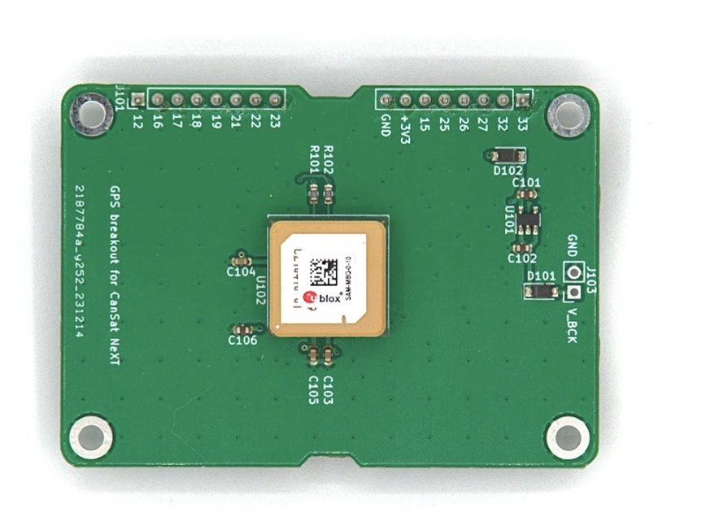
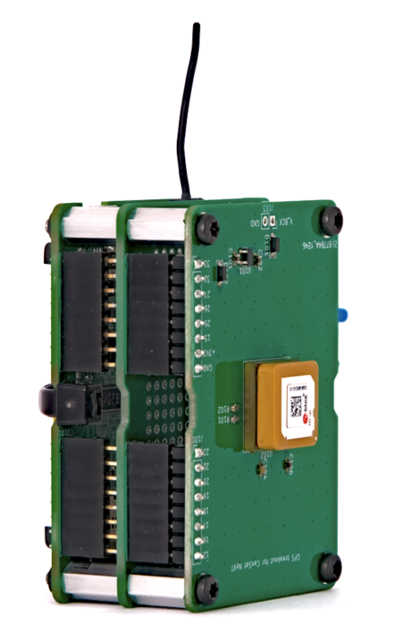

# CanSat NeXT GNSS-modul

CanSat NeXT GNSS-modulet udvider CanSat NeXT med positionssporing og præcise realtidsur-funktioner. Modulet er baseret på U-Blox SAM-M10Q GNSS-modtageren fra U-Blox.

## Hardware

Modulet forbinder GNSS-modtageren til CanSat NeXT via UART i udvidelsesheaderen. Enheden bruger udvidelsesheaderens ben 16 og 17 til UART RX og TX og tager også strømforsyningen fra +3V3-linjen i udvidelsesheaderen.

Som standard forsynes GNSS-modulets backup-registre fra +3V3-linjen. Selvom dette gør modulet nemt at bruge, betyder det, at modulet altid skal starte helt forfra, når det forsøger at finde et fix. For at afhjælpe dette er det muligt at levere en ekstern strømkilde via backup-spændingslinjen gennem J103-headers. Spændingen, der leveres til V_BCK-ben, skal være 2-6,5 volt, og strømforbruget er konstant 65 mikroampere, selv når hovedstrømmen er slukket. Tilførsel af backup-spænding gør det muligt for GNSS-modtageren at bevare alle indstillinger, men også – afgørende – almanak- og efemeridedata, hvilket reducerer tiden til at opnå fix fra ~30 sekunder til 1-2 sekunder, hvis enheden ikke har flyttet sig væsentligt mellem strømafbrydelser.

Der findes mange andre GNSS-breakouts og -moduler fra virksomheder som blandt andre Sparkfun og Adafruit. Disse kan forbindes til CanSat NeXT via den samme UART-grænseflade eller ved brug af SPI og I2C, afhængigt af modulet. CanSat NeXT-biblioteket bør også understøtte andre breakouts, der bruger U-blox-moduler. Når du leder efter GNSS-breakouts, så prøv at finde en, hvor basis-PCB’en er så stor som muligt – de fleste har for små PCB’er, hvilket gør deres antenneydelse meget svag sammenlignet med moduler med større PCB’er. Enhver størrelse mindre end 50x50 mm vil begynde at hæmme ydeevnen og evnen til at finde og opretholde et fix.

For mere information om GNSS-modulet og det store antal indstillinger og funktioner, der er tilgængelige, se databladet for GNSS-modtageren på [U-Blox’ website](https://www.u-blox.com/en/product/sam-m10q-module).

Hardwareintegrationen af modulet til CanSat NeXT er virkelig enkel – efter montering af afstandsstykker i skruehullerne indsættes header-benene forsigtigt i ben-soklerne. Hvis du har til hensigt at lave en flerlaget elektronisk stak, skal du sørge for at placere GNSS som det øverste modul for at tillade 

## Software

Den nemmeste måde at komme i gang med at bruge CanSat NeXT GNSS på er med vores egen Arduino-bibliotek, som du kan finde i Arduino Library Manager. For instruktioner i, hvordan du installerer biblioteket, henvises til siden [kom godt i gang](./../course/lesson1.md).

Biblioteket indeholder eksempler på, hvordan man læser position og aktuel tid, samt hvordan man transmitterer dataene med CanSat NeXT.

En hurtig bemærkning om indstillingerne – modulet skal have at vide, hvilken type miljø det vil blive brugt i, så det bedst kan approximere brugerens position. Typisk er antagelsen, at brugeren vil være ved jordniveau, og selvom de kan være i bevægelse, er accelerationen sandsynligvis ikke særlig høj. Dette er naturligvis ikke tilfældet med CanSats, som kan blive opsendt med raketter eller ramme jorden med ret høje hastigheder. Derfor sætter biblioteket som standard positionen til at blive beregnet under antagelse af et høj-dynamisk miljø, hvilket gør det muligt at opretholde fix i det mindste nogenlunde under hurtig acceleration, men det gør også positionen på jorden mærkbart mindre præcis. Hvis høj nøjagtighed efter landing i stedet er mere ønskelig, kan du initialisere GNSS-modulet med kommandoen `GNSS_init(DYNAMIC_MODEL_GROUND)`, som erstatter standarden `GNSS_init(DYNAMIC_MODEL_ROCKET)` = `GNSS_init()`. Derudover findes `DYNAMIC_MODEL_AIRBORNE`, som er en smule mere præcis end raketmodellen, men antager kun beskeden acceleration.

Dette bibliotek prioriterer brugervenlighed og har kun grundlæggende funktionaliteter såsom at hente position og tid fra GNSS. For brugere, der søger mere avancerede GNSS-funktioner, kan det fremragende SparkFun_u-blox_GNSS_Arduino_Library være et bedre valg.

## Biblioteksspecifikation

Her er de tilgængelige kommandoer fra CanSat GNSS-biblioteket.

### GNSS_Init

| Function             | uint8_t GNSS_Init(uint8_t dynamic_model)                          |
|----------------------|--------------------------------------------------------------------|
| **Return Type**      | `uint8_t`                                                          |
| **Return Value**     | Returnerer 1 hvis initialiseringen var vellykket, eller 0 hvis der opstod en fejl. |
| **Parameters**       |                                                                    |
|                      | `uint8_t dynamic_model`                                           |
|                      | Dette vælger den dynamiske model, eller det miljø GNSS-modulet antager. Mulige valg er DYNAMIC_MODEL_GROUND, DYNAMIC_MODEL_AIRBORNE og DYNAMIC_MODEL_ROCKET. |
| **Description**      | Denne kommando initialiserer GNSS-modulet, og du bør kalde denne i setup-funktionen. |

### readPosition

| Function             | uint8_t readPosition(float &x, float &y, float &z)          |
|----------------------|--------------------------------------------------------------------|
| **Return Type**      | `uint8_t`                                                          |
| **Return Value**     | Returnerer 0 hvis målingen var vellykket.                           |
| **Parameters**       |                                                                    |
|                      | `float &latitude, float &longitude, float &altitude`                                    |
|                      | `float &x`: Adresse på en float-variabel, hvor dataene vil blive gemt. |
| **Used in example sketch** | Alle                                                  |
| **Description**      | Denne funktion kan bruges til at læse enhedens position som koordinater. Værdierne vil være semi-tilfældige, før fix er opnået. Højden er meter over havniveau, selvom den ikke er særlig præcis. |

### getSIV

| Function             | uint8_t getSIV()                  |
|----------------------|--------------------------------------------------------------------|
| **Return Type**      | `uint8_t`                                                          |
| **Return Value**     | Antal satellitter i sigte |
| **Used in example sketch** | AdditionalFunctions                                          |
| **Description**      | Returnerer antallet af satellitter i sigte. Typisk indikerer værdier under 3 intet fix. |

### getTime

| Function             | uint32_t getTime()                  |
|----------------------|--------------------------------------------------------------------|
| **Return Type**      | `uint32_t`                                                          |
| **Return Value**     | Aktuel Epoch-tid |
| **Used in example sketch** | AdditionalFunctions                                          |
| **Description**      | Returnerer den aktuelle epoch-tid, som angivet af signalerne fra GNSS-satellitter. Med andre ord er dette antallet af sekunder, der er gået siden 00:00:00 UTC, torsdag den første januar 1970. |