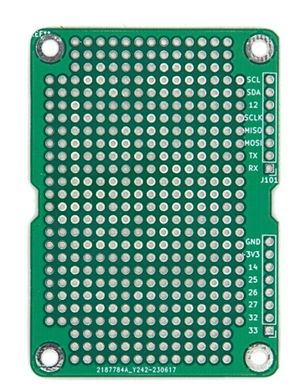

import perfboard_render from './img/perf_render.png';

# CanSat NeXT Perf Board

CanSat NeXT Perf Board er et tilbehør, der er beregnet til at gøre integrationen af eksterne enheder med CanSat nemmere, og til at gøre din egen elektronik mekanisk mere sikker og bedre organiseret. Det er i bund og grund et perf board, som deler formen med CanSat NeXT-boardet, og som også giver nem tilslutning til extension pin header.

Perf boardets vigtigste funktion er gennempletterede huller, placeret med 0,1 tomme (2,54 mm) mellemrum, hvilket er den standard-**pitch**, der bruges i elektronik, især i hobbyelektronik. Dette gør integrationen af de fleste kommercielle breakout-boards og mange kommercielle IC'er ekstremt nem, da de kan loddes direkte på kontakterne på perf boardet.

På oversiden har hullerne en lille pletteret ring for at hjælpe med forbindelser, men på undersiden er der store pletterede rektangler, som gør det meget lettere at lave loddebroer mellem felterne, hvilket hjælper med at skabe elektrisk forbindelse mellem enhederne på dit board og mellem de tilføjede enheder og CanSat NeXT.

Derudover er nogle af de gennempletterede huller tættest på headeren allerede forbundet til extension pin headers. Dette hjælper dig med at undgå at skulle tilføje kabler mellem pin headeren og hovedområdet på perf boardet, og hjælper også med at stable flere perf boards oven på hinanden, især når du bruger [stacking pin headers](https://spacelabnextdoor.com/electronics/32-cansat-next-stacking-header). For at tjekke hvilken extension pin der gør hvad, henvises der til [Pinout](../CanSat-hardware/pin_out.md)

