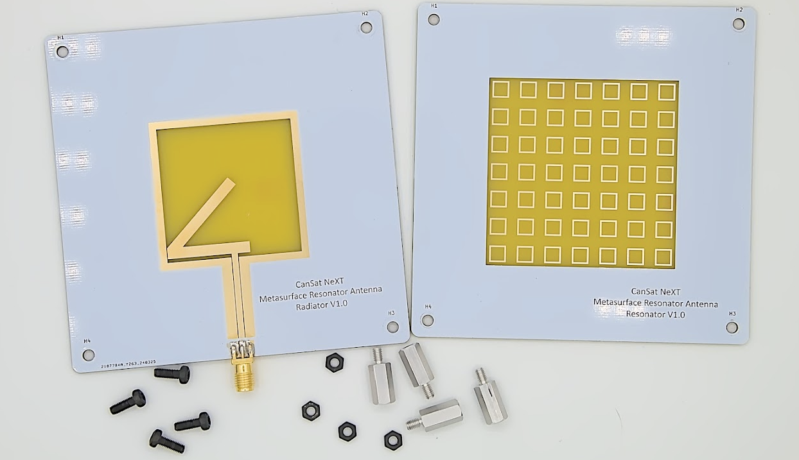
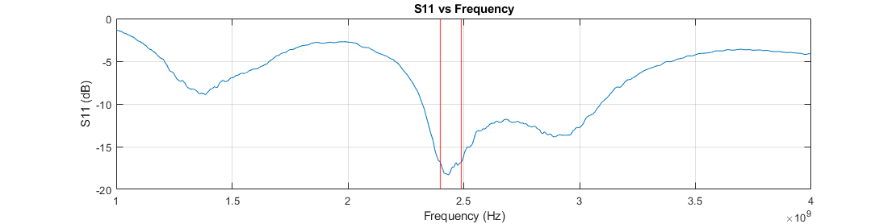

# Metasurface-resonatorantenne

CanSat NeXT Metasurface Resonator Antenna er et eksternt antennemodul, som kan bruges på jordstationssiden til at øge kommunikationsrækkevidden og også gøre kommunikationen mere pålidelig.

[Kit-antennen](./../CanSat-hardware/communication#quarter-wave-antenna) til CanSat NeXT er blevet brugt til med succes at gennemføre CanSat-missioner, hvor CanSat’en blev opsendt til en højde på 1 kilometer. Ved disse afstande begynder monopolsantennen dog at være på grænsen af det operationelle område og kan også nogle gange miste signalet på grund af polarisationsfejl, der opstår fra den lineære polarisering af monopolsantennen. Metasurface-resonatorantenne-kittet er designet til at muliggøre mere pålidelig drift under denne type ekstreme forhold og også muliggøre drift med betydeligt længere rækkevidder.

Metasurface-resonatorantennen består af to printkort. Hovedantennen er på radiatorprintet, hvor en slot-type antenne er ætset ind i PCB’et. Dette printkort alene giver omtrent 3 dBi gain og har [cirkulær polarisering](https://en.wikipedia.org/wiki/Circular_polarization), hvilket i praksis betyder, at signalstyrken ikke længere er afhængig af orienteringen af satellitantennen. Dette printkort kan derfor bruges som en antenne i sig selv, hvis en bredere *beam width* er ønskelig.

Det andet printkort, som antennen har sit navn fra, er den særlige funktion ved dette antennekit. Det skal placeres 10-15 mm fra det første printkort, og det har et array af resonatorelementer. Elementerne energiseres af slot-antennen under dem, og dette gør til gengæld antennen mere *direktiv*. Med denne tilføjelse fordobles gain til 6 dBi.

Billedet nedenfor viser antennens *reflektionskoefficient* målt med en vektornetværksanalysator (VNA). Plottet viser de frekvenser, hvor antennen er i stand til at transmittere energi. Selvom antennen har ret god wideband-ydeevne, viser plottet et godt impedanstilpasning i det operationelle frekvensområde 2400-2490 MHz. Dette betyder, at ved disse frekvenser transmitteres det meste af effekten som radiobølger i stedet for at blive reflekteret tilbage. De laveste reflektionsværdier i midten af båndet er omkring -18.2 dB, hvilket betyder, at kun 1.51 % af effekten blev reflekteret tilbage fra antennen. Selvom det er mere vanskeligt at måle, tyder simulationer på, at yderligere 3 % af transmissionseffekten omdannes til varme i selve antennen, men de øvrige 95.5 % - antennens strålingseffektivitet - udsendes som elektromagnetisk stråling.

Som nævnt før er antennens gain omkring 6 dBi. Dette kan øges yderligere ved brug af en *reflektor* bag antennen, som reflekterer radiobølgerne tilbage ind i antennen og forbedrer direktiviteten. Selvom en parabolsk skive ville være en ideel reflektor, kan selv blot et fladt metalplan være meget nyttigt til at øge antennens ydeevne. Ifølge simulationer og felttests øger et metalplan - såsom et stykke stålplade - placeret 50-60 mm bag antennen gain til omtrent 10 dBi. Metalplanet bør være mindst 200 x 200 mm i størrelse - større planer bør være bedre, men kun marginalt. Det bør dog ikke være meget mindre end dette. Planet bør ideelt set være massivt metal, såsom en stålplade, men selv et trådnet vil fungere, så længe hullerne er mindre end 1/10 bølgelængde (~1.2 cm) i størrelse.