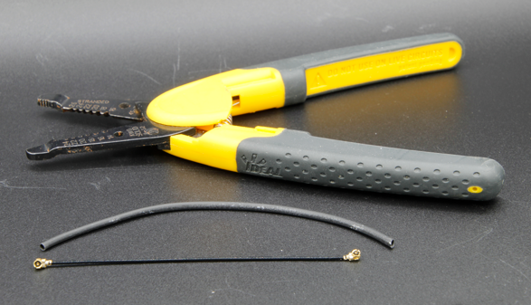
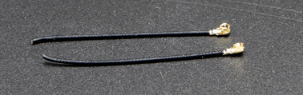
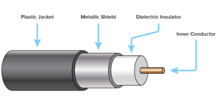
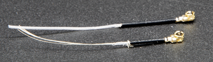
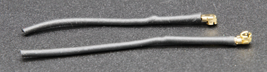

# Kommunikation og antenner

Denne artikel introducerer de nøglebegreber, der er nødvendige for trådløs datatransmission med CanSat NeXT. Først gennemgås kommunikationssystemet på et generelt niveau, derefter præsenteres nogle forskellige muligheder for antennevalg ved brug af CanSat NeXT. Til sidst præsenterer den sidste del af artiklen en simpel vejledning til at bygge en kvartbølge-monopolantenne ud fra de dele, der følger med i kittet.

## Kom godt i gang

CanSat NeXT er næsten klar til at starte trådløs kommunikation direkte ud af kassen. Det eneste, der er nødvendigt, er den korrekte software samt en antenne til både senderen og modtageren. For det første henvises der til softwarematerialerne på denne side. For det sidste indeholder denne side instruktioner i, hvordan man vælger en ekstern antenne, og hvordan man konstruerer en simpel monopolantenne ud fra materialerne, der følger med CanSat NeXT.

Selvom boardet er ret robust over for den slags takket være softwarekontroller, bør du aldrig forsøge at sende noget fra en radio uden en antenne. Selvom det er usandsynligt på grund af de lave effekter i dette system, kan den reflekterede radiobølge forårsage reel skade på elektronikken.

## CanSat NeXT kommunikationssystem

CanSat NeXT håndterer den trådløse dataoverførsel lidt anderledes end de ældre CanSat-kits. I stedet for et separat radiomodul bruger CanSat NeXT MCU’ens integrerede WiFi-radio til kommunikationen. WiFi-radioen bruges normalt til at overføre data mellem en ESP32 og internettet, muliggøre brugen af ESP32 som en simpel server eller endda forbinde ESP32 til en bluetooth-enhed, men med nogle smarte TCP-IP-konfigurationstricks kan vi muliggøre direkte peer-to-peer-kommunikation mellem ESP32-enheder. Systemet hedder ESP-NOW, og det er udviklet og vedligeholdt af EspressIf, som er udviklerne af ESP32-hardware. Derudover findes der særlige lavhastighedskommunikationsskemaer, som ved at øge energien pr. bit i transmissionen markant øger den mulige rækkevidde for wifi-radioen ud over de sædvanlige få tiere meter. 

Datahastigheden for ESP-NOW er betydeligt hurtigere end det, der ville være muligt med den gamle radio. Selv ved blot at reducere tiden mellem pakker i eksempel-koden kan CanSat NeXT sende ~20 fulde pakker til GS på et sekund. Teoretisk kan datahastigheden være op til 250 kbit/s i long range mode, men dette kan være svært at opnå i softwaren. Når det er sagt, bør transmission af f.eks. hele billeder fra et kamera under flyvningen være fuldt ud mulig med korrekt software. 

Selv med simple kvartbølgelængde-monopolantenner (et 31 mm stykke ledning) i begge ender var CanSat NeXT i stand til at sende data til ground station fra 1,3 km afstand, hvor line of sight blev mistet. Ved test med en drone var rækkevidden begrænset til cirka 1 km. Det er muligt, at dronen forstyrrede radioen nok til at begrænse rækkevidden en smule. Med en bedre antenne kunne rækkevidden dog øges endnu mere. En lille yagi-antenne ville teoretisk have øget den operationelle rækkevidde 10 gange.

Der er et par praktiske detaljer, der adskiller sig fra det ældre radiokommunikationssystem. For det første sker “parring” af satellitter til ground station-modtagere via Media Access Control (MAC)-adresser, som sættes i koden. WiFi-systemet er smart nok til at håndtere timing-, kollisions- og frekvensproblemerne i baggrunden. Brugeren skal blot sikre, at GS lytter på den MAC-adresse, som satellitten sender med.
For det andet er radioens frekvens anderledes. WiFi-radioen opererer i 2,4 GHz-båndet (centerfrekvensen er 2,445 GHz), hvilket betyder, at både udbredelseskarakteristika og krav til antennedesign er anderledes end før. Signalet er noget mere følsomt over for regn og line-of-sight-problemer og kan i nogle tilfælde muligvis ikke transmittere, hvor det gamle system ville have virket. 

Bølgelængden af radiosignalet er også anderledes. Da

$$\lambda = \frac{c}{f} \approx \frac{3*10^8 \text{ m/s}}{2.445 * 10^9 \text {Hz}} = 0.12261 \text{ m,}$$

bør en kvartbølgelængde-monopolantenne have en længde på 0,03065 m eller 30,65 mm. Denne længde er også markeret på CanSat NeXT PCB’et for at gøre afkortning af kablet lidt nemmere. Antennen bør afkortes præcist, men inden for ~0,5 mm er stadig fint.

En kvartbølgeantenne har tilstrækkelig RF-ydeevne til CanSat-konkurrencerne. Når det er sagt, kan det være interessant for nogle brugere at få endnu bedre rækkevidde. Et muligt forbedringspunkt er længden af monopolantennen. I praksis ligger kvartbølge-resonansen måske ikke præcis ved den rigtige frekvens, da andre parametre såsom miljø, omkringliggende metalelementer eller den del af ledningen, der stadig er dækket af jordet metal, kan påvirke resonansen en smule. Antennen kunne tunes ved brug af en vector network analyzer (VNA). Jeg tror, jeg bør gøre dette på et tidspunkt og rette materialerne derefter. 

En mere robust løsning ville være at bruge en anden type antenne. Ved 2,4 GHz findes der masser af sjove antenneidéer på internettet. Disse inkluderer en helix-antenne, yagi-antenne, pringles-antenne og mange andre. Mange af disse vil, hvis de er godt konstrueret, nemt overgå den simple monopol. Selv blot en dipol ville være en forbedring i forhold til en simpel ledning.

Stikket, der bruges på de fleste ESP32-moduler, er et Hirose U.FL-stik. Dette er et miniature RF-stik af god kvalitet, som giver god RF-ydeevne for svage signaler. Et problem med dette stik er dog, at kablet er ret tyndt, hvilket gør det lidt upraktisk i nogle tilfælde. Det medfører også større RF-tab end ønsket, hvis kablet er langt, som det kan være ved brug af en ekstern antenne. I disse tilfælde kan et U.FL til SMA-adapterkabel bruges. Jeg vil undersøge, om vi kan tilbyde disse i vores webshop. Dette ville gøre det muligt for teams at bruge et mere velkendt SMA-stik. Når det er sagt, er det fuldt ud muligt at bygge gode antenner ved blot at bruge U.FL. 

I modsætning til SMA er U.FL dog mekanisk afhængig af snap-on fastholdelsesfunktioner for at holde stikket på plads. Dette er normalt tilstrækkeligt, men for ekstra sikkerhed er det en god idé at tilføje en strips for ekstra fastholdelse. CanSat NeXT PCB’et har slidser ved siden af antennestikket til at rumme en lille strips. Ideelt set tilføjes en 3d-printet eller på anden måde konstrueret støttebøsning til kablet før stripsen. En fil til den 3d-printede støtte er tilgængelig fra GitHub-siden.

## Antennemuligheder {#antenna-options}

En antenne er i bund og grund en enhed, der omdanner ikke-guidede elektromagnetiske bølger til guidede og omvendt. På grund af enhedens simple natur findes der et væld af muligheder at vælge imellem, når du skal vælge antenne til din enhed. Set fra et praktisk synspunkt er der stor frihed i antennevalget og en hel del ting at tage højde for. Du skal mindst overveje

1. Antennens driftsfrekvens (skal inkludere 2,45 GHz)
2. Antennens båndbredde (mindst 35 MHz)
3. Antennens impedans (50 ohm)
4. Stik (U.FL eller du kan bruge adaptere)
5. Fysisk størrelse (passer den i dåsen)
6. Pris
7. Fremstillingsmetoder, hvis du laver antennen selv.
8. Antennens polarisering.

Antennevalg kan virke overvældende, og det er det ofte, men i dette tilfælde bliver det meget lettere af, at vi faktisk bruger en Wi-Fi-radio – vi kan faktisk bruge næsten enhver 2,4 GHz Wi-Fi-antenne med systemet. De fleste af dem er dog for store, og de har også en tendens til at bruge stik, der hedder RP-SMA, snarere end U.FL. Med en passende adapter kan de dog være gode valg til brug med groundstation. Der findes endda retningsbestemte antenner, hvilket betyder, at du kan få ekstra gain for at forbedre radiolinket. 

Wi-Fi-antenner er et solidt valg, men de har én væsentlig ulempe – polarisering. De er næsten altid lineært polariserede, hvilket betyder, at signalstyrken varierer betydeligt afhængigt af orienteringen af senderen og modtageren. I værste fald kan antenner, der står vinkelret på hinanden, endda opleve, at signalet forsvinder helt. Derfor er en alternativ mulighed at bruge droneantenner, som har en tendens til at være cirkulært polariserede. I praksis betyder dette, at vi har nogle konstante polariseringstab, men de er mindre dramatiske. En anden smart løsning til at omgå polarisationsproblemet er at bruge to modtagere med antenner monteret vinkelret på hinanden. På den måde vil mindst én af dem altid have en passende orientering til at modtage signalet.

Selvfølgelig vil en ægte maker altid gerne lave sin egen antenne. Nogle interessante konstruktioner, der egner sig til DIY-fremstilling, inkluderer en helix-antenne, "pringles"-antenne, yagi, dipol eller en monopolantenne. Der findes mange instruktioner online til at bygge de fleste af disse. Den sidste del af denne artikel viser, hvordan du laver din egen monopolantenne, egnet til CanSat-konkurrencer, ud fra materialerne, der leveres med CanSat NeXT.

## Bygning af en kvartbølge-monopolantenne {#quarter-wave-antenna}

Denne del af artiklen beskriver, hvordan man bygger en rimeligt effektiv kvartbølge-monopolantenne ud fra materialerne, der følger med i kittet. Antennen kaldes sådan, fordi den kun har én pol (sammenlign med en dipol), og dens længde er en fjerdedel af den bølgelængde, vi transmitterer.

Ud over koaksialkablet og et stykke krympeflex skal du bruge en form for afisoleringstang og en bidetang. Næsten enhver type vil fungere. Derudover skal du bruge en varmekilde til krympeflexen, såsom en varmluftpistol, loddekolbe eller endda en lighter.

Start først med at klippe kablet cirka over på midten.

Dernæst bygger vi selve antennen. Denne del bør udføres så præcist som muligt. Inden for ca. 0,2 mm vil fungere fint, men prøv at komme så tæt på den korrekte længde som muligt, da det vil hjælpe på ydeevnen.

Et koaksialkabel består af fire dele – en centerleder, dielektrikum, skærm og en yderkappe. Normalt bruges disse kabler til at transmittere radiofrekvenssignaler mellem enheder, så strømme på centerlederen balanceres af dem i skærmen. Ved at fjerne skærmlederen vil strømme på den indre leder dog skabe en antenne. Længden af dette blotlagte område vil bestemme bølgelængden eller driftsfrekvensen for antennen, og vi ønsker nu, at den matcher vores driftsfrekvens på 2,445 GHz, så vi skal fjerne skærmen over en længde på 30,65 mm.

Afisoler forsigtigt yderkappen fra kablet. Ideelt set skal du forsøge kun at fjerne kappen og skærmen over den ønskede længde. At skære i isolatoren er dog ikke en katastrofe. Det er normalt lettere at fjerne yderkappen i dele frem for det hele på én gang. Desuden kan det være lettere først at fjerne for meget og derefter klippe den indre leder til den rigtige længde, frem for at forsøge at ramme helt præcist i første forsøg.

Billedet nedenfor viser de afisolerede kabler. Prøv at lave det som det øverste, men det nederste vil også fungere – det kan bare være mere følsomt over for fugt. Hvis der er løse stykker af skærmen tilbage, så klip dem forsigtigt af. Sørg for, at der ikke er nogen mulighed for, at den indre leder og skærmen rører hinanden – selv en enkelt tråd vil gøre antennen ubrugelig.

Antennen er nu fuldt funktionel på dette tidspunkt, men den kan være følsom over for fugt. Derfor vil vi nu tilføje en ny kappe til den, hvilket er det, krympeflexen er til. Klip to stykker, der er lidt længere end antennen, du har lavet, og placer det over antennen og brug en varmekilde til at krympe det på plads. Pas på ikke at brænde krympeflexen, især hvis du bruger noget andet end en varmluftpistol.

Herefter er antennerne klar. På groundstation-siden er antennen sandsynligvis fin som den er. På den anden side, selvom stikket er ret sikkert, er det en god idé at støtte stikket på en eller anden måde på CanSat-siden. En meget robust måde er at bruge en 3d-printet støtte og en strips, men mange andre metoder vil også fungere. Husk også at overveje, hvordan antennen skal placeres inde i dåsen. Ideelt set bør den være et sted, hvor transmissionen ikke blokeres af metaldele.

### Antennestøtte

Til sidst er her en step-fil af støtten vist på billedet. Du kan importere denne i det meste CAD-software og modificere den eller printe den med en 3d-printer.

[Download step-file](/assets/3d-files/uFl-support.step)