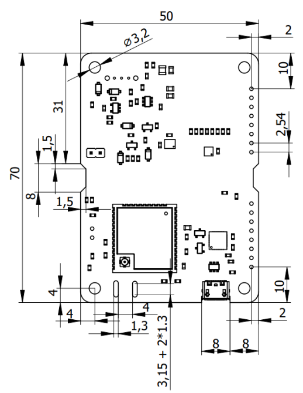

# Mekanisk design

## PCB-dimensioner

CanSat NeXT-hovedkortet er bygget på et 70 x 50 x 1,6 mm PCB, med elektronik på oversiden og batteri på undersiden. PCB'et har monteringspunkter i hvert hjørne, 4 mm fra siderne. Monteringspunkterne har en diameter på 3,2 mm med et jordet pad-område på 6,4 mm, og de er beregnet til M3-skruer eller afstandsstykker. Pad-området er også stort nok til at rumme en M3-møtrik. Derudover har kortet to trapezformede 8 x 1,5 mm udskæringer på siderne og et komponentfrit område på oversiden i midten, så der kan tilføjes en strips eller anden ekstra støtte til batterierne til flyveoperationer. Tilsvarende kan der findes to 8 x 1,3 mm slidser ved siden af MCU-antenneforbindelsen, så antennen kan fastgøres til kortet med en lille strips eller et stykke snor. USB-stikket er trukket en smule ind i kortet for at forhindre eventuelle udstikkere. Der er tilføjet en lille udskæring for at kunne rumme visse USB-kabler på trods af indtrækningen. Udvidelsesheaderne er standard 0,1 tomme (2,54 mm) hun-headers, og de er placeret, så centrum af monteringshullet er 2 mm fra kortets lange kant. Headeren tættest på den korte kant er 10 mm fra den. PCB'ets tykkelse er 1,6 mm, og batteriernes højde fra kortet er cirka 13,5 mm. Headerne er cirka 7,2 mm høje. Dette gør højden af det omsluttende volumen cirka 22,3 mm. Desuden, hvis afstandsstykker bruges til at stable kompatible kort sammen, bør afstandsstykker, spacere eller andet mekanisk monteringssystem adskille kortene med mindst 7,5 mm. Ved brug af standard pin-headers er den anbefalede kortadskillelse 12 mm.

Nedenfor kan du downloade en .step-fil af perf-boardet, som kan bruges til at tilføje PCB'et i et CAD-design som reference, eller endda som et udgangspunkt for et modificeret kort.

[Download step-file](/assets/3d-files/cansat.step)

## Design af et brugerdefineret PCB {#custom-PCB}

Hvis du vil tage dit elektronikdesign til næste niveau, bør du overveje at lave et brugerdefineret PCB til elektronikken. KiCAD er et fantastisk, gratis software, der kan bruges til at designe PCB'er, og at få dem fremstillet er overraskende overkommeligt.

Her er ressourcer til at komme i gang med KiCAD: https://docs.kicad.org/#_getting_started

Her er en KiCAD-skabelon til at starte dit eget CanSat-kompatible kredsløbskort: [Download KiCAD template](/assets/kicad/Breakout-template.zip)