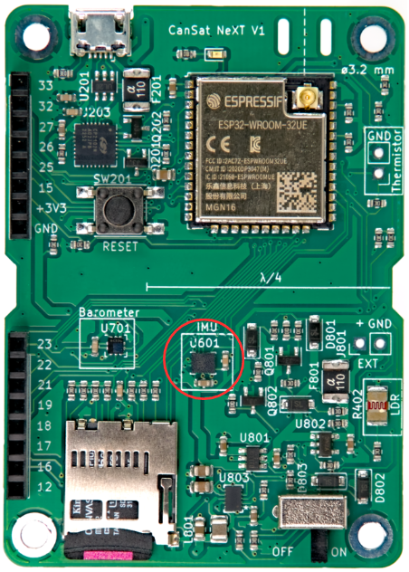
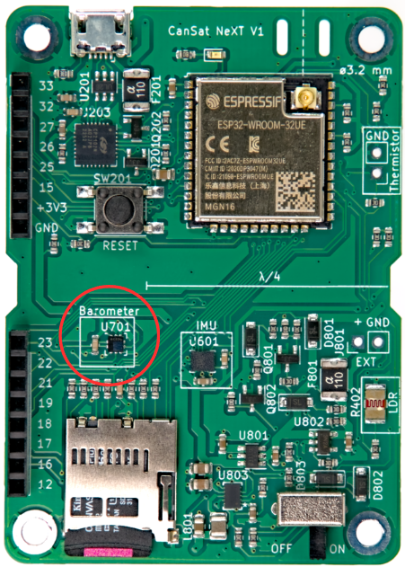
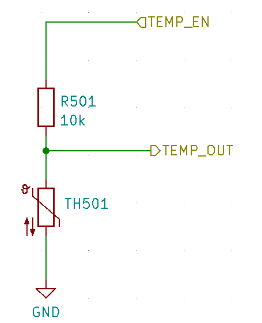
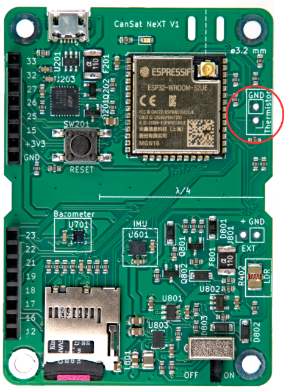

# Indbyggede sensorer

Denne artikel introducerer de sensorer, der er integreret på CanSat NeXT-hovedprintet. Brugen af sensorerne er dækket i softwaredokumentationen, mens denne artikel giver mere information om selve sensorerne.

Der er tre indbyggede sensorer på CanSat NeXT-hovedprintet. Disse er IMU’en LSM6DS3, tryksensoren LPS22HB og LDR’en. Derudover har printet en gennemføringshul-slot til tilføjelse af en ekstern termistor. Da LPS22HB allerede har både tryk- og temperaturmåleegenskaber, er den teoretisk set tilstrækkelig til at opfylde de primære missionskriterier i CanSat-konkurrencerne alene. Men da den måler den interne junction-temperatur, eller grundlæggende temperaturen på PCB’et på det sted, er det i de fleste konfigurationer ikke en god måling af atmosfærisk temperatur. Derudover kan den absolutte måling fra tryksensoren understøttes af de ekstra data fra IMU’ens accelerometer. LDR’en er først og fremmest tilføjet for at hjælpe elever med at lære begreberne omkring analoge sensorer, da responsen på stimuli er næsten øjeblikkelig, mens en termistor tager tid om at varme op og køle ned. Når det er sagt, kan den også understøtte de kreative missioner, som eleverne finder på, ligesom IMU’ens accelerometer og gyroskop. Desuden opfordrer CanSat NeXT, ud over den indbyggede sensor, til brug af yderligere sensorer via udvidelsesinterfacet.

## Inertimåleenhed {#IMU}

IMU’en, LSM6DS3 fra STMicroelectronics, er en SiP (system-in-package)-type MEMS-sensorenhed, der integrerer et accelerometer, et gyroskop og aflæsningselektronikken i en lille pakke. Sensoren understøtter SPI- og I2C-serielle interfaces og inkluderer også en intern temperatursensor. 

LSM6DS3 har omskiftelige accelerationsmåleområder på ±2/±4/±8/±16 G og vinkelhastighedsmåleområder på ±125/±250/±500/±1000/±2000 deg/s. Brug af et højere område reducerer også enhedens opløsning.

I CanSat NeXT bruges LSM6DS3 i I2C-tilstand. I2C-adressen er 1101010b (0x6A), men den næste version vil tilføje understøttelse af at modificere hardwaren for at ændre adressen til 1101011b (0x6B), hvis en avanceret bruger har behov for at bruge den oprindelige adresse til noget andet.

Måleområderne vil som standard blive sat til maksimum i biblioteket for at indfange mest mulig data fra den voldsomme raketopsendelse. Dataområderne kan også ændres af brugeren.

## Barometer {#barometer}

Tryksensoren LPS22HB fra STMicroelectronics er en anden SiP MEMS-enhed, designet til måling af tryk fra 260-1260 hPa. Det område, den rapporterer data i, er betydeligt større, men nøjagtigheden af målinger uden for dette område er tvivlsom. MEMS-tryksensorer fungerer ved at måle piezoresistive ændringer i sensormembranen. Da temperatur også påvirker modstanden i piezoelementet, skal det kompenseres. For at muliggøre dette har chippen også en relativt nøjagtig junction-temperatursensor lige ved siden af det piezoresistive element. Denne temperaturmåling kan også læses fra sensoren, men man skal huske, at det er en måling af den interne chiptemperatur, ikke af den omgivende luft.

Ligesom IMU’en kan LPS22HB også kommunikeres med ved hjælp af enten SPI- eller I2C-interface. I CanSat NeXT er den forbundet til det samme I2C-interface som IMU’en. I2C-adressen for LPS22HB er 1011100b (0x5C), men vi vil tilføje understøttelse for at ændre den til 0x5D, hvis det ønskes.

## Analog til digital-konverter

Dette henviser til spændingsmålingen ved brug af analogRead() kommandoen.

Den 12-bit analog-til-digital-konverter (ADC) i ESP32 er notorisk ikke-lineær. Dette betyder ikke noget for de fleste anvendelser, såsom at bruge den til at detektere temperaturændringer eller ændringer i LDR-modstand, men at lave absolutte målinger af batterispænding eller NTC-modstand kan være lidt vanskeligt. En måde at omgå dette på er omhyggelig kalibrering, som f.eks. ville give tilstrækkeligt nøjagtige data for temperaturen. CanSat-biblioteket tilbyder dog også en kalibreret korrektionsfunktion. Funktionen implementerer en tredjeordens polynomiekorrektion for ADC’en, der korrelerer ADC-aflæsningen med den faktiske spænding, der er til stede på ADC-pinnen. Korrektionsfunktionen er

$$V = -1.907217e \times 10^{-11} \times a^3 + 8.368612 \times 10^{-8} \times a^2 + 7.081732e \times 10^{-4} \times a + 0.1572375$$

Hvor V er den målte spænding, og a er 12-bit ADC-aflæsningen fra analogRead(). Funktionen er inkluderet i biblioteket og kaldes adcToVoltage. Brug af denne formel gør ADC-aflæsningsfejlen mindre end 1% inden for et spændingsområde på 0.1 V - 3.2 V.

## Lysafhængig modstand

CanSat NeXT-hovedprintet indeholder også en LDR i sensorsættet. LDR’en er en særlig type modstand, idet modstanden varierer med belysning. De præcise karakteristika kan variere, men med den LDR, vi bruger i øjeblikket, er modstanden 5-10 kΩ ved 10 lux og 300 kΩ i mørke.

Måden dette bruges på i CanSat NeXT er, at en spænding på 3.3 V påføres en sammenligningsmodstand fra MCU’en. Dette medfører, at spændingen ved LDR_OUT bliver

$$V_{LDR} = V_{EN} \frac{R402}{R401+R402} $$.

Og når R402-modstanden ændrer sig, vil spændingen ved LDR_OUT også ændre sig. Denne spænding kan læses med ESP32 ADC’en og derefter korreleres til LDR’ens modstand. I praksis er vi dog normalt interesserede i ændringen snarere end den absolutte værdi med LDR’er. For eksempel er det ofte tilstrækkeligt at detektere en stor ændring i spændingen, når enheden udsættes for lys efter at være blevet udsendt fra raketten, for eksempel. Tærskelværdierne sættes normalt eksperimentelt snarere end beregnes analytisk. Bemærk, at i CanSat NeXT skal du aktivere de analoge indbyggede sensorer ved at skrive MEAS_EN pin HIGH. Dette er vist i eksempelkoderne.

## Termistor

Kredsløbet, der bruges til at læse den eksterne termistor, er meget lig LDR-aflæsningskredsløbet. Præcis den samme logik gælder: når en spænding påføres sammenligningsmodstanden, ændrer spændingen ved TEMP_OUT sig i henhold til

$$V_{TEMP} = V_{EN} \frac{TH501}{TH501+R501} $$.

I dette tilfælde er vi dog normalt interesserede i den absolutte værdi af termistorens modstand. Derfor er VoltageConversion nyttig, da den lineariserer ADC-aflæsningerne og også beregner V_temp direkte. På denne måde kan brugeren beregne termistorens modstand i koden. Værdien bør stadig korreleres med temperatur ved hjælp af målinger, selvom termistorens datablad også kan indeholde nogle spor til, hvordan man beregner temperaturen ud fra modstanden. Bemærk, at hvis du gør alt analytisk, bør du også tage højde for modstandsvariationen for R501. Dette gøres lettest ved at måle modstanden med et multimeter i stedet for at antage, at den er 10 000 ohm.

Sammenligningsmodstanden på PCB’et er relativt stabil over et temperaturområde, men den ændrer sig også en smule. Hvis der ønskes meget nøjagtige temperaturaflæsninger, bør dette kompenseres for. Junction-temperaturmålingen fra tryksensoren kan bruges til dette. Når det er sagt, er det bestemt ikke påkrævet til CanSat-konkurrencer. For dem, der er interesserede, rapporterer producenten, at den termiske koefficient for R501 er 100 PPM/°C.

Mens barometerets temperatur for det meste afspejler temperaturen på selve printet, kan termistoren monteres, så den reagerer på temperaturændringer uden for printet, endda uden for dåsen. Du kan også tilføje ledninger for at få den endnu længere væk. Hvis den skal bruges, kan termistoren loddes på det passende sted på CanSat NeXT-printet. Polariseringen er ligegyldig, dvs. den kan monteres begge veje.

