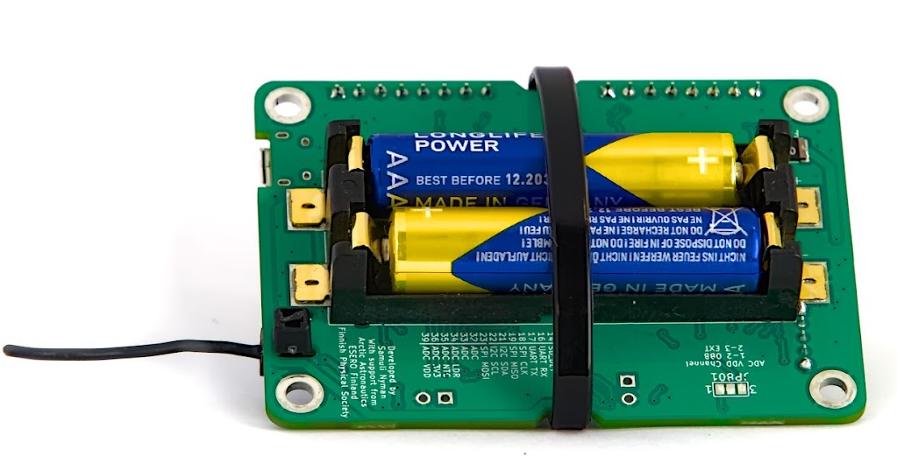
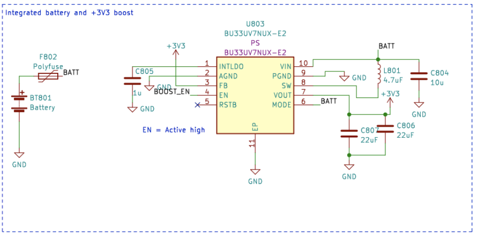
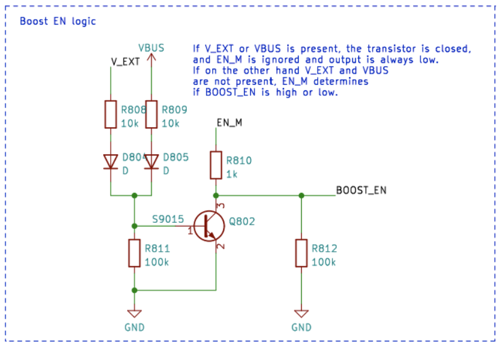
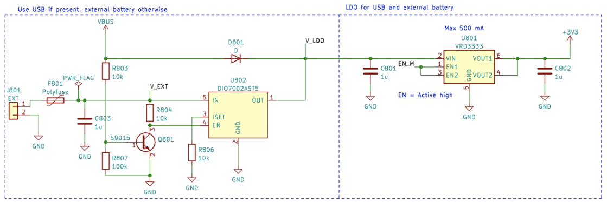
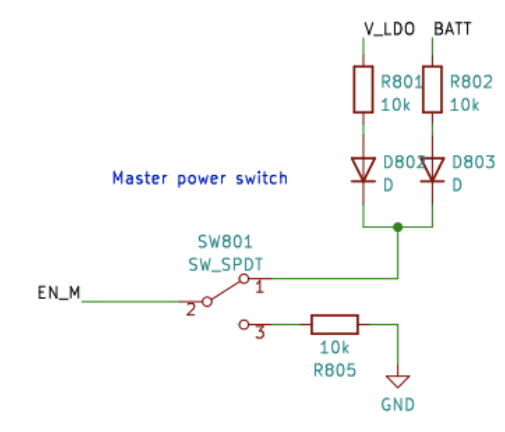
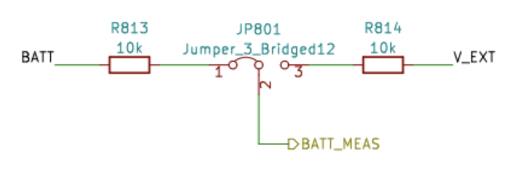

# Elektrisk strømstyring

Denne artikel forklarer, hvordan man tænder CanSat NeXT-boardet, hvordan man sikkert tilslutter eksterne enheder til boardet, og til sidst hvordan strømsystemet fungerer.

## Kom godt i gang

For de fleste brugere er det ofte nok blot at indsætte to AAA-batterier i den indbyggede batteriholder og fastgøre dem på plads. Når USB tilsluttes, skifter CanSat NeXT automatisk til at bruge USB-strøm i stedet for batterierne, så batterilevetiden forlænges. Husk at skifte til friske batterier før en flyvning.

## CanSat NeXT strømsystem

Der er tre måder at forsyne CanSat NeXT med strøm på. Standardmåden er at forsyne den via USB, så når brugeren udvikler softwaren, forsyner pc’en enheden, og der kræves ingen ekstern strøm. Den anden måde er at bruge de indbyggede batterier (OBB). Dette gøres ved at indsætte to standard 1,5 V AAA-batterier i batteristikforbindelsen på undersiden af hovedboardet. USB er stadig standardmåden, selv hvis batterier er isat, dvs. batterikapaciteten bruges ikke, når USB er tilsluttet.

Dette er de sædvanlige muligheder og bør dække de fleste anvendelser. Derudover findes der dog to “avancerede” muligheder for at forsyne CanSat NeXT med strøm, hvis det er nødvendigt til et særligt formål. For det første har boardet tomme gennemhul-headers mærket EXT, som kan bruges til at tilslutte et eksternt batteri. Batterispændingen kan være 3,2-6V. EXT-linjen frakobles automatisk, når USB ikke er til stede, for at forlænge batterilevetiden og for at beskytte batteriet. Der er en sikkerhedsfunktion, der deaktiverer OBB, hvis et batteri er tilsluttet, men OBB bør stadig ikke være til stede, når eksterne batterier bruges.

Der er også en sidste mulighed, som giver alt ansvar til brugeren, og det er at tilføre 3V3 til enheden gennem udvidelsesinterfacet. Dette er ikke en sikker måde at forsyne enheden med strøm på, men avancerede brugere, der ved, hvad de laver, kan finde dette som den nemmeste måde at opnå de ønskede funktionaliteter på.

Sammenfattende er der tre sikre måder at forsyne CanSat NeXT med strøm på:

1. Brug af USB - hovedmetode brugt til udvikling
2. Brug af indbyggede batterier - anbefalet metode til flyvning
3. Brug af et eksternt batteri - for avancerede brugere

Ved brug af almindelige AAA-batterier blev der opnået en batterilevetid på 4 timer ved stuetemperatur og 50 minutter ved -40 grader celsius. Under testen aflæste enheden alle sensorer og transmitterede deres data 10 gange i sekundet. Det skal bemærkes, at almindelige alkaliske batterier ikke er designet til at fungere ved så lave temperaturer, og de begynder typisk at lække kalium efter denne slags torturtests. Dette er ikke farligt, men de alkaliske batterier bør altid bortskaffes sikkert bagefter, især hvis de blev brugt i et usædvanligt miljø såsom ekstrem kulde eller efter at være blevet droppet fra en raket. Eller begge dele.

Ved brug af USB bør strømtrækket fra udvidelsespindene ikke overstige 300 mA. OBB er en smule mere tilgivende og giver højst 800 mA fra udvidelsespindene. Hvis der kræves mere strøm, bør et eksternt batteri overvejes. Dette er sandsynligvis ikke tilfældet, medmindre du f.eks. kører motorer (små servoer er fine) eller varmelegemer. Små kameraer osv. er stadig fine.

## Ekstra - hvordan det adaptive multi-kilde strømskema fungerer

For at opnå de ønskede funktionaliteter sikkert, skal vi tage højde for en hel del ting i designet af strømsystemet. For det første, for sikkert at kunne tilslutte USB, EXT og OBB på samme tid, skal strømsystemet kunne tænde og slukke for de forskellige strømkilder. Dette kompliceres yderligere af, at det ikke kan gøres i software, da brugeren skal kunne have hvilken som helst software, de ønsker, uden at bringe sikker drift i fare. Desuden har OBB et ganske anderledes spændingsområde end USB og det eksterne batteri. Dette nødvendiggør, at OBB bruger en boost-regulator, mens USB og EXT kræver enten en buck-regulator eller en LDO. For enkelhed og pålidelighed bruges en LDO på den linje. Endelig skal én strømafbryder kunne frakoble alle strømkilder.

Nedenfor er skemaet for boost-konverteren. IC’en er BU33UV7NUX, en boost-konverter specifikt designet til at give +3,3V fra to alkaliske batterier. Den aktiveres, når BOOST_EN-linjen er høj, eller over 0,6 V.

Alle OBB-, USB- og EXT-linjer er beskyttet med en sikring, overstrømsbeskyttelse, beskyttelse mod omvendt spænding og strøm samt overtemperaturbeskyttelse. Derudover er OBB beskyttet med undervoltage lock out og kortslutningsbeskyttelse, da disse situationer bør undgås med alkaliske batterier.

Bemærk i det følgende afsnit, at ekstern batterispænding er V_EXT, USB-spænding er VBUS, og OBB-spænding er BATT.

BOOST_EN-linjen styres af et switch-kredsløb, som enten tager input fra EN_MASTER (EN_M)-linjen, eller ignorerer dette, hvis V_EXT eller VBUS er til stede. Dette er lavet for at sikre, at boost altid er slukket, når VBUS og V_EXT er til stede, og at den kun aktiveres, hvis både VBUS og V_EXT er 0V, og EN_M er høj.

Eller som en sandhedstabel:

| V_EXT | VBUS | EN_M | BOOST_EN |
|-------|------|------|----------|
| 1     | 1    | 1    | 0        |
| 1     | 1    | 0    | 0        |
| 0     | 0    | 0    | 0        |
| 0     | 0    | 1    | 1        |

Så BOOST_EN = EN_M ∧ !(V_EXT ∨ V_BUS). 
 
Dernæst skal vi frakoble V_EXT, hvis VBUS er til stede, for at forhindre uønsket afladning eller utilsigtet opladning. Dette gøres ved hjælp af en power switch-IC med hjælp fra et transistor-kredsløb, som trækker enable-linjen på power switch’en ned, hvis VBUS er til stede. Dette frakobler batteriet. USB-linjen bruges altid, når den er til stede, så den føres til LDO’en med en simpel schottky-diode.

Samlet set fører dette kredsløb til en funktionalitet, hvor USB-strøm bruges, hvis den er til stede, og V_EXT bruges, når USB ikke er til stede. Til sidst bruges EN_M til at aktivere eller deaktivere LDO’en.

EN_M styres af brugeren via en strømafbryder. Afbryderen forbinder EN_M til enten USB eller EXT, eller batterispændingen når kun OBB bruges. Når afbryderen slås fra, forbinder den EN_M til jord, hvilket slukker både LDO’en og boost-regulatoren.

Så i praksis tænder/slukker strømafbryderen enheden, USB bruges hvis til stede, og V_EXT foretrækkes frem for OBB. Endelig er der endnu en detalje at overveje. Hvilken spænding skal ESP32 måle som batterispændingen?

Dette blev løst på en enkel måde. Spændingen, der er forbundet til ESP32 ADC, er altid OBB, men brugeren kan i stedet vælge V_EXT ved at skære jumperen over med en skalpel og lodde jumperen JP801, så den kortslutter 2-3 i stedet. Dette vælger V_EXT til BATT_MEAS i stedet.

Jumperen kan findes på undersiden af CanSat NeXT-hovedboardet. Jumperen er ret nem at lodde, så vær ikke bange for at skære 1-2-linjen, hvis du bruger et eksternt batteri. Den kan altid loddes igen for at bruge 1-2 i stedet.