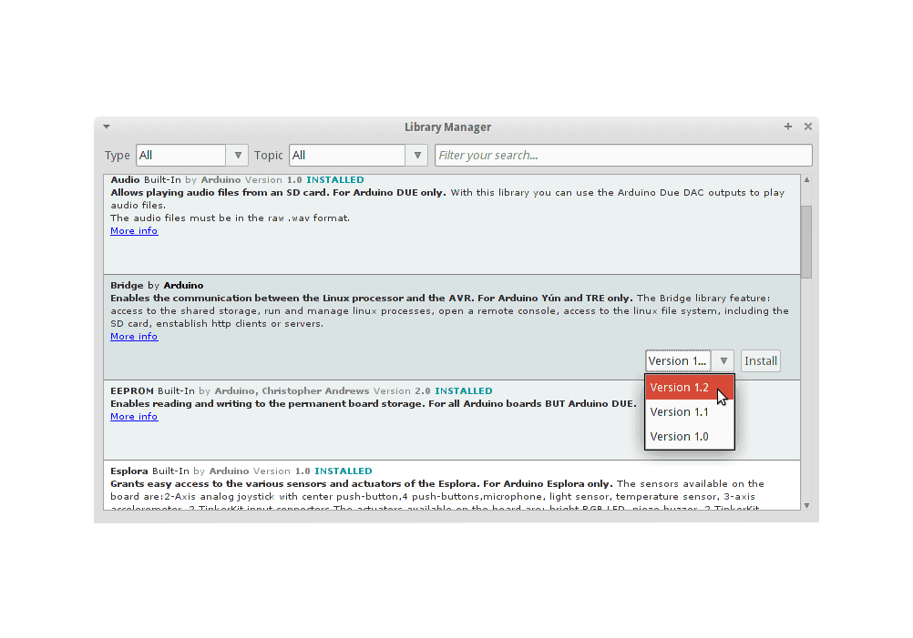

# CanSat NeXT Software

Den anbefalede måde at bruge CanSat NeXT på er med CanSat NeXT Arduino-biblioteket, som er tilgængeligt via Arduino Library Manager og GitHub. Før du installerer CanSat NeXT-biblioteket, skal du installere Arduino IDE og ESP32 board-support.

## Kom godt i gang

### Installer Arduino IDE

Hvis du ikke allerede har gjort det, så download og installer Arduino IDE fra den officielle hjemmeside https://www.arduino.cc/en/software.

### Tilføj ESP32-support

CanSat NeXT er baseret på ESP32-mikrocontrolleren, som ikke er inkluderet i Arduino IDE’s standardinstallation. Hvis du ikke tidligere har brugt ESP32-mikrocontrollere med Arduino, skal board-supporten installeres først. Det kan gøres i Arduino IDE via *Tools->board->Board Manager* (eller tryk blot (Ctrl+Shift+B) hvor som helst). I board manager skal du søge efter ESP32 og installere esp32 by Espressif.

### Installer Cansat NeXT-biblioteket

CanSat NeXT-biblioteket kan downloades fra Arduino IDE’s Library Manager via *Sketch > Include Libraries > Manage Libraries*.

*Billedkilde: Arduino Docs, https://docs.arduino.cc/software/ide-v1/tutorials/installing-libraries*

I Library Manager-søgefeltet skal du skrive "CanSatNeXT" og vælge "Install". Hvis IDE’en spørger, om du også vil installere afhængighederne, så klik ja.

## Manuel installation

Biblioteket er også hostet i sit eget [GitHub-repository](https://github.com/netnspace/CanSatNeXT_library) og kan klones eller downloades og installeres fra kildekoden.

I dette tilfælde skal du udpakke biblioteket og flytte det til den mappe, hvor Arduino IDE kan finde det. Du kan finde den præcise placering i *File > Preferences > Sketchbook*.

*Billedkilde: Arduino Docs, https://docs.arduino.cc/software/ide-v1/tutorials/installing-libraries*

# Forbindelse til PC

Efter installation af CanSat NeXT softwarebiblioteket kan du tilslutte CanSat NeXT til din computer. Hvis den ikke registreres, kan det være nødvendigt først at installere de nødvendige drivere. Driverinstallationen sker automatisk i de fleste tilfælde, men på nogle PC’er skal den udføres manuelt. Drivere kan findes på Silicon Labs’ hjemmeside: https://www.silabs.com/developers/usb-to-uart-bridge-vcp-drivers
For yderligere hjælp til opsætning af ESP32, se følgende vejledning: https://docs.espressif.com/projects/esp-idf/en/latest/esp32/get-started/establish-serial-connection.html

# Du er klar!

Du kan nu finde CanSatNeXT-eksempler i Arduino IDE via *File->Examples->CanSatNeXT*.