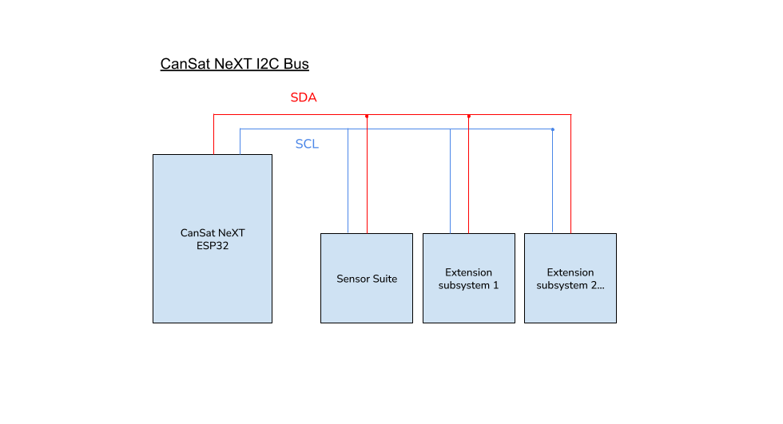
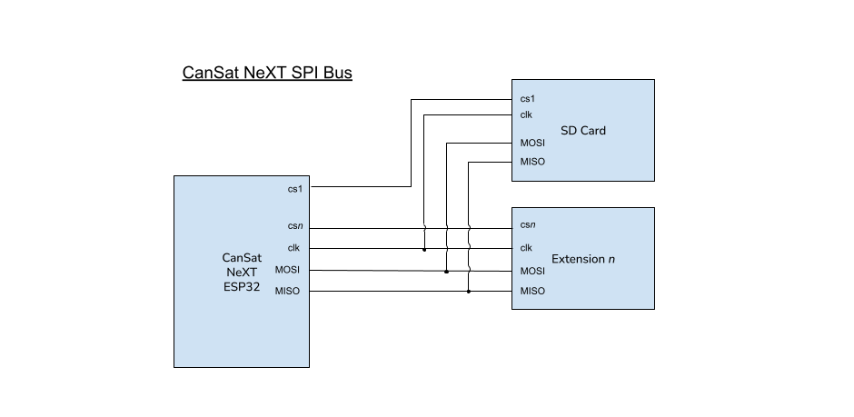

# Udvidelsesinterface

Brugerdefinerede enheder kan bygges og bruges sammen med CanSat. Disse kan bruges til at lave interessante projekter, som du kan finde idéer til i vores [Blog](/blog).

CanSats udvidelsesinterface har en fri UART-linje, to ADC-ben og 5 frie digitale I/O-ben. Derudover er SPI- og I2C-linjer tilgængelige for udvidelsesinterfacet, selvom de deles med henholdsvis SD-kortet og sensorsuiten.

Brugeren kan også vælge at bruge UART2- og ADC-benene som digital I/O, hvis seriel kommunikation eller analog-til-digital-konvertering ikke er nødvendig i deres løsning.

| Pin number | Pin name | Use as      | Notes                     |
|------------|----------|-------------|---------------------------|
| 12         | GPIO12   | Digital I/O | Free                      |
| 15         | GPIO15   | Digital I/O | Free                      |
| 16         | GPIO16   | UART2 RX    | Free                      |
| 17         | GPIO17   | UART2 TX    | Free                      |
| 18         | SPI_CLK  | SPI CLK     | Co-use with SD card       |
| 19         | SPI_MISO | SPI MISO    | Co-use with SD card       |
| 21         | I2C_SDA  | I2C SDA     | Co-use with sensor suite  |
| 22         | I2C_SCL  | I2C SCL     | Co-use with sensor suite  |
| 23         | SPI_MOSI | SPI MOSI    | Co-use with SD card       |
| 25         | GPIO25   | Digital I/O | Free                      |
| 26         | GPIO26   | Digital I/O | Free                      |
| 27         | GPIO27   | Digital I/O | Free                      |
| 32         | GPIO32   | ADC         | Free                      |
| 33         | GPIO33   | ADC         | Free                      |

*Table: Opslagstabel for udvidelsesinterface-ben. Pin name refererer til bibliotekets pin-navn.*

# Kommunikationsmuligheder

CanSat-biblioteket inkluderer ikke kommunikations-wrappere til de brugerdefinerede enheder. For UART-, I2C- og SPI-kommunikation mellem CanSat NeXT og din brugerdefinerede payload-enhed, henvises der til Arduinos standardbiblioteker [UART](https://docs.arduino.cc/learn/communication/uart/), [Wire](https://docs.arduino.cc/learn/communication/wire/) og [SPI](https://docs.arduino.cc/learn/communication/spi/), henholdsvis. 

## UART

UART2-linjen er et godt alternativ, da den fungerer som et ikke-allokeret kommunikationsinterface til udvidede payloads.


For at sende data gennem UART-linjen, henvises der til Arduino 

```
       CanSat NeXT
          ESP32                          User's device
   +----------------+                 +----------------+
   |                |   TX (Transmit) |                |
   |       TX  o----|---------------->| RX  (Receive)  |
   |                |                 |                |
   |       RX  o<---|<----------------| TX             |
   |                |   GND (Ground)  |                |
   |       GND  o---|-----------------| GND            |
   +----------------+                 +----------------+
```
*Image: UART-protokol i ASCII*


## I2C

Brug af I2C understøttes, men brugeren skal være opmærksom på, at der findes et andet undersystem på linjen.

Med flere I2C-slaver skal brugerkoden angive, hvilken I2C-slave CanSat bruger på et givent tidspunkt. Dette skelnes ved en slaveadresse, som er en unik hexadecimal kode for hver enhed og kan findes i undersystemenhedens datablad.

## SPI

Brug af SPI understøttes også, men brugeren skal være opmærksom på, at der findes et andet undersystem på linjen.

Med SPI foretages skelnen mellem slaver i stedet ved at angive en chip select-pin. Brugeren skal dedikere en af de frie GPIO-ben til at være chip select for deres brugerdefinerede udvidede payload-enhed. SD-kortets chip select-pin er defineret i biblioteksfilen ``CanSatPins.h`` som ``SD_CS``.



*Image: CanSat NeXT I2C-bussen med flere sekundære, eller "slave", undersystemer. I denne kontekst er sensorsuiten et af slave-undersystemerne.*



*Image: CanSat NeXT SPI-buskonfigurationen, når to sekundære, eller "slave", undersystemer er til stede. I denne kontekst er SD-kortet et af slave-undersystemerne.*