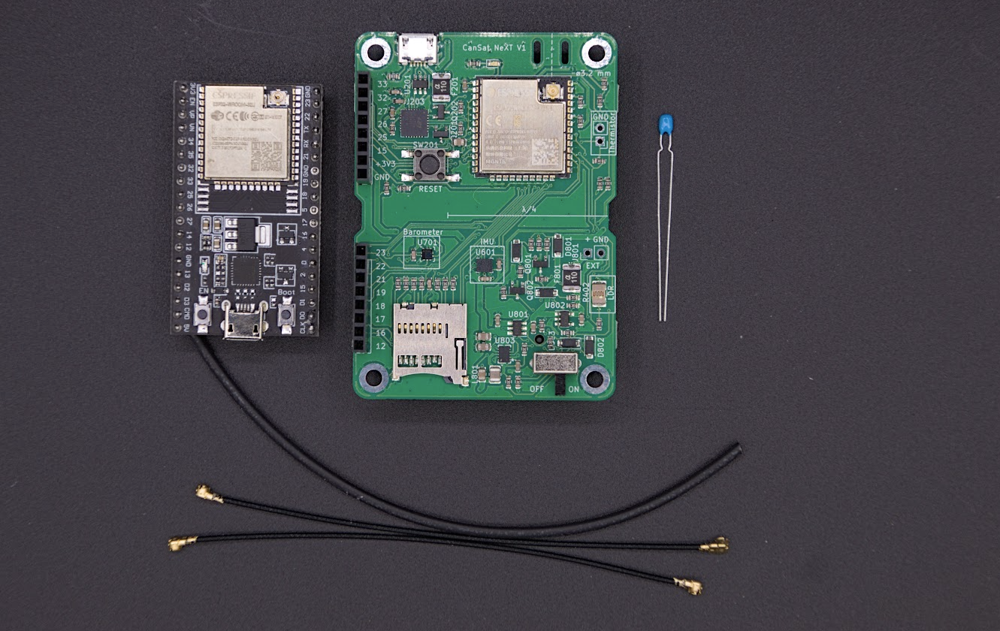

# CanSat NeXT-kursus

## Velkommen til CanSat NeXT!

CanSat NeXT er en ny variant af CanSat-kittet, som integrerer de nødvendige funktioner, der skal til for en vellykket CanSat-opsendelse, direkte på ét board, så du kan komme i gang med det samme med softwareudvikling og dine egne missioner. CanSat NeXT glemmer dog ikke din sekundære mission, da du kan tilslutte enhver sensor eller eksterne enheder til udvidelses-headers. Du kan tænke på CanSat NeXT som en Arduino, bare med sensorer og andre funktioner allerede inkluderet direkte fra start.

## Dit kit

Hvis du endnu ikke har et CanSat NeXT-kit, kan du få et fra vores webshop: https://spacelabnextdoor.com/. Alternativt er skoler, der deltager i CanSat-konkurrencer og -programmer, som regel berettigede til at få kits gennem ESERO-netværket.

Kittet indeholder ét CanSat-board, som er det, du primært kommer til at arbejde med. Derudover er der et andet board, som vil blive brugt som groundstation-radio — du vil bruge det til at videresende beskeder mellem en computer og CanSat'en.

Selvom CanSat NeXT allerede har et termometer ombord, indeholder kittet også en termistor, som kan loddes på boardet for at måle temperaturen uden for selve boardet.

Til sidst indeholder kittet to radiokabler, som kan bruges til at bygge simple antenner, der muliggør kommunikation op til en kilometer væk. Der er kun brug for ét kabel, men det er rart at have en reserve. Krympeflexen er inkluderet for at give vejrbeskyttelse til antennerne. For instruktioner i, hvordan antennen bygges, henvises til artiklen [Communication and Antennas](./../CanSat-hardware/communication.md).

## Lektioner

Denne side indeholder et voksende antal simple lektioner, der hjælper dig godt i gang med dit CanSat NeXT-kit. Den første lektion handler om at sætte din computer op til at starte CanSat-programmering, og de efterfølgende lektioner præsenterer forskellige hardwarefunktioner i CanSat NeXT. Derudover har vi en blog til at fremvise forskellige projekter lavet med CanSat NeXT, som kan være interessante, når du planlægger din egen CanSat-mission.

[Klik her for den første lektion!](./lesson1).