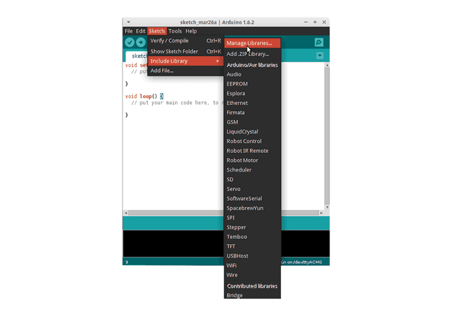
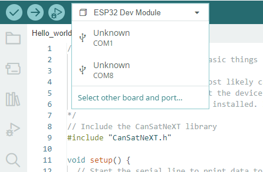
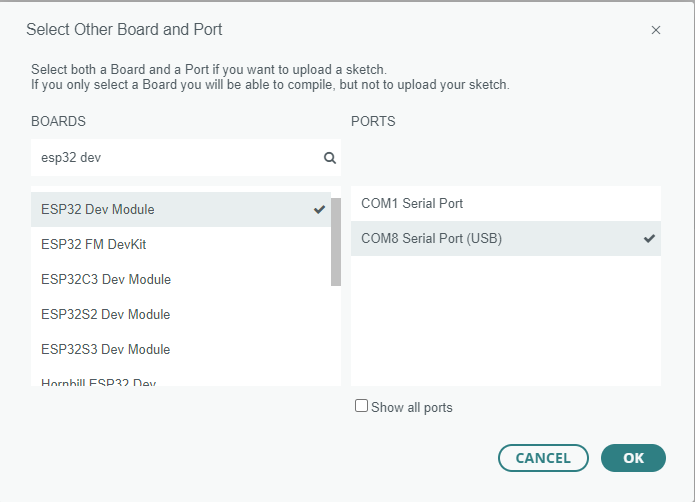
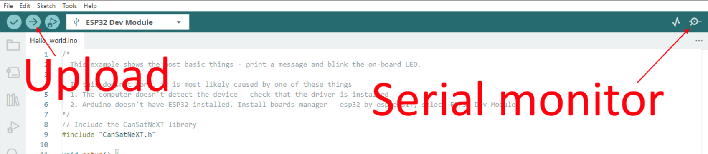

# Lektion 1: Hello World!

Denne første lektion får dig i gang med CanSat NeXT ved at vise, hvordan du skriver og kører dit første program på boardet.

Efter denne lektion vil du have de nødvendige værktøjer til at begynde at udvikle software til din CanSat.

## Installation af værktøjerne

CanSat NeXT anbefales at blive brugt med Arduino IDE, så lad os begynde med at installere det samt de nødvendige biblioteker og boards.

### Installér Arduino IDE

Hvis du ikke allerede har gjort det, så download og installér Arduino IDE fra den officielle hjemmeside https://www.arduino.cc/en/software.

### Tilføj ESP32-understøttelse

CanSat NeXT er baseret på ESP32-mikrocontrolleren, som ikke er inkluderet i Arduino IDE’s standardinstallation. Hvis du ikke har brugt ESP32-mikrocontrollere med Arduino før, skal understøttelsen til boardet installeres først. Det kan gøres i Arduino IDE via *Tools->board->Board Manager* (eller bare tryk (Ctrl+Shift+B) hvor som helst). I Board Manager skal du søge efter ESP32 og installere esp32 by Espressif.

### Installér Cansat NeXT-biblioteket

CanSat NeXT-biblioteket kan downloades fra Arduino IDE’s Library Manager via *Sketch > Include Libraries > Manage Libraries*.



*Billedkilde: Arduino Docs, https://docs.arduino.cc/software/ide-v1/tutorials/installing-libraries*

I Library Managers søgefelt skal du skrive "CanSatNeXT" og vælge "Install". Hvis IDE’en spørger, om du også vil installere afhængighederne, så klik ja.s

## Tilslutning til PC

Efter installation af CanSat NeXT-softwarebiblioteket kan du tilslutte CanSat NeXT til din computer. Hvis den ikke bliver registreret, kan det være nødvendigt først at installere de nødvendige drivere. Driverinstallationen sker automatisk i de fleste tilfælde, men på nogle PC’er skal den udføres manuelt. Drivere kan findes på Silicon Labs’ hjemmeside: https://www.silabs.com/developers/usb-to-uart-bridge-vcp-drivers
For yderligere hjælp til opsætning af ESP32, se følgende vejledning: https://docs.espressif.com/projects/esp-idf/en/latest/esp32/get-started/establish-serial-connection.html

## Kør dit første program

Lad os nu bruge de nyinstallerede biblioteker til at begynde at køre noget kode på CanSat NeXT. Som traditionen byder, starter vi med at blinke LED’en og skrive "Hello World!" til computeren.

### Vælg den korrekte port

Efter at have tilsluttet CanSat NeXT til din computer (og tændt for strømmen) skal du vælge den korrekte port. Hvis du ikke ved, hvilken der er den rigtige, så frakobl blot enheden og se, hvilken port der forsvinder.



Arduino IDE beder nu om enhedstypen. Vælg ESP32 Dev Module.



### Vælg et eksempel

CanSat NeXT-biblioteket har flere eksempelkoder, der viser, hvordan man bruger de forskellige funktioner på boardet. Du kan finde disse eksempel-sketches via File -> Examples -> CanSat NeXT. Vælg "Hello_world".

Når du har åbnet den nye sketch, kan du uploade den til boardet ved at trykke på upload-knappen.



Efter et stykke tid bør LED’en på boardet begynde at blinke. Derudover sender enheden en besked til PC’en. Du kan se dette ved at åbne Serial Monitor og vælge baud rate 115200.

Prøv også at trykke på knappen på boardet. Den bør nulstille processoren, eller med andre ord, genstarte koden fra begyndelsen.

### Hello World forklaret

Lad os se, hvad der faktisk sker i denne kode ved at gennemgå den linje for linje. Først begynder koden med at **inkludere** CanSat-biblioteket. Denne linje bør være i starten af næsten alle programmer skrevet til CanSat NeXT, da den fortæller compileren, at vi vil bruge funktionerne fra CanSat NeXT-biblioteket.

```Cpp title="Include CanSat NeXT"
#include "CanSatNeXT.h"
```
Herefter hopper koden til setup-funktionen. Her har vi to kald – først er serial det interface, vi bruger til at sende beskeder til PC’en via USB. Tallet inde i funktionskaldet, 115200, refererer til baud-rate, dvs. hvor mange ettaller og nuller der sendes hvert sekund. Det næste kald, `CanSatInit()`, kommer fra CanSat NeXT-biblioteket og initialiserer alle de indbyggede sensorer og andre funktioner. Ligesom `#include`-kommandoen findes dette typisk i sketches til CanSat NeXT. Alt, hvad du gerne vil have til at køre kun én gang ved opstart, bør inkluderes i setup-funktionen.

```Cpp title="Setup"
void setup() {
  // Start the serial line to print data to the terminal
  Serial.begin(115200);
  // Start all CanSatNeXT on-board systems.
  CanSatInit();
}
```

Efter setup begynder koden at gentage loop-funktionen uendeligt. Først sætter programmet output-pinnen LED til høj, dvs. have en spænding på 3,3 volt. Dette tænder den indbyggede LED. Efter 100 millisekunder sættes spændingen på den output-pin tilbage til nul. Nu venter programmet i 400 ms og sender derefter en besked til PC’en. Efter at beskeden er sendt, starter loop-funktionen igen fra begyndelsen.

```Cpp title="Loop"
void loop() {
  // Let's blink the LED
  digitalWrite(LED, HIGH);
  delay(100);
  digitalWrite(LED, LOW);
  delay(400);
  Serial.println("This is a message!");
}
```

Du kan også prøve at ændre delay-værdierne eller beskeden for at se, hvad der sker. Tillykke med at være nået så langt! Opsætning af værktøjerne kan være tricky, men det burde blive sjovere herfra. 

---

I den næste lektion begynder vi at læse data fra de indbyggede sensorer.

[Klik her for den anden lektion!](./lesson2)