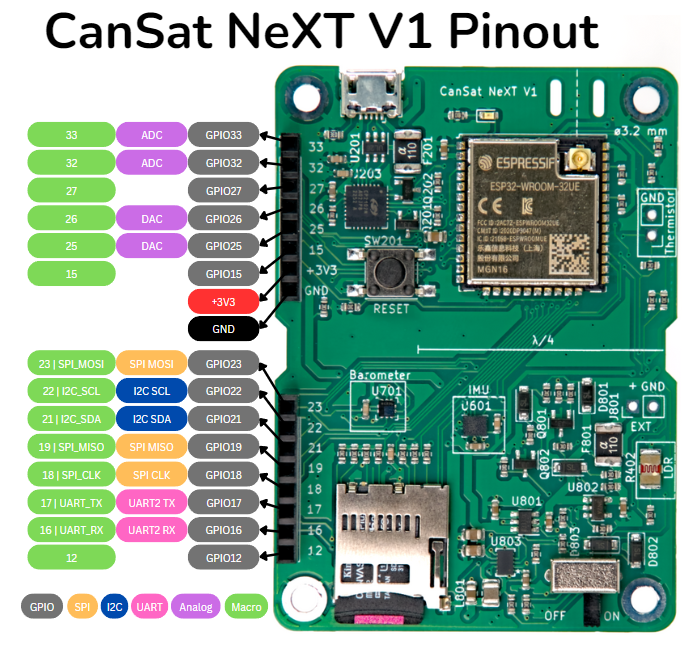

# Lektion 11: Satellitten skal vokse

Selvom CanSat NeXT allerede har mange integrerede sensorer og enheder på selve satellitboardet, kræver mange spændende CanSat-missioner brug af andre eksterne sensorer, servoer, kameraer, motorer eller andre aktuatorer og enheder. Denne lektion er en smule anderledes end de foregående, da vi vil diskutere integrationen af forskellige eksterne enheder til CanSat. Dit konkrete use case er sandsynligvis ikke behandlet, men måske noget lignende er. Hvis der er noget, du mener bør dækkes her, så send gerne feedback til mig på samuli@kitsat.fi.

Denne lektion er en smule anderledes end den forrige, for selvom al information er nyttig, bør du føle dig fri til at springe til de områder, der er relevante for netop dit projekt, og bruge denne side som reference. Før du fortsætter denne lektion, så kig dog venligst materialet igennem, der præsenteres i [hardware](./../CanSat-hardware/CanSat-hardware.md)-afsnittet af CanSat NeXT-dokumentationen, da det dækker en masse information, der kræves for at integrere eksterne enheder.

## Tilslutning af eksterne enheder

Der er to gode måder at tilslutte eksterne enheder til CanSat NeXT: ved at bruge [Perf Boards](../CanSat-accessories/CanSat-NeXT-perf.md) og specialdesignede PCB'er. At lave dit eget PCB er lettere (og billigere), end du måske tror, og for at komme i gang er et godt udgangspunkt denne [KiCAD-vejledning](https://docs.kicad.org/8.0/en/getting_started_in_kicad/getting_started_in_kicad.html). Vi har også en [skabelon](../CanSat-hardware/mechanical_design#custom-PCB) tilgængelig til KiCAD, så det er meget nemt at lave dine boards i samme format.

Når det er sagt, er det for de fleste CanSat-missioner en rigtig god måde at skabe pålidelige, robuste elektronikstakke ved at lodde de eksterne sensorer eller andre enheder på et perf board.

En endnu nemmere måde at komme i gang på, især ved første prototyping, er at bruge jumperkabler (også kaldet Dupont-kabler eller breadboard-ledninger). De følger typisk endda med sensor-breakouts, men kan også købes separat. De deler samme 0,1 tomme pitch, som bruges af extension pin header, hvilket gør det meget nemt at forbinde enheder med kabler. Men selvom kabler er nemme at bruge, er de ret klodsede og upålidelige. Af denne grund anbefales det varmt at undgå kabler til flyvemodellen af din CanSat.

## Deling af strøm til enhederne

CanSat NeXT bruger 3,3 volt til alle sine egne enheder, hvilket er grunden til, at det også er den eneste spændingslinje, der er ført ud til extension header. Mange kommercielle breakouts, især ældre, understøtter også 5 volt drift, da det er den spænding, der bruges af legacy Arduinoer. Langt de fleste enheder understøtter dog også drift direkte ved 3,3 volt.

I de få tilfælde, hvor 5 volt er absolut nødvendigt, kan du inkludere en **boost converter** på boardet. Der findes færdige moduler, men du kan også lodde mange enheder direkte på perf boardet. Når det er sagt, så prøv først at bruge enheden med 3,3 volt i stedet, da der er en god chance for, at det vil virke.

Den maksimalt anbefalede strømtræk fra 3,3 volt-linjen er 300 mA, så for strømkrævende enheder som motorer eller varmelegemer bør du overveje en ekstern strømkilde.

## Datalinjer

Extension header har i alt 16 pins, hvoraf to er reserveret til ground- og power-linjer. Resten er forskellige typer inputs og outputs, hvoraf de fleste har flere mulige anvendelser. Boardets pinout viser, hvad hver af pinsene kan.



### GPIO

Alle de eksponerede pins kan bruges som general purpose inputs og outputs (GPIO), hvilket betyder, at du kan udføre `digitalWrite`- og `digitalRead`-funktioner med dem i koden.

### ADC

Pins 33 og 32 har en analog til digital converter (ADC), hvilket betyder, at du kan bruge `analogRead` (og `adcToVoltage`) til at læse spændingen på denne pin.

### DAC

Disse pins kan bruges til at skabe en specifik spænding på outputtet. Bemærk, at de producerer den ønskede spænding, men de kan kun levere en meget lille mængde strøm. De kan bruges som referencepunkter for sensorer eller endda som en audio-output, men du får brug for en forstærker (eller to). Du kan bruge `dacWrite` til at skrive spændingen. Der er også et eksempel på dette i CanSat libary.

### SPI

Serial Peripheral Interface (SPI) er en standard datalinje, ofte brugt af Arduino-breakouts og lignende enheder. En SPI-enhed kræver fire pins:

| **Pin Name**    | **Description**                                              | **Usage**                                                       |
|-----------------|--------------------------------------------------------------|-----------------------------------------------------------------|
| **MOSI**        | Main Out Secondary In                                         | Data sent from the main device (e.g., CanSat) to the secondary device. |
| **MISO**        | Main In Secondary Out                                         | Data sent from the secondary device back to the main device.      |
| **SCK**         | Serial Clock                                                  | Clock signal generated by the main device to synchronize communication. |
| **SS/CS**       | Secondary Select/Chip Select                                  | Used by the main device to select which secondary device to communicate with. |

Her er main CanSat NeXT-boardet, og secondary er den enhed, du vil kommunikere med. MOSI-, MISO- og SCK-pins kan deles af flere secondaries, men alle skal have deres egen CS-pin. CS-pinnen kan være enhver GPIO-pin, hvilket er grunden til, at der ikke er en dedikeret i bussen.

(Bemærk: Legacy-materialer bruger nogle gange termerne "master" og "slave" til at referere til main- og secondary-enheder. Disse termer betragtes nu som forældede.)

På CanSat NeXT-boardet bruger SD-kortet den samme SPI-linje som extension header. Når du tilslutter en anden SPI-enhed til bussen, betyder det ikke noget. Men hvis SPI-pins bruges som GPIO, er SD-kortet reelt deaktiveret.

For at bruge SPI skal du ofte angive, hvilke pins fra processoren der bruges. Et eksempel kunne se sådan ud, hvor **macros** inkluderet i CanSat-biblioteket bruges til at sætte de andre pins, og pin 12 sættes som chip select.

```Cpp title="Initializing the SPI line for a sensor"
adc.begin(SPI_CLK, SPI_MOSI, SPI_MISO, 12);
```

Macros `SPI_CLK`, `SPI_MOSI` og `SPI_MISO` erstattes af compileren med henholdsvis 18, 23 og 19.

### I2C

Inter-Integrated Circuit er en anden populær databuss-protokol, især brugt til små integrerede sensorer, såsom tryksensoren og IMU'en på CanSat NeXT-boardet.

I2C er praktisk, fordi det kun kræver to pins, SCL og SDA. Der er heller ingen separat chip select-pin; i stedet adskilles forskellige enheder af forskellige **adresser**, som bruges til at etablere kommunikation. På den måde kan du have flere enheder på samme bus, så længe de alle har en unik adresse.

| **Pin Name** | **Description**          | **Usage**                                                     |
|--------------|--------------------------|---------------------------------------------------------------|
| **SDA**      | Serial Data Line          | Bi-directional data line used for communication between main and secondary devices. |
| **SCL**      | Serial Clock Line         | Clock signal generated by the main device to synchronize data transfer with secondary devices. |

Barometeret og IMU'en er på samme I2C-bus som extension header. Tjek adresserne for disse enheder på siden [On-Board sensors](../CanSat-hardware/on_board_sensors#IMU). Ligesom med SPI kan du bruge disse pins til at tilslutte andre I2C-enheder, men hvis de bruges som GPIO-pins, er IMU og barometer deaktiveret.

I Arduino-programmering kaldes I2C nogle gange `Wire`. I modsætning til SPI, hvor pinout ofte specificeres for hver sensor, bruges I2C i Arduino ofte ved først at etablere en datalinje og derefter referere til den for hver sensor. Nedenfor er et eksempel på, hvordan barometeret initialiseres af CanSat NeXT-biblioteket:

```Cpp title="Initializing the second serial line"
Wire.begin(I2C_SDA, I2C_SCL);
initBaro(&Wire)
```

Så først initialiseres en `Wire` ved at fortælle den de rigtige I2C-pins. Macros `I2C_SDA` og `I2C_SCL`, der er sat i CanSat NeXT-biblioteket, erstattes af compileren med henholdsvis 22 og 21.

### UART

Universal asynchronous receiver-transmitter (UART) er på nogle måder den simpleste dataprotokol, da den blot sender data som binær ved en specificeret frekvens. Som sådan er den begrænset til point-to-point-kommunikation, hvilket betyder, at du normalt ikke kan have flere enheder på samme bus.

| **Pin Name** | **Description**          | **Usage**                                                     |
|--------------|--------------------------|---------------------------------------------------------------|
| **TX**       | Transmit                  | Sends data from the main device to the secondary device.       |
| **RX**       | Receive                   | Receives data from the secondary device to the main device.    |

På CanSat bruges UART'en i extension header ikke til noget andet. Der er dog en anden UART-linje, men den bruges til USB-kommunikationen mellem satellitten og en computer. Det er den, der bruges, når der sendes data til `Serial`.

Den anden UART-linje kan initialiseres i kode sådan her:

```Cpp title="Initializing the second serial line"
Serial2.begin(115200, SERIAL_8N1, 16, 17);
```

### PWM

Nogle enheder bruger også [pulse-width modulation](https://en.wikipedia.org/wiki/Pulse-width_modulation) (PWM) som deres kontrolinput. Det kan også bruges til dæmpbare LED'er eller til at styre effektoutput i nogle situationer, blandt mange andre use cases.

Med Arduino kan kun visse pins bruges som PWM. Men da CanSat NeXT er en ESP32-baseret enhed, kan alle output-pins bruges til at skabe et PWM-output. PWM styres med `analogWrite`.

## Hvad med (mit specifikke use case)?

For de fleste enheder kan du finde en masse information på internettet. For eksempel: google den specifikke breakout, du har, og brug disse dokumenter til at tilpasse de eksempler, du finder, til brug med CanSat NeXT. Sensorerne og andre enheder har også **datasheets**, som bør indeholde en masse information om, hvordan man bruger enheden, selvom de nogle gange kan være lidt svære at tyde. Hvis du føler, at der er noget, denne side burde have dækket, så lad mig endelig vide det på samuli@kitsat.fi.

I den næste, sidste lektion vil vi diskutere, hvordan du forbereder din satellit til opsendelsen.

[Klik her for den næste lektion!](./lesson12)