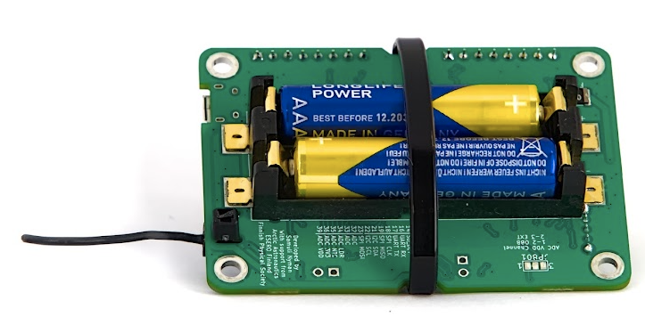
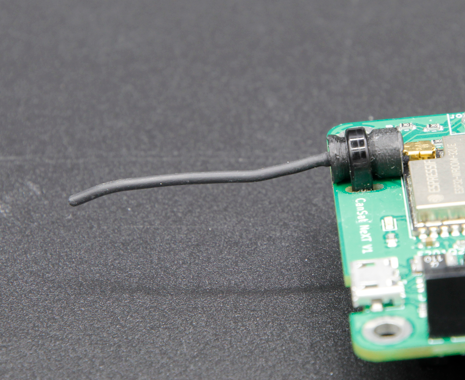

# Lektion 12: Klar til opsendelse?

I denne sidste lektion vil vi tale om, hvordan man forbereder satellitten, jordstationen og teamet til opsendelsen. Efter denne lektion vil vi også have en *gennemgang* for at tjekke flyveparathed, men denne lektion fokuserer på at maksimere chancerne for en succesfuld mission. I denne lektion vil vi tale om at forberede din elektronik mekanisk og elektrisk, kontrollere radiokommunikationssystemet og til sidst diskutere nogle nyttige forberedelsestrin, der bør udføres i god tid før selve opsendelsesbegivenheden. 


Denne lektion er igen lidt anderledes, da vi i stedet for at se på nye programmeringskoncepter diskuterer, hvordan man forbedrer enhedens pålidelighed i missionen. Desuden, selvom du sandsynligvis ikke er færdig med at bygge (eller definere) satellitmissionen, hvis du først nu gennemgår kurset, er det godt at læse materialet på denne side igennem, overveje disse aspekter, når du planlægger din enhed og mission, og vende tilbage til dem, når du faktisk forbereder opsendelsen.

## Mekaniske overvejelser

For det første, som diskuteret i den forrige lektion, bør elektronik-**stakken** bygges, så den holder sammen selv under kraftige vibrationer og stød. En god måde at designe elektronikken på er at bruge perf boards, som holdes sammen af [afstandsstykker](https://spacelabnextdoor.com/electronics/27-cansat-next-rp-sma-ufl) og forbindes elektrisk enten via en connector eller med et godt understøttet kabel. Til sidst bør hele elektronikstakken fastgøres til satellitrammen, så den ikke bevæger sig rundt. En stiv forbindelse med skruer er altid et solidt valg (bogstaveligt talt), men det er ikke den eneste mulighed. Et alternativ kunne være at designe systemet til at gå i stykker ved sammenstød, ligesom en [krøllezone](https://en.wikipedia.org/wiki/Crumple_zone). Alternativt kan et polstret monteringssystem med gummi, skum eller lignende reducere de belastninger, som elektronikken udsættes for, hvilket hjælper med at skabe systemer, der kan bruges flere gange.

I en typisk CanSat er der nogle dele, som er særligt sårbare over for problemer under opsendelse eller ved hurtigere-end-forventede landinger. Det er batterierne, SD-kortet og antennen. 

### Fastgørelse af batterierne

På CanSat NeXT er boardet designet, så en strips kan fastgøres rundt om boardet for at sikre, at batterierne holdes på plads under vibrationer. Ellers har de en tendens til at hoppe ud af soklerne. En anden bekymring ved batterier er, at nogle batterier er kortere, end der ville være ideelt til batteriholderen, og det er muligt, at ved et særligt kraftigt stød vil batterikontakterne bøje under batteriernes vægt, så en kontakt mistes. For at afhjælpe dette kan kontakterne understøttes ved at tilføje et stykke strips, skum eller andet fyld bag fjederkontakterne. I utilsigtede (og tilsigtede) faldtests har dette forbedret pålideligheden, selvom CanSat NeXT'er integreret i velbyggede CanSats har overlevet fald fra op til 1000 meter (uden faldskærm) selv uden disse beskyttelsesforanstaltninger. En endnu bedre måde at understøtte batterierne på er at designe en støttestruktur direkte til CanSat-rammen, så den bærer batteriernes vægt ved sammenstød i stedet for batteriholderen.




### Fastgørelse af antennekablet

Antenneconnectoren er U.Fl, som er en connector-type klassificeret til bilindustrien. De håndterer vibrationer og stød ganske godt, selv uden eksterne mekaniske understøtninger. Pålideligheden kan dog forbedres ved at fastgøre antennen med små strips. CanSat NeXT-boardet har små slidser ved siden af antennen til dette formål. For at holde antennen i en neutral position kan der [printes en støtte](../CanSat-hardware/communication#quarter-wave-antenna) til den.



### Fastgørelse af SD-kortet

SD-kortet kan hoppe ud af holderen ved kraftige stød. Igen har boardene overlevet fald og flyvninger, men pålideligheden kan forbedres ved at tape eller lime SD-kortet fast til holderen. Nyere CanSat NeXT-boards (≥1.02) er udstyret med SD-kortholdere med høj sikkerhed for at afhjælpe dette problem yderligere.

## Kommunikationstest

En af de mest afgørende detaljer for en succesfuld mission er at have et pålideligt radiolink. Der er mere information om valg og/eller bygning af antenner i [hardwareafsnittet](../CanSat-hardware/communication.md#antenna-options) af dokumentationen. Uanset den valgte antenne er test dog en afgørende del af ethvert radiosystem. 

Korrekt antennetest kan være vanskelig og kræver specialiseret udstyr såsom [VNA'er](https://en.wikipedia.org/wiki/Network_analyzer_(electrical)), men vi kan lave en funktionel test direkte med CanSat NeXT-kittet. 

Programmer først satellitten til at sende data, for eksempel en dataaflæsning én gang i sekundet. Programmer derefter jordstationen til at modtage data og til at udskrive **RSSI**-værdier (Received signal strength indicator), som angivet af funktionen `getRSSI()`, der er en del af CanSat NeXT-biblioteket.

```Cpp title="Read RSSI"
#include "CanSatNeXT.h"

void setup() {
  Serial.begin(115200);
  GroundStationInit(28);
}

void loop() {}

void onDataReceived(String data)
{
  int rssi = getRSSI();
  Serial.print("RSSI: ");
  Serial.println(rssi);
}
```

Denne værdi repræsenterer den faktiske elektriske **effekt**, som jordstationen modtager gennem sin antenne, når den modtager en besked. Værdien udtrykkes i [decibelmilliwatt](https://en.wikipedia.org/wiki/DBm). En typisk aflæsning med en fungerende antenne i begge ender, når enhederne står på samme bord, er -30 dBm (1000 nanowatt), og den bør falde hurtigt, når afstanden øges. I frit rum følger den omtrent den inverse kvadratloven, men ikke helt på grund af ekkoer, fresnelzoner og andre ufuldkommenheder. Med de radioindstillinger, som CanSat NeXT bruger som standard, kan RSSI komme ned til cirka -100 dBm (0,1 pikowatt), og der kommer stadig noget data igennem. 

Dette svarer typisk til en afstand på omkring en kilometer ved brug af monopole-antenner, men kan være meget mere, hvis jordstationsantennen har betydelig [gain](https://en.wikipedia.org/wiki/Gain_(antenna)), hvilket direkte lægges til dBm-aflæsningen.

## Strømtests

Det er en god idé at måle strømforbruget for din satellit med et multimeter. Det er også nemt: Fjern blot et af batterierne, og hold det manuelt, så du kan bruge multimeterets strømmåling til at forbinde mellem den ene ende af batteriet og batterikontakten. Denne aflæsning bør være i størrelsesordenen 130-200 mA, hvis CanSat NeXT-radioen er aktiv, og der ikke er eksterne enheder. Strømforbruget stiger, efterhånden som batterierne aflades, da der kræves mere strøm for at holde spændingen på 3,3 volt, når batterispændingen falder.

Typiske AAA-batterier har en kapacitet på omkring 1200 mAh, hvilket betyder, at enhedens vedvarende strømforbrug bør være mindre end 300 mA for at sikre, at batterierne holder hele missionen. Det er også derfor, det er en god idé at have flere driftstilstande, hvis der er strømkrævende enheder ombord, da de kan tændes lige før flyvningen for at sikre god batterilevetid.

Selvom en matematisk tilgang til at estimere batterilevetiden er en god start, er det stadig bedst at foretage en faktisk måling af batterilevetiden ved at tage friske batterier og gennemføre en simuleret mission.

## Aerospace-test

I rumfartsindustrien gennemgår hver satellit grundige tests for at sikre, at den kan overleve de barske forhold ved opsendelse, i rummet og nogle gange ved genindtræden. Selvom CanSats opererer i et lidt anderledes miljø, kan du stadig tilpasse nogle af disse tests for at forbedre pålideligheden. Nedenfor er nogle almindelige rumfartstests, der bruges til CubeSats og små satellitter, sammen med idéer til, hvordan du kunne implementere lignende test for din CanSat.

### Vibrationstest

Vibrationstest bruges i små satellitsystemer af to grunde. Den primære grund er, at testen har til formål at identificere strukturens resonansfrekvenser for at sikre, at rakettens vibrationer ikke begynder at resonere i nogen struktur i satellitten, hvilket kan føre til en fejl i satellitsystemerne. Den sekundære grund er også relevant for CanSat-systemer, nemlig at bekræfte håndværkets kvalitet og sikre, at systemet vil overleve raketopsendelsen. Satellit-vibrationstest udføres med specialiserede vibrations-testbænke, men effekten kan også simuleres med mere kreative løsninger. Prøv at finde på en måde virkelig at ryste satellitten (eller helst dens reserve) og se, om noget går i stykker. Hvordan kunne det forbedres?

### Stødtest

En fætter til vibrationstests: Stødtests simulerer den eksplosive trinadskillelse under raketopsendelsen. Stødaccelerationen kan være op til 100 G, hvilket let kan ødelægge systemer. Dette kunne simuleres med en faldtest, men overvej, hvordan du gør det sikkert, så satellitten, du eller gulvet ikke går i stykker.

### Termisk test

Termisk test omfatter at udsætte hele satellitten for yderpunkterne i det planlagte driftsområde og også at bevæge sig hurtigt mellem disse temperaturer. I en CanSat-kontekst kunne dette betyde at teste satellitten i en fryser for at simulere en opsendelse på en kold dag eller i en let opvarmet ovn for at simulere en varm opsendelsesdag. Vær forsigtig med, at elektronikken, plast eller din hud ikke udsættes direkte for ekstreme temperaturer.

## Generelle gode idéer

Her er nogle yderligere tips til at hjælpe med at sikre en succesfuld mission. Disse spænder fra tekniske forberedelser til organisatoriske praksisser, der vil forbedre den samlede pålidelighed af din CanSat. Du er velkommen til at foreslå nye idéer, der kan tilføjes her, via den sædvanlige kanal (samuli@kitsat.fi).

- Overvej at have en tjekliste for at undgå at glemme noget lige før opsendelsen
- Test hele flyvesekvensen på forhånd i en simuleret flyvning
- Test satellitten også under lignende miljøforhold, som forventes under flyvningen. Sørg for, at faldskærmen også er OK ved de forventede temperaturer.
- Hav reservebatterier, og tænk over, hvordan de installeres, hvis det bliver nødvendigt
- Hav et ekstra SD-kort; de fejler nogle gange
- Hav en reservecomputer, og deaktiver opdateringer på computeren før opsendelsen.
- Hav ekstra strips, skruer og hvad end du ellers har brug for til at samle satellitten
- Hav nogle grundlæggende værktøjer ved hånden til at hjælpe med adskillelse og samling
- Hav ekstra antenner
- Du kan også have flere jordstationer i drift på samme tid, hvilket også kan bruges til at triangulere satellitten, især hvis der er RSSI tilgængelig.
- Hav klare roller for hvert teammedlem under opsendelse, drift og genfinding.

---

Dette er slutningen på lektionerne for nu. På den næste side er der en flyveparathedsgennemgang, som er en øvelse, der hjælper med at sikre succesfulde missioner.

[Klik her for flyveparathedsgennemgangen!](./review2)