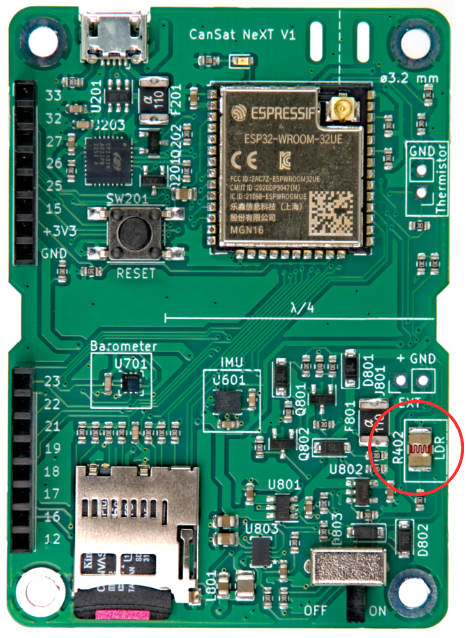
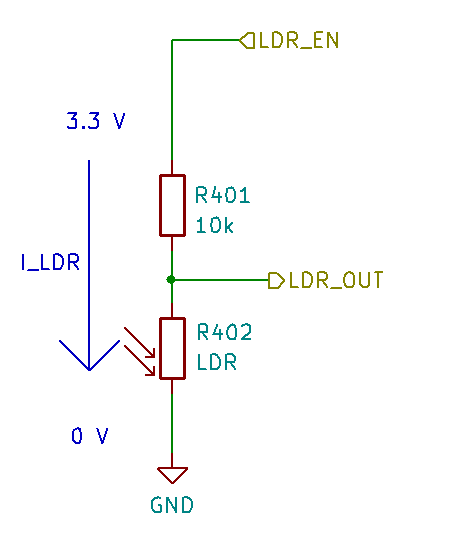

# Lektion 4: Modstand er ikke nytteløst

Indtil videre har vi fokuseret på at bruge digitale sensorenheder til at få værdier direkte i SI-enheder. Elektriske enheder foretager dog normalt målingen på en indirekte måde, og konverteringen til de ønskede enheder udføres derefter bagefter. Dette blev tidligere gjort af selve sensorenhederne (og af CanSat NeXT-biblioteket), men mange sensorer, vi bruger, er meget mere simple. En type analoge sensorer er resistive sensorer, hvor modstanden i et sensorelement ændrer sig afhængigt af et fænomen. Resistive sensorer findes for en lang række størrelser – herunder kraft, temperatur, lysintensitet, kemiske koncentrationer, pH og mange andre.

I denne lektion vil vi bruge den lysafhængige modstand (LDR) på CanSat NeXT-boardet til at måle den omgivende lysintensitet. Selvom termistoren bruges på en meget lignende måde, vil det være fokus i en fremtidig lektion. De samme færdigheder gælder direkte for brug af LDR og termistor samt mange andre resistive sensorer.



## Fysikken bag resistive sensorer

I stedet for at springe direkte til softwaren, lad os tage et skridt tilbage og diskutere, hvordan aflæsning af en resistiv sensor generelt fungerer. Betragt skemaet nedenfor. Spændingen ved LDR_EN er 3,3 volt (processorens driftsspænding), og vi har to modstande forbundet i serie på dens vej. Den ene af disse er **LDR** (R402), mens den anden er en **referencemodstand** (R402). Referencemodstandens modstand er 10 kilo-ohm, mens LDR’ens modstand varierer mellem 5-300 kilo-ohm afhængigt af lysforholdene.



Da modstandene er forbundet i serie, er den samlede modstand

$$
R = R_{401} + R_{LDR},
$$

og strømmen gennem modstandene er

$$
I_{LDR} = \frac{V_{OP}}{R},
$$

hvor $V_{OP}$ er MCU’ens driftsspænding. Husk, at strømmen skal være den samme gennem begge modstande. Derfor kan vi beregne spændingsfaldet over LDR’en som

$$
V_{LDR} = R_{LDR} * I_{LDR} =  V_{OP} \frac{R_{LDR}}{R_{401} + R_{LDR}}.
$$

Og dette spændingsfald er LDR’ens spænding, som vi kan måle med en analog-til-digital-konverter. Normalt kan denne spænding korreleres direkte eller kalibreres til at svare til målte værdier, som for eksempel fra spænding til temperatur eller lysstyrke. Nogle gange er det dog ønskeligt først at beregne den målte modstand. Hvis nødvendigt kan den beregnes som:

$$
R_{LDR} = \frac{V_{LDR}}{I_{LDR}} = \frac{V_{LDR}}{V_{OP}} (R_{401} + R_{LDR}) = R_{401} \frac{\frac{V_{LDR}}{V_{OP}}}{1-\frac{V_{LDR}}{V_{OP}}}
$$

## Aflæsning af LDR i praksis

Aflæsning af LDR eller andre resistive sensorer er meget nemt, da vi blot skal forespørge analog-til-digital-konverteren om spændingen. Lad os denne gang starte en ny Arduino Sketch fra bunden. File -> New Sketch.

Først starter vi sketchen som før ved at inkludere biblioteket. Dette gøres i begyndelsen af sketchen. I setup skal du starte serial og initialisere CanSat, ligesom før.

```Cpp title="Basic Setup"
#include "CanSatNeXT.h"

void setup() {
  Serial.begin(115200);
  CanSatInit();
}
```

En grundlæggende loop til at læse LDR’en er ikke meget mere kompliceret. Modstandene R401 og R402 er allerede på boardet, og vi skal blot læse spændingen fra deres fælles node. Lad os læse ADC-værdien og printe den.

```Cpp title="Basic LDR loop"
void loop() {
    int value = analogRead(LDR);
    Serial.print("LDR value:");
    Serial.println(value);
    delay(200);
}
```

Med dette program reagerer værdierne tydeligt på lysforhold. Vi får lavere værdier, når LDR’en udsættes for lys, og højere værdier, når det er mørkere. Værdierne er dog i hundreder og tusinder, ikke i et forventet spændingsområde. Det skyldes, at vi nu læser den direkte output fra ADC’en. Hver bit repræsenterer en spændingssammenligningsstige, der er enten én eller nul afhængigt af spændingen. Værdierne er nu 0-4095 (2^12-1) afhængigt af indgangsspændingen. Igen er denne direkte måling sandsynligvis det, du vil bruge, hvis du laver noget som [at detektere pulser med LDR’en](./../../blog/first-project#pulse-detection), men ret ofte er almindelige volt rare at arbejde med. Selvom det er en god øvelse selv at beregne spændingen, indeholder biblioteket en konverteringsfunktion, der også tager højde for ADC’ens ikke-linearitet, hvilket betyder, at outputtet er mere præcist end ved en simpel lineær konvertering.

```Cpp title="Reading the LDR voltage "
void loop() {
    float LDR_voltage = analogReadVoltage(LDR);
    Serial.print("LDR value:");
    Serial.println(LDR_voltage);
    delay(200);
}
```

:::note

Denne kode er kompatibel med serial plotter i Arduino Code. Prøv det!

:::

:::tip[Exercise]

Det kunne være nyttigt at detektere, at CanSat’en er blevet udsendt fra raketten, så for eksempel faldskærmen kan blive udløst på det rigtige tidspunkt. Kan du skrive et program, der detekterer en simuleret udsendelse? Simulér opsendelsen ved først at dække LDR’en (raketintegration) og derefter afdække den (udsendelse). Programmet kunne outputte udsendelsen til terminalen eller blinke med en LED for at vise, at udsendelsen skete.

:::

---

Den næste lektion handler om at bruge SD-kortet til at gemme målinger, indstillinger og mere!

[Klik her for den næste lektion!](./lesson5)