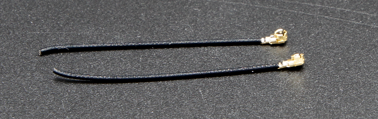

# Kommunikation und Antennen

Dieser Artikel führt in die wichtigsten Konzepte ein, die für die drahtlose Datenübertragung mit CanSat NeXT benötigt werden. Zunächst wird das Kommunikationssystem auf allgemeiner Ebene besprochen, anschließend werden einige verschiedene Optionen für die Antennenauswahl bei der Verwendung von CanSat NeXT vorgestellt. Schließlich bietet der letzte Teil des Artikels ein einfaches Tutorial zum Bau einer Viertelwellen-Monopolantenne aus den im Kit enthaltenen Teilen.

## Erste Schritte

CanSat NeXT ist fast bereit, direkt aus der Box mit der drahtlosen Kommunikation zu beginnen. Alles, was benötigt wird, ist die richtige Software und eine Antenne sowohl für den Sender als auch für den Empfänger. Für Ersteres verweisen Sie auf die Softwarematerialien auf dieser Seite. Für Letzteres enthält diese Seite Anweisungen zur Auswahl einer externen Antenne und zum Bau einer einfachen Monopolantenne aus den mit CanSat NeXT gelieferten Materialien.

Obwohl die Platine dank Softwareprüfungen recht widerstandsfähig gegen solche Dinge ist, sollten Sie niemals versuchen, etwas von einem Radio ohne Antenne zu senden. Obwohl dies aufgrund der geringen Leistung dieses Systems unwahrscheinlich ist, kann die reflektierte Radiowelle echten Schaden an der Elektronik verursachen.

## CanSat NeXT Kommunikationssystem

CanSat NeXT handhabt die drahtlose Datenübertragung etwas anders als die älteren CanSat-Kits. Anstelle eines separaten Radiomoduls verwendet CanSat NeXT das integrierte WiFi-Radio des MCU für die Kommunikation. Das WiFi-Radio wird normalerweise verwendet, um Daten zwischen einem ESP32 und dem Internet zu übertragen, die Verwendung des ESP32 als einfachen Server zu ermöglichen oder sogar den ESP32 mit einem Bluetooth-Gerät zu verbinden. Mit bestimmten cleveren TCP-IP-Konfigurationstricks können wir jedoch eine direkte Peer-to-Peer-Kommunikation zwischen ESP32-Geräten ermöglichen. Das System heißt ESP-NOW und wird von EspressIf entwickelt und gewartet, den Entwicklern der ESP32-Hardware. Darüber hinaus gibt es spezielle Niedriggeschwindigkeits-Kommunikationsschemata, die durch Erhöhung der Energie pro Bit der Übertragung die mögliche Reichweite des WiFi-Radios über die üblichen wenigen Dutzend Meter erheblich erhöhen.

Die Datenrate von ESP-NOW ist erheblich schneller als das, was mit dem alten Radio möglich wäre. Selbst bei einfacher Verringerung der Zeit zwischen den Paketen im Beispielcode kann CanSat NeXT ~20 vollständige Pakete pro Sekunde an die Bodenstation senden. Theoretisch kann die Datenrate im Langstreckenmodus bis zu 250 kbit/s betragen, aber dies kann in der Software schwer zu erreichen sein. Das bedeutet jedoch, dass die Übertragung von beispielsweise vollständigen Bildern von einer Kamera während des Fluges mit der richtigen Software durchaus machbar sein sollte.

Selbst mit einfachen Viertelwellen-Monopolantennen (ein 31 mm langes Stück Draht) an beiden Enden konnte CanSat NeXT Daten von 1,3 km Entfernung an die Bodenstation senden, an welchem Punkt die Sichtlinie verloren ging. Bei Tests mit einer Drohne war die Reichweite auf etwa 1 km begrenzt. Es ist möglich, dass die Drohne das Radio genug gestört hat, um die Reichweite etwas zu begrenzen. Mit einer besseren Antenne könnte die Reichweite jedoch noch weiter erhöht werden. Eine kleine Yagi-Antenne hätte theoretisch die Betriebsreichweite um das Zehnfache erhöht.

Es gibt einige praktische Details, die sich vom älteren Funkkommunikationssystem unterscheiden. Erstens erfolgt das „Pairing“ von Satelliten mit Bodenstationsempfängern über Media Access Control (MAC)-Adressen, die im Code festgelegt sind. Das WiFi-System ist intelligent genug, um die Timing-, Kollisions- und Frequenzprobleme im Hintergrund zu handhaben. Der Benutzer muss lediglich sicherstellen, dass die Bodenstation auf die MAC-Adresse hört, mit der der Satellit sendet.
Zweitens ist die Frequenz des Radios anders. Das WiFi-Radio arbeitet im 2,4 GHz-Band (die Mittenfrequenz beträgt 2,445 GHz), was bedeutet, dass sowohl die Ausbreitungscharakteristiken als auch die Anforderungen an das Antennendesign anders sind als zuvor. Das Signal ist etwas empfindlicher gegenüber Regen und Sichtlinienproblemen und kann in einigen Fällen möglicherweise nicht übertragen, in denen das alte System funktioniert hätte.

Die Wellenlänge des Funksignals ist ebenfalls anders. Da

$$\lambda = \frac{c}{f} \approx \frac{3*10^8 \text{ m/s}}{2.445 * 10^9 \text {Hz}} = 0.12261 \text{ m,}$$

sollte eine Viertelwellen-Monopolantenne eine Länge von 0,03065 m oder 30,65 mm haben. Diese Länge ist auch auf der CanSat NeXT-Platine markiert, um das Schneiden des Kabels etwas zu erleichtern. Die Antenne sollte präzise geschnitten werden, aber innerhalb von ~0,5 mm ist immer noch in Ordnung.

Eine Viertelwellenantenne hat ausreichende HF-Leistung für die CanSat-Wettbewerbe. Das heißt, es könnte für einige Benutzer von Interesse sein, eine noch bessere Reichweite zu erzielen. Ein möglicher Verbesserungsbereich ist die Länge der Monopolantenne. In der Praxis könnte die Viertelwellenresonanz nicht genau bei der richtigen Frequenz liegen, da andere Parameter wie Umgebung, umgebende Metallelemente oder der Teil des Drahtes, der noch mit geerdetem Metall bedeckt ist, die Resonanz etwas beeinflussen könnten. Die Antenne könnte mit einem Vektornetzwerkanalysator (VNA) abgestimmt werden. Ich denke, ich sollte dies irgendwann tun und die Materialien entsprechend korrigieren.

Eine robustere Lösung wäre die Verwendung eines anderen Antennenstils. Bei 2,4 GHz gibt es im Internet viele interessante Antennenideen. Dazu gehören eine Helixantenne, Yagi-Antenne, Pringles-Antenne und viele andere. Viele davon, wenn sie gut konstruiert sind, werden die einfache Monopolantenne leicht übertreffen. Sogar ein Dipol wäre eine Verbesserung gegenüber einem einfachen Draht.

Der auf den meisten ESP32-Modulen verwendete Stecker ist ein Hirose U.FL-Stecker. Dies ist ein qualitativ hochwertiger Miniatur-HF-Stecker, der eine gute HF-Leistung für schwache Signale bietet. Ein Problem mit diesem Stecker ist jedoch, dass das Kabel ziemlich dünn ist, was es in einigen Fällen etwas unpraktisch macht. Es führt auch zu größeren als gewünschten HF-Verlusten, wenn das Kabel lang ist, wie es bei Verwendung einer externen Antenne der Fall sein könnte. In diesen Fällen könnte ein U.FL-zu-SMA-Adapterkabel verwendet werden. Ich werde sehen, ob wir diese in unserem Webshop anbieten können. Dies würde es den Teams ermöglichen, einen vertrauteren SMA-Stecker zu verwenden. Das heißt, es ist völlig möglich, gute Antennen nur mit U.FL zu bauen.

Im Gegensatz zu SMA verlässt sich U.FL jedoch mechanisch auf Schnapp-Retentionsmerkmale, um den Stecker an Ort und Stelle zu halten. Dies ist normalerweise ausreichend, jedoch ist es aus Sicherheitsgründen eine gute Idee, einen Kabelbinder für zusätzliche Sicherheit hinzuzufügen. Die CanSat NeXT-Platine hat neben dem Antennenanschluss Schlitze, um einen kleinen Kabelbinder aufzunehmen. Idealerweise sollte vor dem Kabelbinder eine 3D-gedruckte oder anderweitig konstruierte Stützhülse für das Kabel hinzugefügt werden. Eine Datei für die 3D-gedruckte Unterstützung ist auf der GitHub-Seite verfügbar.

## Antennenoptionen

Eine Antenne ist im Wesentlichen ein Gerät, das ungeführte elektromagnetische Wellen in geführte umwandelt und umgekehrt. Aufgrund der einfachen Natur des Geräts gibt es eine Vielzahl von Optionen, aus denen Sie die Antenne für Ihr Gerät auswählen können. Aus praktischer Sicht bietet die Antennenauswahl viel Freiheit und es gibt viele Dinge zu berücksichtigen. Sie müssen mindestens Folgendes berücksichtigen:

1. Betriebsfrequenz der Antenne (sollte 2,45 GHz umfassen)
2. Bandbreite der Antenne (mindestens 35 MHz)
3. Impedanz der Antenne (50 Ohm)
4. Stecker (U.FL oder Sie können Adapter verwenden)
5. Physische Größe (Passt sie in die Dose?)
6. Kosten
7. Herstellungsmethoden, wenn Sie die Antenne selbst herstellen.
8. Polarisation der Antenne.

Die Auswahl einer Antenne kann überwältigend erscheinen, und das ist sie oft auch, jedoch wird es in diesem Fall dadurch erheblich erleichtert, dass wir tatsächlich ein Wi-Fi-Radio verwenden - wir können fast jede 2,4 GHz Wi-Fi-Antenne mit dem System verwenden. Die meisten von ihnen sind jedoch zu groß und verwenden auch eher RP-SMA-Stecker als U.FL. Mit einem geeigneten Adapter können sie jedoch gute Optionen für die Verwendung mit der Bodenstation sein. Es gibt sogar Richtantennen, was bedeutet, dass Sie zusätzlichen Gewinn erzielen können, um die Funkverbindung zu verbessern.

Wi-Fi-Antennen sind eine solide Wahl, haben jedoch einen wesentlichen Nachteil - die Polarisation. Sie sind fast immer linear polarisiert, was bedeutet, dass die Signalstärke erheblich variiert, je nach Ausrichtung des Senders und des Empfängers. Im schlimmsten Fall könnten die Antennen, die senkrecht zueinander stehen, sogar das Signal vollständig ausblenden. Daher ist eine alternative Option die Verwendung von Drohnenantennen, die tendenziell zirkular polarisiert sind. In der Praxis bedeutet dies, dass wir einige konstante Polarisationsverluste haben, aber sie sind weniger dramatisch. Eine clevere alternative Lösung, um das Polarisationsproblem zu umgehen, besteht darin, zwei Empfänger zu verwenden, mit Antennen, die senkrecht zueinander montiert sind. Auf diese Weise wird mindestens einer von ihnen immer eine geeignete Ausrichtung zum Empfang des Signals haben.

Natürlich wird ein echter Macher immer seine eigene Antenne bauen wollen. Einige interessante Konstruktionen, die sich für die DIY-Herstellung eignen, umfassen eine Helix-Antenne, "Pringles"-Antenne, Yagi, Dipol oder eine Monopolantenne. Es gibt viele Anleitungen online zum Bau der meisten dieser Antennen. Der letzte Teil dieses Artikels zeigt, wie Sie Ihre eigene Monopolantenne, geeignet für CanSat-Wettbewerbe, aus den mit CanSat NeXT gelieferten Materialien herstellen können.

## Bau einer Viertelwellen-Monopolantenne

Dieser Abschnitt des Artikels beschreibt, wie man aus den im Kit enthaltenen Materialien eine einigermaßen effektive Viertelwellen-Monopolantenne baut. Die Antenne wird so genannt, da sie nur einen Pol hat (im Vergleich zu einem Dipol) und ihre Länge ein Viertel der Wellenlänge beträgt, die wir übertragen.

Zusätzlich zum Koaxialkabel und einem Stück Schrumpfschlauch benötigen Sie eine Art Abisolierzange und Drahtschneider. Fast jeder Typ wird funktionieren. Zusätzlich benötigen Sie eine Wärmequelle für den Schrumpfschlauch, wie eine Heißluftpistole, einen Lötkolben oder sogar ein Feuerzeug.

Zuerst beginnen Sie damit, das Kabel ungefähr in der Mitte zu durchschneiden.

Als nächstes bauen wir die eigentliche Antenne. Dieser Teil sollte so präzise wie möglich durchgeführt werden. Innerhalb von 0,2 mm oder so wird gut funktionieren, aber versuchen Sie, es so nah wie möglich an die richtige Länge zu bringen, da dies die Leistung verbessert.

Ein Koaxialkabel besteht aus vier Teilen - einem Innenleiter, einem Dielektrikum, einem Schirm und einem Außenmantel. Normalerweise werden diese Kabel verwendet, um Hochfrequenzsignale zwischen Geräten zu übertragen, sodass die Ströme auf dem Innenleiter durch die im Schirm ausgeglichen werden. Wenn jedoch der Schirmleiter entfernt wird, erzeugen die Ströme auf dem Innenleiter eine Antenne. Die Länge dieses freigelegten Bereichs bestimmt die Wellenlänge oder Betriebsfrequenz der Antenne, und wir möchten nun, dass sie mit unserer Betriebsfrequenz von 2,445 GHz übereinstimmt. Daher müssen wir den Schirm von einer Länge von 30,65 mm entfernen.

Entfernen Sie vorsichtig den Außenmantel vom Kabel. Idealerweise versuchen Sie, nur den Mantel und den Schirm von der gewünschten Länge zu entfernen. Das Schneiden des Isolators ist jedoch keine Katastrophe. Es ist normalerweise einfacher, den Außenmantel in Teilen zu entfernen, anstatt alles auf einmal. Außerdem könnte es einfacher sein, zuerst zu viel zu entfernen und dann den Innenleiter auf die richtige Länge zu schneiden, anstatt zu versuchen, es beim ersten Versuch genau richtig zu machen.

Das Bild unten zeigt die abisolierten Kabel. Versuchen Sie, es wie das obere zu machen, aber das untere wird auch funktionieren - es könnte nur empfindlicher gegenüber Feuchtigkeit sein. Wenn noch lose Teile des Schirms übrig sind, schneiden Sie diese vorsichtig ab. Stellen Sie sicher, dass keine Möglichkeit besteht, dass der Innenleiter und der Schirm sich berühren - selbst ein einzelner Draht würde die Antenne unbrauchbar machen.

Die Antenne ist an diesem Punkt nun vollständig funktionsfähig, könnte jedoch empfindlich gegenüber Feuchtigkeit sein. Daher möchten wir nun eine neue Ummantelung hinzufügen, wofür der Schrumpfschlauch gedacht ist. Schneiden Sie zwei Stücke, die etwas länger sind als die Antenne, die Sie hergestellt haben, und platzieren Sie sie über der Antenne und verwenden Sie eine Wärmequelle, um sie an Ort und Stelle zu schrumpfen. Seien Sie vorsichtig, den Schrumpfschlauch nicht zu verbrennen, insbesondere wenn Sie etwas anderes als eine Heißluftpistole verwenden.

Danach sind die Antennen einsatzbereit. Auf der Bodenstationsseite ist die Antenne wahrscheinlich so in Ordnung. Auf der anderen Seite, obwohl der Stecker ziemlich sicher ist, ist es eine gute Idee, den Stecker irgendwie auf der CanSat-Seite zu stützen. Eine sehr robuste Möglichkeit ist die Verwendung einer 3D-gedruckten Unterstützung und eines Kabelbinders, jedoch werden viele andere Methoden auch funktionieren. Denken Sie auch daran, wie die Antenne in der Dose platziert wird. Idealerweise sollte sie an einem Ort sein, an dem die Übertragung nicht durch Metallteile blockiert wird.

### Antennenunterstützung

Abschließend hier eine Step-Datei der gezeigten Unterstützung. Sie können diese in die meisten CAD-Software importieren und modifizieren oder mit einem 3D-Drucker drucken.

[Step-Datei herunterladen](/assets/3d-files/uFl-support.step)