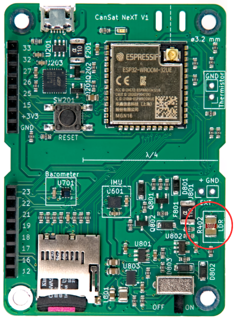

# On-Board-Sensoren

Dieser Artikel stellt die Sensoren vor, die in die Hauptplatine des CanSat NeXT integriert sind. Die Verwendung der Sensoren wird in der Softwaredokumentation behandelt, während dieser Artikel mehr Informationen über die Sensoren selbst bietet.

Es gibt drei On-Board-Sensoren auf der CanSat NeXT Hauptplatine. Diese sind das IMU LSM6DS3, der Drucksensor LPS22HB und der LDR. Zusätzlich verfügt die Platine über einen Durchsteckplatz zum Hinzufügen eines externen Thermistors. Da der LPS22HB bereits sowohl Druck- als auch Temperaturmessfunktionen hat, genügt er theoretisch, um die primären Missionskriterien der CanSat-Wettbewerbe allein zu erfüllen. Da er jedoch die interne Verbindungstemperatur misst, oder im Grunde die Temperatur der Leiterplatte an dieser Stelle, ist er in den meisten Konfigurationen keine gute atmosphärische Temperaturmessung. Zusätzlich kann die absolute Messung des Drucksensors durch die zusätzlichen Daten des IMU-Beschleunigungsmessers unterstützt werden. Der LDR wurde in erster Linie hinzugefügt, um den Schülern zu helfen, die Konzepte bezüglich analoger Sensoren zu erlernen, da die Reaktion auf Reize fast sofort erfolgt, während ein Thermistor Zeit benötigt, um sich zu erwärmen und abzukühlen. Das heißt, er kann auch die kreativen Missionen unterstützen, die sich die Schüler ausdenken, genau wie der Beschleunigungsmesser und das Gyroskop der IMUs. Darüber hinaus ermutigt der CanSat NeXT zusätzlich zur On-Board-Sensorik die Verwendung zusätzlicher Sensoren über die Erweiterungsschnittstelle.

## Inertiale Messeinheit

Das IMU, LSM6DS3 von STMicroelectronics, ist ein SiP (System-in-Package) MEMS-Sensorgerät, das einen Beschleunigungsmesser, ein Gyroskop und die Ausleseelektronik in einem kleinen Gehäuse integriert. Der Sensor unterstützt SPI- und I2C-Serienschnittstellen und enthält auch einen internen Temperatursensor.

Das LSM6DS3 hat umschaltbare Beschleunigungsmessbereiche von ±2/±4/±8/±16 G und Winkelgeschwindigkeitsmessbereiche von ±125/±250/±500/±1000/±2000 Grad/s. Die Verwendung eines höheren Bereichs verringert auch die Auflösung des Geräts.

Im CanSat NeXT wird das LSM6DS3 im I2C-Modus verwendet. Die I2C-Adresse ist 1101010b (0x6A), aber die nächste Version wird die Unterstützung für die Änderung der Hardware hinzufügen, um die Adresse auf 1101011b (0x6B) zu ändern, falls ein fortgeschrittener Benutzer die ursprüngliche Adresse für etwas anderes verwenden muss.

Die Messbereiche werden standardmäßig in der Bibliothek auf das Maximum gesetzt, um die meisten Daten vom heftigen Raketenstart zu erfassen. Die Datenbereiche sind auch vom Benutzer modifizierbar.

## Barometer

Der Drucksensor LPS22HB von STMicroelectronics ist ein weiteres SiP MEMS-Gerät, das für die Messung von Druck von 260-1260 hPa ausgelegt ist. Der Bereich, in dem er Daten meldet, ist erheblich größer, aber die Genauigkeit der Messungen außerhalb dieses Bereichs ist fraglich. Die MEMS-Drucksensoren arbeiten, indem sie piezoresistive Änderungen in der Sensormembran messen. Da die Temperatur den Widerstand des Piezoelements ebenfalls beeinflusst, muss sie kompensiert werden. Um dies zu ermöglichen, hat der Chip auch einen relativ genauen Verbindungstemperatursensor direkt neben dem piezoresistiven Element. Diese Temperaturmessung kann ebenfalls vom Sensor abgelesen werden, aber es muss beachtet werden, dass es sich um eine Messung der internen Chiptemperatur handelt, nicht der umgebenden Luft.

Ähnlich wie das IMU kann auch das LPS22HB entweder über die SPI- oder die I2C-Schnittstelle kommuniziert werden. Im CanSat NeXT ist es mit derselben I2C-Schnittstelle wie das IMU verbunden. Die I2C-Adresse des LPS22HB ist 1011100b (0x5C), aber wir werden die Unterstützung hinzufügen, um sie auf 0x5D zu ändern, falls gewünscht.

## Analog-Digital-Wandler

Dies bezieht sich auf die Spannungsmessung mit dem Befehl analogRead().

Der 12-Bit-Analog-Digital-Wandler (ADC) im ESP32 ist notorisch nichtlinear. Dies spielt für die meisten Anwendungen keine Rolle, wie z.B. die Erkennung von Temperaturänderungen oder Änderungen im LDR-Widerstand, jedoch können absolute Messungen der Batteriespannung oder des NTC-Widerstands etwas knifflig sein. Ein Weg, dies zu umgehen, ist eine sorgfältige Kalibrierung, die ausreichend genaue Daten für die Temperatur liefern würde. Die CanSat-Bibliothek bietet jedoch auch eine kalibrierte Korrekturfunktion. Die Funktion implementiert eine Korrektur mit einem Polynom dritten Grades für den ADC, die die ADC-Ablesung mit der tatsächlichen Spannung am ADC-Pin korreliert. Die Korrekturfunktion ist

$$V = -1.907217e \times 10^{-11} \times a^3 + 8.368612 \times 10^{-8} \times a^2 + 7.081732e \times 10^{-4} \times a + 0.1572375$$

wobei V die gemessene Spannung und a die 12-Bit-ADC-Ablesung von analogRead() ist. Die Funktion ist in der Bibliothek enthalten und wird adcToVoltage genannt. Die Verwendung dieser Formel macht den ADC-Ablesefehler innerhalb eines Spannungsbereichs von 0,1 V - 3,2 V weniger als 1 %.

## Lichtabhängiger Widerstand

Die CanSat NeXT Hauptplatine integriert auch einen LDR in das Sensorset. Der LDR ist eine spezielle Art von Widerstand, bei dem der Widerstand mit der Beleuchtung variiert. Die genauen Eigenschaften können variieren, aber mit dem LDR, den wir derzeit verwenden, beträgt der Widerstand 5-10 kΩ bei 10 Lux und 300 kΩ im Dunkeln.

Die Art und Weise, wie dies im CanSat NeXT verwendet wird, ist, dass eine Spannung von 3,3 V von der MCU an einen Vergleichswiderstand angelegt wird. Dies führt dazu, dass die Spannung bei LDR_OUT

$$V_{LDR} = V_{EN} \frac{R402}{R401+R402} $$

beträgt. Und da sich der R402-Widerstand ändert, ändert sich auch die Spannung bei LDR_OUT. Diese Spannung kann mit dem ESP32 ADC gelesen und dann mit dem Widerstand des LDR korreliert werden. In der Praxis sind wir jedoch normalerweise mehr an der Änderung als am absoluten Wert interessiert. Zum Beispiel reicht es normalerweise aus, eine große Änderung der Spannung zu erkennen, wenn das Gerät nach dem Aussetzen aus der Rakete Licht ausgesetzt wird. Die Schwellenwerte werden normalerweise experimentell festgelegt, anstatt analytisch berechnet. Beachten Sie, dass Sie im CanSat NeXT die analogen On-Board-Sensoren aktivieren müssen, indem Sie den MEAS_EN-Pin auf HIGH setzen. Dies wird in den Beispielcodes gezeigt.

## Thermistor

Die Schaltung, die zum Auslesen des externen Thermistors verwendet wird, ist der LDR-Ausleseschaltung sehr ähnlich. Die gleiche Logik gilt, dass, wenn eine Spannung an den Vergleichswiderstand angelegt wird, sich die Spannung bei TEMP_OUT gemäß

$$V_{TEMP} = V_{EN} \frac{TH501}{TH501+R501} $$

ändert. In diesem Fall sind wir jedoch normalerweise an dem absoluten Wert des Thermistorwiderstands interessiert. Daher ist die VoltageConversion nützlich, da sie die ADC-Ablesungen linearisiert und auch die V_temp direkt berechnet. Auf diese Weise kann der Benutzer den Widerstand des Thermistors im Code berechnen. Der Wert sollte immer noch mit der Temperatur durch Messungen korreliert werden, obwohl das Thermistordatensheet möglicherweise auch einige Hinweise darauf enthält, wie die Temperatur aus dem Widerstand berechnet werden kann. Beachten Sie, dass Sie, wenn Sie alles analytisch machen, auch die Widerstandsvarianz von R501 berücksichtigen sollten. Dies wird am einfachsten durch Messen des Widerstands mit einem Multimeter anstelle der Annahme, dass er 10.000 Ohm beträgt, erreicht.

Der Vergleichswiderstand auf der Leiterplatte ist über einen Temperaturbereich relativ stabil, ändert sich jedoch auch leicht. Wenn sehr genaue Temperaturmessungen gewünscht werden, sollte dies kompensiert werden. Die Verbindungstemperaturmessung des Drucksensors kann dafür verwendet werden. Das heißt, es ist definitiv nicht erforderlich für CanSat-Wettbewerbe. Für diejenigen, die interessiert sind, wird der thermische Koeffizient des R501 vom Hersteller mit 100 PPM/°C angegeben.

Während die Barometertemperatur hauptsächlich die Temperatur der Platine selbst widerspiegelt, kann der Thermistor so montiert werden, dass er auf Temperaturänderungen außerhalb der Platine, sogar außerhalb der Dose, reagiert. Sie können auch Drähte hinzufügen, um ihn noch weiter zu entfernen. Wenn er verwendet wird, kann der Thermistor an der entsprechenden Stelle auf der CanSat NeXT Platine verlötet werden. Die Polarisation spielt keine Rolle, d.h. er kann in beide Richtungen montiert werden.

