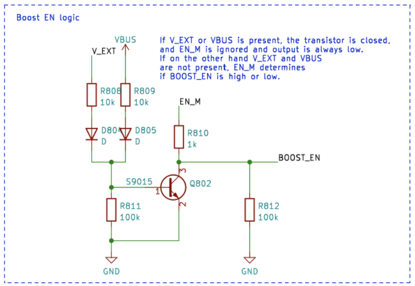

# Elektrisches Energiemanagement

Dieser Artikel erklärt, wie man das CanSat NeXT-Board einschaltet, wie man externe Geräte sicher mit dem Board verbindet und schließlich, wie das Energiesystem funktioniert.

## Erste Schritte

Für die meisten Benutzer reicht es oft aus, einfach zwei AAA-Batterien in den integrierten Batteriefach einzulegen und sie zu sichern. Wenn der USB angeschlossen ist, wechselt CanSat NeXT automatisch zur Nutzung der USB-Stromversorgung anstelle der Batterien, um die Batterielebensdauer zu verlängern. Denken Sie daran, vor einem Flug frische Batterien einzusetzen.

## CanSat NeXT Energiesystem

Es gibt drei Möglichkeiten, das CanSat NeXT mit Strom zu versorgen. Die Standardmethode ist die Stromversorgung über USB, sodass der PC das Gerät mit Strom versorgt, wenn der Benutzer die Software entwickelt, und keine externe Stromversorgung erforderlich ist. Die zweite Möglichkeit ist die Verwendung der integrierten Batterien (OBB). Dies geschieht durch Einlegen von zwei Standard-1,5-V-AAA-Batterien in den Batteriekonnektor auf der Unterseite der Hauptplatine. Der USB bleibt die Standardmethode, auch wenn Batterien eingelegt sind, d. h. die Batteriekapazität wird nicht genutzt, wenn USB angeschlossen ist.

Dies sind die üblichen Optionen und sollten die meisten Anwendungsfälle abdecken. Zusätzlich gibt es jedoch zwei „fortgeschrittene“ Optionen zur Stromversorgung von CanSat NeXT, falls dies für einen speziellen Zweck erforderlich ist. Erstens hat das Board leere Durchgangsloch-Header mit der Bezeichnung EXT, die zum Anschließen einer externen Batterie verwendet werden können. Die Batteriespannung kann 3,2-6V betragen. Die EXT-Leitung wird automatisch getrennt, wenn USB nicht vorhanden ist, um die Batterielebensdauer zu verlängern und die Batterie zu schützen. Es gibt eine Sicherheitsfunktion, dass die OBB deaktiviert wird, wenn eine Batterie angeschlossen ist, aber die OBB sollte dennoch nicht vorhanden sein, wenn externe Batterien verwendet werden.

Es gibt auch eine letzte Option, die dem Benutzer die volle Verantwortung überträgt, nämlich das Eingeben von 3V3 in das Gerät über die Erweiterungsschnittstelle. Dies ist keine sichere Möglichkeit, das Gerät mit Strom zu versorgen, aber fortgeschrittene Benutzer, die wissen, was sie tun, könnten dies als den einfachsten Weg empfinden, um die gewünschten Funktionen zu erreichen.

Zusammenfassend gibt es drei sichere Möglichkeiten, CanSat NeXT mit Strom zu versorgen:

1. Verwendung von USB - Hauptmethode für die Entwicklung
2. Verwendung der integrierten Batterien - empfohlene Methode für den Flug
3. Verwendung einer externen Batterie - Für fortgeschrittene Benutzer

Mit normalen AAA-Batterien wurde eine Batterielebensdauer von 4 Stunden bei Raumtemperatur und 50 Minuten bei -40 Grad Celsius erreicht. Während des Tests las das Gerät alle Sensoren aus und übertrug ihre Daten 10 Mal pro Sekunde. Es sollte beachtet werden, dass normale Alkalibatterien nicht dafür ausgelegt sind, bei solch niedrigen Temperaturen zu arbeiten, und sie beginnen normalerweise, Kalium nach solchen Belastungstests zu lecken. Dies ist nicht gefährlich, aber die Alkalibatterien sollten danach immer sicher entsorgt werden, insbesondere wenn sie in einer ungewöhnlichen Umgebung wie extremer Kälte verwendet wurden oder aus einer Rakete gefallen sind. Oder beides.

Bei Verwendung von USB sollte der Stromverbrauch von den Erweiterungspins 300 mA nicht überschreiten. Die OBB sind etwas nachsichtiger und liefern maximal 800 mA von den Erweiterungspins. Wenn mehr Leistung benötigt wird, sollte eine externe Batterie in Betracht gezogen werden. Dies ist höchstwahrscheinlich nicht der Fall, es sei denn, Sie betreiben Motoren (kleine Servos sind in Ordnung) oder Heizungen, zum Beispiel. Kleine Kameras usw. sind immer noch in Ordnung.

## Extra - wie das adaptive Multi-Source-Energieschema funktioniert

Um die gewünschten Funktionen sicher zu erreichen, müssen wir viele Dinge im Design des Energiesystems berücksichtigen. Erstens muss das Energiesystem, um USB, EXT und OBB gleichzeitig sicher anschließen zu können, die verschiedenen Energiequellen ein- und ausschalten. Dies wird dadurch erschwert, dass es nicht in der Software erfolgen kann, da der Benutzer jede gewünschte Software haben muss, ohne den sicheren Betrieb zu gefährden. Darüber hinaus hat die OBB einen ganz anderen Spannungsbereich als USB und externe Batterie. Dies erfordert, dass die OBB einen Boost-Regler verwendet, während USB und EXT entweder einen Buck-Regler oder einen LDO benötigen. Aus Gründen der Einfachheit und Zuverlässigkeit wird in dieser Leitung ein LDO verwendet. Schließlich sollte ein Netzschalter in der Lage sein, alle Energiequellen zu trennen.

Unten ist das Schaltbild für den Boost-Konverter. Der IC ist BU33UV7NUX, ein speziell entwickelter Boost-Konverter, um +3,3V aus zwei Alkalibatterien zu liefern. Er wird aktiviert, wenn die BOOST_EN-Leitung hoch ist oder über 0,6 V liegt.

Alle OBB-, USB- und EXT-Leitungen sind mit einer Sicherung, Überstromschutz, Verpolungs- und Stromschutz sowie Übertemperaturschutz geschützt. Darüber hinaus ist die OBB mit Unterspannungssperre und Kurzschlussschutz geschützt, da diese Situationen mit Alkalibatterien vermieden werden sollten.

Beachten Sie im folgenden Abschnitt, dass die externe Batteriespannung V_EXT, die USB-Spannung VBUS und die OBB-Spannung BATT ist.

Die BOOST_EN-Leitung wird von einem Schaltkreis gesteuert, der entweder das Eingangssignal von der EN_MASTER (EN_M)-Leitung übernimmt oder dies ignoriert, wenn V_EXT oder VBUS vorhanden ist. Dies soll sicherstellen, dass der Boost immer ausgeschaltet ist, wenn VBUS und V_EXT vorhanden sind, und er nur aktiviert wird, wenn sowohl VBUS als auch V_EXT bei 0V sind und die EN_M hoch ist.

Oder als Wahrheitstabelle:

| V_EXT | VBUS | EN_M | BOOST_EN |
|-------|------|------|----------|
| 1     | 1    | 1    | 0        |
| 1     | 1    | 0    | 0        |
| 0     | 0    | 0    | 0        |
| 0     | 0    | 1    | 1        |

Also BOOST_EN = EN_M ∧ !(V_EXT ∨ V_BUS).

Als nächstes müssen wir V_EXT trennen, wenn VBUS vorhanden ist, um unerwünschte Entladung oder versehentliches Laden zu verhindern. Dies wird mit einem Netzschalter-IC unter Verwendung eines Transistorschaltkreises durchgeführt, der die Enable-Leitung des Netzschalters herunterzieht, wenn VBUS vorhanden ist. Dies trennt die Batterie. Die USB-Leitung wird immer verwendet, wenn sie vorhanden ist, daher wird sie mit einer einfachen Schottky-Diode zum LDO geleitet.

Insgesamt führt dieser Schaltkreis zu einer Funktionalität, bei der USB-Strom verwendet wird, wenn er vorhanden ist, und V_EXT verwendet wird, wenn USB nicht vorhanden ist. Schließlich wird die EN_M verwendet, um den LDO zu aktivieren oder zu deaktivieren.

Die EN_M wird vom Benutzer über einen Netzschalter gesteuert. Der Schalter verbindet EN_M entweder mit USB oder EXT oder der Batteriespannung, wenn nur OBB verwendet wird. Wenn der Schalter ausgeschaltet ist, verbindet er EN_M mit Masse, wodurch sowohl der LDO als auch der Boost-Regler ausgeschaltet werden.

In der Praxis schaltet der Netzschalter das Gerät ein/aus, USB wird verwendet, wenn es vorhanden ist, und V_EXT wird gegenüber OBB bevorzugt. Schließlich gibt es noch ein Detail zu beachten. Welche Spannung sollte der ESP32 als Batteriespannung messen?

Dies wurde auf einfache Weise gelöst. Die Spannung, die mit dem ESP32-ADC verbunden ist, ist immer die OBB, aber der Benutzer kann stattdessen V_EXT auswählen, indem er den Jumper mit einem Skalpell durchtrennt und den Jumper JP801 lötet, um stattdessen 2-3 zu überbrücken. Dies wählt V_EXT für die BATT_MEAS aus.

Der Jumper befindet sich auf der Unterseite der CanSat NeXT-Hauptplatine. Der Jumper ist ziemlich einfach zu löten, also scheuen Sie sich nicht, die 1-2-Leitung zu durchtrennen, wenn Sie eine externe Batterie verwenden. Er kann immer wieder gelötet werden, um stattdessen wieder 1-2 zu verwenden.