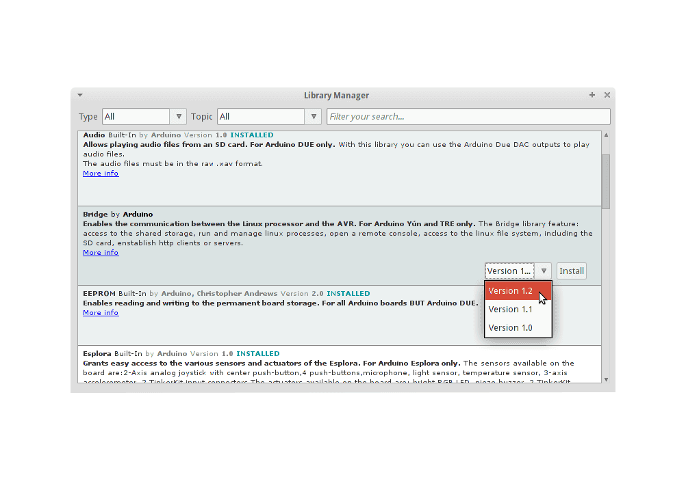

# CanSat NeXT Software

Die empfohlene Methode zur Verwendung von CanSat NeXT ist die CanSat NeXT Arduino-Bibliothek, die im Arduino-Bibliotheksmanager und auf Github verfügbar ist. Vor der Installation der CanSat NeXT-Bibliothek müssen Sie die Arduino IDE und die ESP32-Board-Unterstützung installieren.

## Erste Schritte

### Arduino IDE installieren

Falls noch nicht geschehen, laden Sie die Arduino IDE von der offiziellen Website https://www.arduino.cc/en/software herunter und installieren Sie sie.

### ESP32-Unterstützung hinzufügen

CanSat NeXT basiert auf dem ESP32-Mikrocontroller, der in der Standardinstallation der Arduino IDE nicht enthalten ist. Wenn Sie ESP32-Mikrocontroller noch nicht mit Arduino verwendet haben, muss die Unterstützung für das Board zuerst installiert werden. Dies kann in der Arduino IDE unter *Werkzeuge->Board->Boardverwalter* (oder einfach (Strg+Umschalt+B) überall drücken) erfolgen. Suchen Sie im Boardverwalter nach ESP32 und installieren Sie das esp32 von Espressif.

### CanSat NeXT-Bibliothek installieren

Die CanSat NeXT-Bibliothek kann über den Bibliotheksmanager der Arduino IDE unter *Sketch > Bibliotheken einbinden > Bibliotheken verwalten* heruntergeladen werden.

*Bildquelle: Arduino Docs, https://docs.arduino.cc/software/ide-v1/tutorials/installing-libraries*

Geben Sie in der Suchleiste des Bibliotheksmanagers "CanSatNeXT" ein und wählen Sie "Installieren". Wenn die IDE fragt, ob Sie auch die Abhängigkeiten installieren möchten, klicken Sie auf Ja.

## Manuelle Installation

Die Bibliothek ist auch in ihrem eigenen [GitHub-Repository](https://github.com/netnspace/CanSatNeXT_library) gehostet und kann geklont oder heruntergeladen und aus dem Quellcode installiert werden.

In diesem Fall müssen Sie die Bibliothek extrahieren und in das Verzeichnis verschieben, in dem die Arduino IDE sie finden kann. Den genauen Speicherort finden Sie unter *Datei > Voreinstellungen > Sketchbook*.

*Bildquelle: Arduino Docs, https://docs.arduino.cc/software/ide-v1/tutorials/installing-libraries*

# Verbindung zum PC

Nach der Installation der CanSat NeXT-Softwarebibliothek können Sie den CanSat NeXT an Ihren Computer anschließen. Falls er nicht erkannt wird, müssen Sie möglicherweise zuerst die erforderlichen Treiber installieren. Die Treiberinstallation erfolgt in den meisten Fällen automatisch, jedoch muss sie auf einigen PCs manuell durchgeführt werden. Treiber finden Sie auf der Silicon Labs-Website: https://www.silabs.com/developers/usb-to-uart-bridge-vcp-drivers
Für zusätzliche Hilfe bei der Einrichtung des ESP32 siehe folgendes Tutorial: https://docs.espressif.com/projects/esp-idf/en/latest/esp32/get-started/establish-serial-connection.html

# Sie sind bereit!

Sie können nun CanSatNeXT-Beispiele in der Arduino IDE unter *Datei->Beispiele->CanSatNeXT* finden.