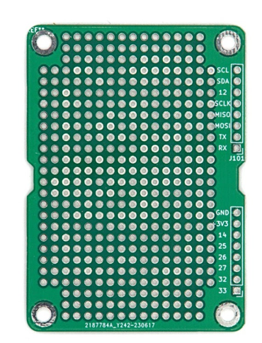

import perfboard_render from './img/perf_render.png';

# CanSat NeXT Perf Board

La CanSat NeXT Perf Board es un accesorio diseñado para facilitar la integración de dispositivos externos al CanSat y para hacer que tus propios componentes electrónicos sean mecánicamente más seguros y mejor organizados. Es esencialmente una placa de prototipos, que comparte la forma de la placa CanSat NeXT, y también proporciona conectividad fácil al conector de pines de extensión.

La característica principal de la placa de prototipos son los agujeros metalizados, espaciados a 0.1 pulgadas (2.54 mm) de distancia, que es el **paso** estándar utilizado en electrónica, especialmente en electrónica de hobby. Esto facilita enormemente la integración de la mayoría de los módulos comerciales y muchos circuitos integrados comerciales, ya que pueden ser soldados directamente a los contactos en la placa de prototipos.

En la parte superior, los agujeros tienen un pequeño anillo metalizado para ayudar en la conectividad, pero en la parte inferior hay grandes rectángulos metalizados, que facilitan mucho la creación de puentes de soldadura entre los cuadrados, ayudando a crear la conectividad eléctrica entre los dispositivos en tu placa, y entre los dispositivos añadidos y el CanSat NeXT.

Además, algunos de los agujeros metalizados más cercanos al conector ya están conectados a los conectores de pines de extensión. Esto te ayuda a evitar la necesidad de añadir cables entre el conector de pines y el área principal de la placa de prototipos, ayudando también a apilar múltiples placas de prototipos una encima de otra, especialmente cuando se utilizan [conectores de pines apilables](https://spacelabnextdoor.com/electronics/32-cansat-next-stacking-header). Para verificar qué extensión de pin hace qué, consulta el [Pinout](../CanSat-hardware/pin_out)

