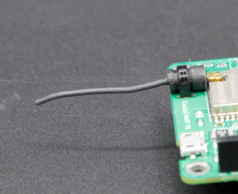

# Comunicación y Antenas

Este artículo introduce los conceptos clave necesarios para la transmisión de datos inalámbrica con CanSat NeXT. Primero, se discute el sistema de comunicación a nivel general, luego se presentan algunas opciones diferentes para la selección de antenas al usar CanSat NeXT. Finalmente, la última parte del artículo presenta un tutorial simple para construir una antena monopolo de un cuarto de onda a partir de las partes incluidas en el kit.

## Comenzando

CanSat NeXT está casi listo para comenzar la comunicación inalámbrica directamente desde la caja. Lo único que se necesita es el software adecuado y una antena tanto para el transmisor como para el receptor. Para el primero, consulte los materiales de software en esta página. Para el segundo, esta página incluye instrucciones sobre cómo seleccionar una antena externa y cómo construir una antena monopolo simple a partir de los materiales incluidos con el CanSat NeXT.

Aunque la placa es bastante resistente a estas cosas gracias a las verificaciones de software, nunca debes intentar transmitir nada desde una radio sin una antena. Aunque es poco probable debido a las bajas potencias involucradas con este sistema, la onda de radio reflejada puede causar daño real a la electrónica.

## Sistema de Comunicación CanSat NeXT

CanSat NeXT maneja la transferencia de datos inalámbrica de manera un poco diferente a los kits CanSat anteriores. En lugar de un módulo de radio separado, CanSat NeXT utiliza el radio WiFi integrado del MCU para la comunicación. El radio WiFi se usa normalmente para transferir datos entre un ESP32 e internet, permitir el uso de ESP32 como un servidor simple, o incluso conectar ESP32 a un dispositivo bluetooth, pero con ciertos trucos de configuración TCP-IP inteligentes, podemos habilitar la comunicación directa de igual a igual entre dispositivos ESP32. El sistema se llama ESP-NOW, y es desarrollado y mantenido por EspressIf, quienes son los desarrolladores del hardware ESP32. Además, existen esquemas especiales de comunicación de baja tasa, que al aumentar la energía por bit de la transmisión, aumentan significativamente el alcance posible del radio WiFi sobre los habituales pocos decenas de metros.

La tasa de datos de ESP-NOW es significativamente más rápida de lo que sería posible con la antigua radio. Incluso simplemente disminuyendo el tiempo entre paquetes en el código de ejemplo, CanSat NeXT es capaz de transmitir ~20 paquetes completos a la GS en un segundo. Teóricamente, la tasa de datos puede ser de hasta 250 kbit/s en el modo de largo alcance, pero esto puede ser difícil de lograr en el software. Dicho esto, la transmisión de, por ejemplo, imágenes completas de una cámara durante el vuelo debería ser completamente factible con el software correcto.

Incluso con antenas monopolo de un cuarto de longitud de onda simples (un trozo de alambre de 31 mm) en ambos extremos, CanSat NeXT pudo enviar datos a la estación terrestre desde 1.3 km de distancia, momento en el cual se perdió la línea de visión. Al probar con un dron, el alcance se limitó a aproximadamente 1 km. Es posible que el dron interfiriera con la radio lo suficiente como para limitar un poco el alcance. Sin embargo, con una mejor antena, el alcance podría aumentarse aún más. Una pequeña antena yagi habría aumentado teóricamente el alcance operativo 10 veces.

Hay un par de detalles prácticos que difieren del sistema de comunicación por radio anterior. Primero, el "emparejamiento" de los satélites con los receptores de la estación terrestre ocurre con direcciones de Control de Acceso al Medio (MAC), que se establecen en el código. El sistema WiFi es lo suficientemente inteligente como para manejar los problemas de sincronización, colisión y frecuencia detrás de escena. El usuario simplemente necesita asegurarse de que la GS esté escuchando la dirección MAC con la que el satélite está transmitiendo.
En segundo lugar, la frecuencia de la radio es diferente. La radio WiFi opera en la banda de 2.4 GHz (la frecuencia central es 2.445 GHz), lo que significa que tanto las características de propagación como los requisitos para el diseño de antenas son diferentes a los de antes. La señal es algo más sensible a la lluvia y a problemas de línea de visión, y podría no ser capaz de transmitir en algunos casos donde el sistema antiguo habría funcionado.

La longitud de onda de la señal de radio también es diferente. Dado que

$$\lambda = \frac{c}{f} \approx \frac{3*10^8 \text{ m/s}}{2.445 * 10^9 \text {Hz}} = 0.12261 \text{ m,}$$

una antena monopolo de un cuarto de longitud de onda debería tener una longitud de 0.03065 m o 30.65 mm. Esta longitud también está marcada en el PCB de CanSat NeXT para facilitar el corte del cable. La antena debe cortarse con precisión, pero dentro de ~0.5 mm está bien.

Una antena de un cuarto de longitud de onda tiene un rendimiento de RF suficiente para las competiciones de CanSat. Dicho esto, podría ser de interés para algunos usuarios obtener un alcance aún mejor. Un posible lugar de mejora es en la longitud de la antena monopolo. En la práctica, la resonancia de un cuarto de longitud de onda podría no estar exactamente en la frecuencia correcta, ya que otros parámetros como el entorno, los elementos metálicos circundantes o la porción del cable aún cubierta con metal conectado a tierra podrían afectar un poco la resonancia. La antena podría ajustarse con el uso de un analizador de redes vectoriales (VNA). Creo que debería hacer esto en algún momento y corregir los materiales en consecuencia.

Una solución más robusta sería usar un estilo diferente de antena. A 2.4 GHz, hay muchas ideas divertidas de antenas en internet. Estas incluyen una antena de hélice, antena yagi, antena "pringles", y muchas otras. Muchas de estas, si están bien construidas, superarán fácilmente al simple monopolo. Incluso solo un dipolo sería una mejora sobre un simple alambre.

El conector utilizado en la mayoría de los módulos ESP32 es un conector Hirose U.FL. Este es un conector RF en miniatura de buena calidad, que proporciona un buen rendimiento RF para señales débiles. Un problema con este conector, sin embargo, es que el cable es bastante delgado, lo que lo hace un poco impráctico en algunos casos. También conduce a pérdidas de RF mayores de lo deseado si el cable es largo, como podría ser al usar una antena externa. En estos casos, se podría usar un cable adaptador de U.FL a SMA. Veré si podemos proporcionar estos en nuestra tienda en línea. Esto permitiría a los equipos usar un conector SMA más familiar. Dicho esto, es completamente posible construir buenas antenas usando solo U.FL.

A diferencia de SMA, sin embargo, U.FL se basa mecánicamente en características de retención a presión para mantener el conector en su lugar. Esto suele ser suficiente, sin embargo, para mayor seguridad, es una buena idea agregar una brida para mayor seguridad. El PCB de CanSat NeXT tiene ranuras junto al conector de la antena para acomodar una pequeña brida. Idealmente, se añadiría una funda de soporte impresa en 3D o construida de otra manera para el cable antes de la brida. Un archivo para el soporte impreso en 3D está disponible en la página de GitHub.

## Opciones de Antena {#antenna-options}

Una antena es esencialmente un dispositivo que transforma ondas electromagnéticas no guiadas en guiadas, y viceversa. Debido a la naturaleza simple del dispositivo, hay una multitud de opciones de las cuales seleccionar la antena para su dispositivo. Desde un punto de vista práctico, la selección de antenas tiene mucha libertad y bastantes cosas a considerar. Necesitas considerar al menos

1. Frecuencia de operación de la antena (debe incluir 2.45 GHz)
2. Ancho de banda de la antena (Al menos 35 MHz)
3. Impedancia de la antena (50 ohmios)
4. Conector (U.FL o puedes usar adaptadores)
5. Tamaño físico (¿Cabe en la lata?)
6. Costo
7. Métodos de fabricación, si estás haciendo la antena tú mismo.
8. Polarización de la antena.

La selección de antenas puede parecer abrumadora, y a menudo lo es, sin embargo, en este caso se hace mucho más fácil por el hecho de que estamos usando un radio Wi-Fi: de hecho, podemos usar casi cualquier antena Wi-Fi de 2.4 GHz con el sistema. Sin embargo, la mayoría de ellas son demasiado grandes, y también tienden a usar conectores llamados RP-SMA, en lugar de U.FL. Sin embargo, con un adaptador adecuado, pueden ser buenas opciones para usar con la estación terrestre. Incluso hay antenas directivas disponibles, lo que significa que puedes obtener ganancia adicional para mejorar el enlace de radio.

Las antenas Wi-Fi son una opción sólida, sin embargo, tienen un inconveniente significativo: la polarización. Casi siempre están polarizadas linealmente, lo que significa que la intensidad de la señal varía significativamente dependiendo de la orientación del transmisor y el receptor. En los peores casos, las antenas perpendiculares entre sí podrían incluso ver que la señal se desvanece por completo. Por lo tanto, una opción alternativa es usar antenas de drones, que tienden a estar polarizadas circularmente. En la práctica, esto significa que tenemos algunas pérdidas de polarización constantes, pero son menos dramáticas. Una solución alternativa e inteligente para evitar el problema de polarización es usar dos receptores, con antenas montadas perpendiculares entre sí. De esta manera, al menos uno de ellos siempre tendrá una orientación adecuada para recibir la señal.

Por supuesto, un verdadero creador siempre querrá hacer su propia antena. Algunas construcciones interesantes que son adecuadas para la fabricación DIY incluyen una antena de hélice, antena "pringles", yagi, dipolo, o una antena monopolo. Hay muchas instrucciones en línea para construir la mayoría de estas. La última parte de este artículo muestra cómo hacer tu propia antena monopolo, adecuada para competiciones de CanSat, a partir de los materiales enviados con CanSat NeXT.

## Construyendo una antena monopolo de un cuarto de onda {#quarter-wave-antenna}

Esta sección del artículo describe cómo construir una antena monopolo de un cuarto de onda razonablemente efectiva a partir de los materiales incluidos en el kit. La antena se llama así ya que solo tiene un polo (en comparación con un dipolo), y su longitud es un cuarto de la longitud de onda que estamos transmitiendo.

Además del cable coaxial y un trozo de tubo termorretráctil, necesitarás algún tipo de pelacables y cortadores de alambre. Casi cualquier tipo funcionará. Además, necesitarás una fuente de calor para el termorretráctil, como una pistola de aire caliente, un soldador o incluso un encendedor.

Primero, comienza cortando el cable aproximadamente por la mitad.

A continuación, construiremos la antena real. Esta parte debe hacerse con la mayor precisión posible. Dentro de 0.2 mm o algo así funcionará bien, pero intenta que sea lo más cercana a la longitud correcta posible, ya que eso ayudará con el rendimiento.

Un cable coaxial consta de cuatro partes: un conductor central, dieléctrico, blindaje y una cubierta exterior. Por lo general, estos cables se utilizan para transmitir señales de radiofrecuencia entre dispositivos, de modo que las corrientes en el conductor central se equilibran con las del blindaje. Sin embargo, al eliminar el conductor del blindaje, las corrientes en el conductor interno crearán una antena. La longitud de esta área expuesta determinará la longitud de onda o frecuencia de operación de la antena, y ahora queremos que coincida con nuestra frecuencia de operación de 2.445 GHz, por lo que necesitamos eliminar el blindaje de una longitud de 30.65 mm.

Desnuda cuidadosamente la cubierta exterior del cable. Idealmente, intenta eliminar solo la cubierta y el blindaje de la longitud deseada. Sin embargo, cortar el aislante no es una catástrofe. Por lo general, es más fácil quitar la cubierta exterior en partes, en lugar de todo de una vez. Además, podría ser más fácil quitar demasiado al principio y luego cortar el conductor interno a la longitud correcta, en lugar de intentar hacerlo exactamente bien en el primer intento.

La imagen a continuación muestra los cables pelados. Intenta hacerlo como el superior, pero el inferior también funcionará; simplemente podría ser más sensible a la humedad. Si quedan piezas colgantes del blindaje, córtalas cuidadosamente. Asegúrate de que no haya posibilidad de que el conductor interno y el blindaje se toquen entre sí; incluso una sola hebra haría que la antena fuera inutilizable.

La antena ahora es totalmente funcional en este punto, sin embargo, puede ser sensible a la humedad. Por lo tanto, ahora queremos agregar una nueva cubierta a esto, que es para lo que sirve el tubo termorretráctil. Corta dos piezas, ligeramente más largas que la antena que has hecho, y colócalas sobre la antena y usa una fuente de calor para encogerlas en su lugar. Ten cuidado de no quemar el tubo termorretráctil, especialmente si usas algo diferente a una pistola de aire caliente.

Después de esto, las antenas están listas. En el lado de la estación terrestre, la antena probablemente esté bien así. Por otro lado, aunque el conector es bastante seguro, es una buena idea soportar el conector de alguna manera en el lado de CanSat. Una forma muy robusta es usar un soporte impreso en 3D y una brida, sin embargo, muchos otros métodos también funcionarán. Recuerda también considerar cómo se colocará la antena dentro de la lata. Idealmente, debería estar en un lugar donde la transmisión no esté bloqueada por ninguna parte metálica.

### Soporte de antena

Finalmente, aquí hay un archivo step del soporte mostrado en la imagen. Puedes importarlo en la mayoría del software CAD, y modificarlo, o imprimirlo con una impresora 3D.

[Descargar archivo step](/assets/3d-files/uFl-support.step)