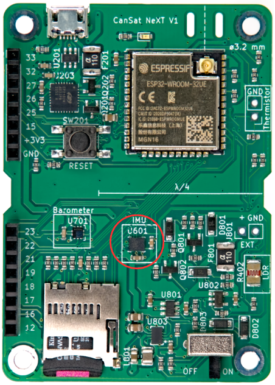

# Sensores Integrados

Este artículo presenta los sensores integrados en la placa principal de CanSat NeXT. El uso de los sensores se cubre en la documentación del software, mientras que este artículo proporciona más información sobre los propios sensores.

Hay tres sensores integrados en la placa principal de CanSat NeXT. Estos son el IMU LSM6DS3, el sensor de presión LPS22HB y el LDR. Además, la placa tiene una ranura para agregar un termistor externo. Como el LPS22HB ya tiene capacidades de medición de presión y temperatura, teóricamente es suficiente para cumplir con los criterios de misión primaria de las competiciones CanSat por sí solo. Sin embargo, como mide la temperatura de la unión interna, o básicamente la temperatura del PCB en ese punto, no es una buena medición de la temperatura atmosférica en la mayoría de las configuraciones. Además, la medición absoluta del sensor de presión puede ser apoyada por los datos adicionales del acelerómetro IMU. El LDR se ha agregado principalmente para ayudar a los estudiantes a aprender los conceptos relacionados con los sensores analógicos, ya que la respuesta a los estímulos es casi instantánea, mientras que un termistor tarda en calentarse y enfriarse. Dicho esto, también puede apoyar las misiones creativas que los estudiantes ideen, al igual que el acelerómetro y el giroscopio de los IMU. Además, además del sensor integrado, el CanSat NeXT fomenta el uso de sensores adicionales a través de la interfaz de extensión.

## Unidad de Medición Inercial

El IMU, LSM6DS3 de STMicroelectronics es un dispositivo sensor MEMS de estilo SiP (sistema en paquete), que integra un acelerómetro, giroscopio y la electrónica de lectura en un paquete pequeño. El sensor admite interfaces seriales SPI e I2C, y también incluye un sensor de temperatura interno.

El LSM6DS3 tiene rangos de medición de aceleración conmutables de ±2/±4/±8/±16 G y rangos de medición de velocidad angular de ±125/±250/±500/±1000/±2000 deg/s. El uso de un rango más alto también disminuye la resolución del dispositivo.

En CanSat NeXT, el LSM6DS3 se utiliza en modo I2C. La dirección I2C es 1101010b (0x6A), pero la próxima versión añadirá soporte para modificar el hardware para cambiar la dirección a 1101011b (0x6B) si un usuario avanzado necesita usar la dirección original para otra cosa.

Los rangos de medición se establecerán en el máximo por defecto en la biblioteca para capturar la mayor cantidad de datos del violento lanzamiento del cohete. Los rangos de datos también son modificables por el usuario.

## Barómetro

El sensor de presión LPS22HB de STMicroelectronics es otro dispositivo MEMS SiP, diseñado para la medición de presión de 260-1260 hPa. El rango en el que informa datos es significativamente mayor, pero la precisión de las mediciones fuera de ese rango es cuestionable. Los sensores de presión MEMS funcionan midiendo cambios piezoresistivos en el diafragma del sensor. Como la temperatura afecta la resistencia del elemento piezoeléctrico, también necesita ser compensada. Para habilitar esto, el chip también tiene un sensor de temperatura de unión relativamente preciso justo al lado del elemento piezoresistivo. Esta medición de temperatura también se puede leer del sensor, pero hay que tener en cuenta que es una medición de la temperatura interna del chip, no del aire circundante.

Similar al IMU, el LPS22HB también puede comunicarse usando la interfaz SPI o I2C. En CanSat NeXT, está conectado a la misma interfaz I2C que el IMU. La dirección I2C del LPS22HB es 1011100b (0x5C), pero añadiremos soporte para cambiarla a 0x5D si se desea.

## Convertidor Analógico a Digital

Esto se refiere a la medición de voltaje usando el comando analogRead().

El convertidor analógico a digital (ADC) de 12 bits en ESP32 es notoriamente no lineal. Esto no importa para la mayoría de las aplicaciones, como usarlo para detectar cambios de temperatura o cambios en la resistencia del LDR, sin embargo, hacer mediciones absolutas del voltaje de la batería o la resistencia del NTC puede ser un poco complicado. Una forma de solucionar esto es mediante una calibración cuidadosa, lo que proporcionaría datos suficientemente precisos para la temperatura, por ejemplo. Sin embargo, la biblioteca CanSat también proporciona una función de corrección calibrada. La función implementa una corrección polinómica de tercer orden para el ADC, correlacionando la lectura del ADC con el voltaje real presente en el pin del ADC. La función de corrección es

$$V = -1.907217e \times 10^{-11} \times a^3 + 8.368612 \times 10^{-8} \times a^2 + 7.081732e \times 10^{-4} \times a + 0.1572375$$

Donde V es el voltaje medido y a es la lectura del ADC de 12 bits de analogRead(). La función está incluida en la biblioteca y se llama adcToVoltage. Usar esta fórmula hace que el error de lectura del ADC sea inferior al 1% dentro de un rango de voltaje de 0.1 V - 3.2 V.

## Resistor Dependiente de la Luz

La placa principal de CanSat NeXT incorpora un LDR al conjunto de sensores también. El LDR es un tipo especial de resistor, en el que la resistencia varía con la iluminación. Las características exactas pueden variar, pero con el LDR que estamos utilizando actualmente, la resistencia es de 5-10 kΩ a 10 lux, y 300 kΩ en la oscuridad.

La forma en que se utiliza esto en CanSat NeXT, es que se aplica un voltaje de 3.3 V a un resistor de comparación desde el MCU. Esto hace que el voltaje en LDR_OUT sea

$$V_{LDR} = V_{EN} \frac{R402}{R401+R402} $$.

Y a medida que cambia la resistencia de R402, el voltaje en LDR_OUT también cambiará. Este voltaje se puede leer con el ADC del ESP32, y luego correlacionarse con la resistencia del LDR. En la práctica, sin embargo, generalmente con los LDR estamos interesados en el cambio más que en el valor absoluto. Por ejemplo, generalmente basta con detectar un gran cambio en el voltaje cuando el dispositivo se expone a la luz después de ser desplegado desde el cohete, por ejemplo. Los valores de umbral generalmente se establecen experimentalmente, en lugar de calcularse analíticamente. Tenga en cuenta que en CanSat NeXT, necesita habilitar los sensores analógicos integrados escribiendo el pin MEAS_EN en ALTO. Esto se muestra en los códigos de ejemplo.

## Termistor

El circuito utilizado para leer el termistor externo es muy similar al circuito de lectura del LDR. Se aplica la misma lógica exacta, que cuando se aplica un voltaje al resistor de comparación, el voltaje en TEMP_OUT cambia de acuerdo con

$$V_{TEMP} = V_{EN} \frac{TH501}{TH501+R501} $$.

En este caso, sin embargo, generalmente estamos interesados en el valor absoluto de la resistencia del termistor. Por lo tanto, la Conversión de Voltaje es útil, ya que lineariza las lecturas del ADC y también calcula directamente el V_temp. De esta manera, el usuario puede calcular la resistencia del termistor en el código. El valor aún debe correlacionarse con la temperatura mediante mediciones, aunque la hoja de datos del termistor también podría incluir algunas pistas sobre cómo calcular la temperatura a partir de la resistencia. Tenga en cuenta que si hace todo analíticamente, también debe tener en cuenta la variación de resistencia de R501. Esto se hace más fácilmente midiendo la resistencia con un multímetro, en lugar de asumir que es de 10 000 ohmios.

El resistor de comparación en el PCB es relativamente estable en un rango de temperatura, sin embargo, también cambia ligeramente. Si se desean lecturas de temperatura muy precisas, esto debe compensarse. La medición de temperatura de la unión del sensor de presión se puede utilizar para esto. Dicho esto, definitivamente no es necesario para las competiciones CanSat. Para aquellos interesados, el coeficiente térmico de R501 es reportado por el fabricante como 100 PPM/°C.

Mientras que la temperatura del barómetro refleja principalmente la temperatura de la propia placa, el termistor se puede montar de tal manera que reaccione a los cambios de temperatura fuera de la placa, incluso fuera de la lata. También puede agregar cables para alejarlo aún más. Si se va a utilizar, el termistor se puede soldar en la ubicación adecuada en la placa CanSat NeXT. La polarización no importa, es decir, se puede montar de cualquier manera.

