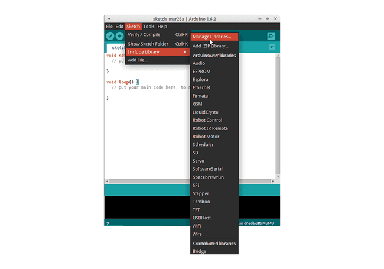

# Software de CanSat NeXT

La forma recomendada de usar CanSat NeXT es con la biblioteca de Arduino CanSat NeXT, disponible desde el administrador de bibliotecas de Arduino y Github. Antes de instalar la biblioteca CanSat NeXT, debes instalar Arduino IDE y el soporte para placas ESP32.

## Comenzando

### Instalar Arduino IDE

Si aún no lo has hecho, descarga e instala el Arduino IDE desde el sitio web oficial https://www.arduino.cc/en/software.

### Agregar soporte para ESP32

CanSat NeXT está basado en el microcontrolador ESP32, que no está incluido en la instalación predeterminada de Arduino IDE. Si no has usado microcontroladores ESP32 con Arduino antes, el soporte para la placa debe instalarse primero. Se puede hacer en Arduino IDE desde *Tools->board->Board Manager* (o simplemente presiona (Ctrl+Shift+B) en cualquier lugar). En el administrador de placas, busca ESP32 e instala el esp32 de Espressif.

### Instalar la biblioteca Cansat NeXT

La biblioteca CanSat NeXT se puede descargar desde el Administrador de Bibliotecas del Arduino IDE desde *Sketch > Include Libraries > Manage Libraries*.

*Fuente de la imagen: Arduino Docs, https://docs.arduino.cc/software/ide-v1/tutorials/installing-libraries*

En la barra de búsqueda del Administrador de Bibliotecas, escribe "CanSatNeXT" y elige "Install". Si el IDE pregunta si también deseas instalar las dependencias, haz clic en sí.

## Instalación manual

La biblioteca también está alojada en su propio [repositorio de GitHub](https://github.com/netnspace/CanSatNeXT_library) y se puede clonar o descargar e instalar desde la fuente.

En este caso, necesitas extraer la biblioteca y moverla al directorio donde Arduino IDE pueda encontrarla. Puedes encontrar la ubicación exacta en *File > Preferences > Sketchbook*.

*Fuente de la imagen: Arduino Docs, https://docs.arduino.cc/software/ide-v1/tutorials/installing-libraries*

# Conectando al PC

Después de instalar la biblioteca de software CanSat NeXT, puedes conectar el CanSat NeXT a tu computadora. En caso de que no sea detectado, es posible que necesites instalar los controladores necesarios primero. La instalación del controlador se realiza automáticamente en la mayoría de los casos, sin embargo, en algunas PC debe hacerse manualmente. Los controladores se pueden encontrar en el sitio web de Silicon Labs: https://www.silabs.com/developers/usb-to-uart-bridge-vcp-drivers
Para obtener ayuda adicional con la configuración del ESP32, consulta el siguiente tutorial: https://docs.espressif.com/projects/esp-idf/en/latest/esp32/get-started/establish-serial-connection.html

# ¡Estás listo para comenzar!

Ahora puedes encontrar ejemplos de CanSatNeXT desde el Arduino IDE en *File->Examples->CanSatNeXT*.