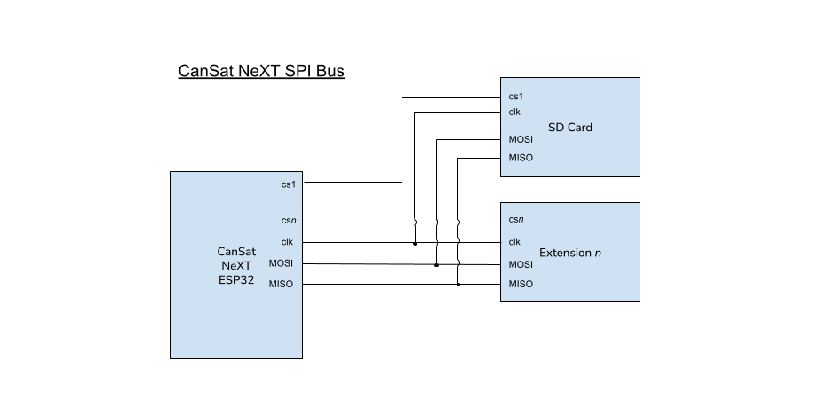

# Interfaz de extensión

Se pueden construir y utilizar dispositivos personalizados junto con CanSat. Estos pueden usarse para realizar proyectos interesantes, para los cuales puedes encontrar ideas en nuestro [Blog](/blog).

La interfaz de extensión de CanSat cuenta con una línea UART libre, dos pines ADC y 5 pines de E/S digitales libres. Además, las líneas SPI e I2C están disponibles para la interfaz de extensión, aunque se comparten con la tarjeta SD y el conjunto de sensores, respectivamente.

El usuario también puede optar por usar los pines UART2 y ADC como E/S digitales, en caso de que la comunicación serial o la conversión de analógico a digital no sean necesarias en su solución.

| Número de pin | Nombre del pin | Usar como    | Notas                     |
|---------------|----------------|--------------|---------------------------|
| 12            | GPIO12         | E/S Digital  | Libre                     |
| 15            | GPIO15         | E/S Digital  | Libre                     |
| 16            | GPIO16         | UART2 RX     | Libre                     |
| 17            | GPIO17         | UART2 TX     | Libre                     |
| 18            | SPI_CLK        | SPI CLK      | Uso compartido con tarjeta SD |
| 19            | SPI_MISO       | SPI MISO     | Uso compartido con tarjeta SD |
| 21            | I2C_SDA        | I2C SDA      | Uso compartido con conjunto de sensores |
| 22            | I2C_SCL        | I2C SCL      | Uso compartido con conjunto de sensores |
| 23            | SPI_MOSI       | SPI MOSI     | Uso compartido con tarjeta SD |
| 25            | GPIO25         | E/S Digital  | Libre                     |
| 26            | GPIO26         | E/S Digital  | Libre                     |
| 27            | GPIO27         | E/S Digital  | Libre                     |
| 32            | GPIO32         | ADC          | Libre                     |
| 33            | GPIO33         | ADC          | Libre                     |

*Tabla: Tabla de búsqueda de pines de la interfaz de extensión. El nombre del pin se refiere al nombre del pin de la biblioteca.*

# Opciones de comunicación

La biblioteca de CanSat no incluye envoltorios de comunicación para los dispositivos personalizados. Para la comunicación UART, I2C y SPI entre CanSat NeXT y tu dispositivo de carga útil personalizado, consulta las bibliotecas predeterminadas de Arduino [UART](https://docs.arduino.cc/learn/communication/uart/), [Wire](https://docs.arduino.cc/learn/communication/wire/) y [SPI](https://docs.arduino.cc/learn/communication/spi/), respectivamente.

## UART

La línea UART2 es una buena alternativa ya que sirve como una interfaz de comunicación no asignada para cargas útiles extendidas.

Para enviar datos a través de la línea UART, consulta el Arduino 

```
       CanSat NeXT
          ESP32                          Dispositivo del usuario
   +----------------+                 +----------------+
   |                |   TX (Transmitir) |                |
   |       TX  o----|---------------->| RX  (Recibir)   |
   |                |                 |                |
   |       RX  o<---|<----------------| TX             |
   |                |   GND (Tierra)  |                |
   |       GND  o---|-----------------| GND            |
   +----------------+                 +----------------+
```
*Imagen: Protocolo UART en ASCII*

## I2C

El uso de I2C está soportado, pero el usuario debe tener en cuenta que existe otro subsistema en la línea.

Con múltiples esclavos I2C, el código del usuario necesita especificar qué esclavo I2C está utilizando el CanSat en un momento dado. Esto se distingue con una dirección de esclavo, que es un código hexadecimal único para cada dispositivo y se puede encontrar en la hoja de datos del dispositivo del subsistema.

## SPI

El uso de SPI también está soportado, pero el usuario debe tener en cuenta que existe otro subsistema en la línea.

Con SPI, la distinción de esclavo se realiza especificando un pin de selección de chip. El usuario debe dedicar uno de los pines GPIO libres para ser un selector de chip para su dispositivo de carga útil extendida personalizada. El pin de selección de chip de la tarjeta SD está definido en el archivo de biblioteca ``CanSatPins.h`` como ``SD_CS``.


*Imagen: el bus I2C de CanSat NeXT con varios subsistemas secundarios o "esclavos". En este contexto, el conjunto de sensores es uno de los subsistemas esclavos.*



*Imagen: la configuración del bus SPI de CanSat NeXT cuando están presentes dos subsistemas secundarios o "esclavos". En este contexto, la tarjeta SD es uno de los subsistemas esclavos.*