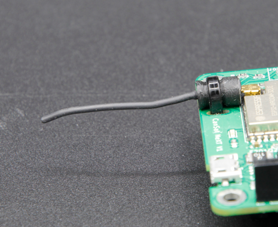

# Lección 12: ¿Listos para el Despegue?

En esta lección final, hablaremos sobre cómo preparar el satélite, la estación terrestre y el equipo para el lanzamiento. Después de esta lección, también tendremos una *revisión* para verificar la preparación para el vuelo, pero esta lección se centra en maximizar las posibilidades de una misión exitosa. En esta lección, hablaremos sobre la preparación de tus componentes electrónicos mecánica y eléctricamente, la verificación del sistema de comunicación por radio y, finalmente, discutiremos algunos pasos útiles de preparación que deben realizarse mucho antes del evento de lanzamiento real.

Esta lección es nuevamente un poco diferente, ya que en lugar de ver nuevos conceptos de programación, estamos discutiendo cómo mejorar la fiabilidad del dispositivo en la misión. Además, aunque probablemente no hayas terminado de construir (o definir) la misión del satélite si estás recorriendo el curso por primera vez, es bueno leer los materiales en esta página, considerar estos aspectos al planificar tu dispositivo y misión, y volver a ellos cuando realmente te prepares para el lanzamiento.

## Consideraciones mecánicas

En primer lugar, como se discutió en la lección anterior, la **pila** de componentes electrónicos debe construirse de manera que se mantenga unida incluso en vibraciones y choques fuertes. Una buena manera de diseñar los componentes electrónicos es usar placas de prototipos, que se mantienen juntas mediante [separadores](https://spacelabnextdoor.com/electronics/27-cansat-next-rp-sma-ufl) y se conectan eléctricamente a través de conectores o con un cable bien soportado. Finalmente, toda la pila de componentes electrónicos debe estar unida al marco del satélite de manera que no se mueva. Una conexión rígida con tornillos siempre es una opción sólida (juego de palabras intencionado), pero no es la única opción. Una alternativa podría ser diseñar el sistema para que se rompa en el impacto, similar a una [zona de deformación](https://es.wikipedia.org/wiki/Zona_de_deformaci%C3%B3n). Alternativamente, un sistema de montaje amortiguado con goma, espuma o un sistema similar podría reducir las tensiones experimentadas por los componentes electrónicos, ayudando a crear sistemas de uso múltiple.

En un CanSat típico, hay algunos elementos que son particularmente vulnerables a problemas durante el lanzamiento o aterrizajes más rápidos de lo esperado. Estos son las baterías, la tarjeta SD y la antena.

### Asegurando las baterías

En CanSat NeXT, la placa está diseñada de manera que se puede colocar una brida alrededor de la placa para asegurar que las baterías se mantengan en su lugar durante la vibración. De lo contrario, tienden a salirse de los zócalos. Otra preocupación sobre las baterías es que algunas son más cortas de lo ideal para el soporte de baterías, y es posible que en un choque particularmente fuerte, los contactos de la batería se doblen bajo el peso de las baterías de manera que se pierda un contacto. Para mitigar esto, los contactos pueden ser soportados añadiendo un trozo de brida, espuma u otro relleno detrás de los contactos de resorte. En pruebas de caída accidentales (e intencionales), esto ha mejorado la fiabilidad, aunque los CanSat NeXT integrados en CanSats bien construidos han sobrevivido a caídas de hasta 1000 metros (sin paracaídas) incluso sin estas medidas de protección. Una forma aún mejor de soportar las baterías es diseñar una estructura de soporte directamente en el marco del CanSat, de manera que soporte el peso de las baterías en el impacto en lugar del soporte de baterías.


### Asegurando el cable de la antena

El conector de la antena es U.Fl, que es un tipo de conector clasificado para automóviles. Manejan bien la vibración y el choque a pesar de no tener soportes mecánicos externos. Sin embargo, la fiabilidad puede mejorarse asegurando la antena con pequeñas bridas. La placa CanSat NeXT tiene pequeñas ranuras junto a la antena para este propósito. Para mantener la antena en una posición neutral, se puede [imprimir un soporte](../CanSat-hardware/communication#quarter-wave-antenna) para ella.



### Asegurando la tarjeta SD

La tarjeta SD puede salirse del soporte en choques fuertes. Nuevamente, las placas han sobrevivido a caídas y vuelos, pero la fiabilidad puede mejorarse pegando con cinta o pegamento la tarjeta SD al soporte. Las placas CanSat NeXT más nuevas (≥1.02) están equipadas con soportes de tarjeta SD de alta seguridad para mitigar aún más este problema.

## Prueba de comunicaciones

Uno de los detalles más vitales para lograr una misión exitosa es tener un enlace de radio confiable. Hay más información sobre la selección y/o construcción de las antenas en [la sección de hardware](../CanSat-hardware/communication#antenna-options) de la documentación. Sin embargo, independientemente de la antena seleccionada, la prueba es una parte vital de cualquier sistema de radio.

La prueba adecuada de antenas puede ser complicada y requiere equipo especializado como [VNAs](https://es.wikipedia.org/wiki/Analizador_de_redes), pero podemos hacer una prueba funcional directamente con el kit CanSat NeXT.

Primero, programa el satélite para enviar datos, por ejemplo, una lectura de datos una vez por segundo. Luego, programa la estación terrestre para recibir datos y para imprimir valores de **RSSI** (Indicador de fuerza de señal recibida), según lo proporcionado por la función `getRSSI()`, que es parte de la biblioteca CanSat NeXT.

```Cpp title="Leer RSSI"
#include "CanSatNeXT.h"

void setup() {
  Serial.begin(115200);
  GroundStationInit(28);
}

void loop() {}

void onDataReceived(String data)
{
  int rssi = getRSSI();
  Serial.print("RSSI: ");
  Serial.println(rssi);
}
```

Este valor representa la **potencia** eléctrica real recibida por la estación terrestre a través de su antena cuando recibe un mensaje. El valor se expresa en [decibelios-miliwatios](https://es.wikipedia.org/wiki/DBm). Una lectura típica con una antena funcionando en ambos extremos cuando los dispositivos están en la misma mesa es de -30 dBm (1000 nanovatios), y debería disminuir rápidamente cuando aumenta la distancia. En espacio libre, sigue aproximadamente la ley del inverso del cuadrado, pero no exactamente debido a los ecos, zonas de Fresnel y otras imperfecciones. Con la configuración de radio que CanSat NeXT usa por defecto, el RSSI puede reducirse a aproximadamente -100 dBm (0.1 picovatio) y aún así algunos datos pasan.

Esto generalmente corresponde a una distancia de aproximadamente un kilómetro cuando se usan las antenas monopolo, pero puede ser mucho más si la antena de la estación terrestre tiene una ganancia significativa, lo que se suma directamente a la lectura en dBm.

## Pruebas de energía

Es una buena idea medir el consumo de corriente de tu satélite usando un multímetro. También es fácil, solo retira una de las baterías y sostenla manualmente de manera que puedas usar la medición de corriente del multímetro para conectar entre un extremo de la batería y el contacto de la batería. Esta lectura debería estar en el orden de 130-200 mA si la radio CanSat NeXT está activa y no hay dispositivos externos. El consumo de corriente aumenta a medida que las baterías se descargan, ya que se necesita más corriente para mantener el voltaje a 3.3 voltios desde el voltaje de la batería que disminuye.

Las baterías AAA típicas tienen una capacidad de alrededor de 1200 mAh, lo que significa que el consumo de corriente sostenido del dispositivo debería ser inferior a 300 mA para asegurar que las baterías duren toda la misión. Esta es también la razón por la que es una buena idea tener múltiples modos de operación si hay dispositivos que consumen mucha corriente a bordo, ya que pueden encenderse justo antes del vuelo para asegurar una buena duración de la batería.

Aunque el enfoque matemático para estimar la duración de la batería es un buen comienzo, aún es mejor hacer una medición real de la duración de la batería obteniendo baterías nuevas y realizando una misión simulada.

## Pruebas aeroespaciales

En la industria aeroespacial, cada satélite se somete a pruebas rigurosas para asegurar que pueda sobrevivir a las duras condiciones del lanzamiento, el espacio y, a veces, la reentrada. Aunque los CanSats operan en un entorno ligeramente diferente, aún podrías adaptar algunas de estas pruebas para mejorar la fiabilidad. A continuación se presentan algunas pruebas aeroespaciales comunes utilizadas para CubeSats y pequeños satélites, junto con ideas sobre cómo podrías implementar pruebas similares para tu CanSat.

### Prueba de vibración

La prueba de vibración se utiliza en sistemas de satélites pequeños por dos razones. La razón principal es que la prueba tiene como objetivo identificar las frecuencias de resonancia de la estructura para asegurar que la vibración del cohete no comience a resonar en ninguna estructura del satélite, lo que podría llevar a una falla en los sistemas del satélite. La segunda razón también es relevante para los sistemas CanSat, que es confirmar la calidad de la artesanía y asegurar que el sistema sobrevivirá al lanzamiento del cohete. La prueba de vibración de satélites se realiza con bancos de prueba de vibración especializados, pero el efecto también puede simularse con soluciones más creativas. Trata de idear una manera de realmente sacudir el satélite (o preferiblemente su repuesto) y ver si algo se rompe. ¿Cómo podría mejorarse?

### Prueba de choque

Un primo de las pruebas de vibración, las pruebas de choque simulan la separación explosiva de etapas durante el lanzamiento del cohete. La aceleración de choque puede ser de hasta 100 Gs, lo que puede romper fácilmente los sistemas. Esto podría simularse con una prueba de caída, pero considera cómo hacerlo de manera segura para que el satélite, tú o el suelo no se rompan.

### Prueba térmica

La prueba térmica incluye exponer todo el satélite a los extremos del rango de operación planificado y también moverse rápidamente entre estas temperaturas. En el contexto de CanSat, esto podría significar probar el satélite en un congelador, simulando un lanzamiento en un día frío, o en un horno ligeramente calentado para simular un día de lanzamiento caluroso. Ten cuidado de que los componentes electrónicos, plásticos o tu piel no estén expuestos directamente a temperaturas extremas.

## Buenas ideas generales

Aquí hay algunos consejos adicionales para ayudar a asegurar una misión exitosa. Estos van desde preparaciones técnicas hasta prácticas organizativas que mejorarán la fiabilidad general de tu CanSat. Siéntete libre de sugerir nuevas ideas para agregar aquí a través del canal habitual (samuli@kitsat.fi).

- Considera tener una lista de verificación para evitar olvidar algo justo antes del lanzamiento
- Prueba toda la secuencia de vuelo de antemano en un vuelo simulado
- Prueba el satélite también en condiciones ambientales similares a las esperadas en el vuelo. Asegúrate de que el paracaídas también esté bien con las temperaturas esperadas.
- Ten baterías de repuesto y piensa en cómo se instalan si es necesario
- Ten una tarjeta SD de repuesto, a veces fallan
- Ten una computadora de repuesto y desactiva las actualizaciones en la computadora antes del lanzamiento.
- Ten bridas, tornillos y lo que sea necesario para ensamblar el satélite
- Ten algunas herramientas básicas a mano para ayudar en el desmontaje y montaje
- Ten antenas adicionales
- También puedes tener múltiples estaciones terrestres operando al mismo tiempo, lo que también puede usarse para triangular el satélite, especialmente si hay RSSI disponible.
- Ten roles claros para cada miembro del equipo durante el lanzamiento, las operaciones y la recuperación.

---

Este es el final de las lecciones por ahora. En la siguiente página hay una revisión de preparación para el vuelo, que es una práctica que ayuda a asegurar misiones exitosas.

[¡Haz clic aquí para la revisión de preparación para el vuelo!](./review2)