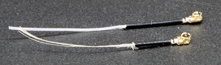
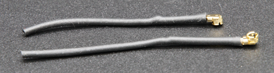

# Side ja antennid

See artikkel tutvustab peamisi kontseptsioone, mis on vajalikud CanSat NeXT-i abil juhtmevabaks andmeedastuseks. Esiteks käsitletakse side süsteemi üldisel tasemel, seejärel tutvustatakse mõningaid erinevaid võimalusi antenni valimiseks, kui kasutatakse CanSat NeXT-i. Lõpuks esitatakse artikli viimases osas lihtne juhend, kuidas ehitada veerandlaine monopoolantenn komplektis olevatest osadest.

## Alustamine

CanSat NeXT on peaaegu valmis juhtmevabaks suhtluseks otse karbist välja võttes. Ainus, mida on vaja, on sobiv tarkvara ja antenn nii saatja kui ka vastuvõtja jaoks. Esimese jaoks vaadake selle lehe tarkvaramaterjale. Teise jaoks sisaldab see leht juhiseid, kuidas valida välist antenni ja kuidas ehitada lihtsat monopoolantenni CanSat NeXT-iga kaasas olevatest materjalidest.

Kuigi plaat on tänu tarkvarakontrollidele selliste asjade suhtes üsna vastupidav, ei tohiks kunagi proovida raadiosaatjat ilma antennita edastada. Kuigi see on ebatõenäoline, kuna selle süsteemiga seotud võimsused on madalad, võib peegeldunud raadiolaine põhjustada elektroonikale tõelist kahju.

## CanSat NeXT side süsteem

CanSat NeXT käsitleb juhtmevaba andmeedastust veidi erinevalt vanematest CanSat komplektidest. Eraldi raadiomooduli asemel kasutab CanSat NeXT suhtlemiseks MCU integreeritud WiFi-raadiot. WiFi-raadiot kasutatakse tavaliselt andmete edastamiseks ESP32 ja interneti vahel, võimaldades kasutada ESP32 lihtsa serverina või isegi ühendada ESP32 Bluetooth-seadmega, kuid teatud nutikate TCP-IP konfiguratsioonitrikkidega saame võimaldada otsest peer-to-peer suhtlust ESP32 seadmete vahel. Süsteemi nimetatakse ESP-NOW-ks ja seda arendab ja hooldab EspressIf, kes on ESP32 riistvara arendajad. Lisaks on olemas spetsiaalsed madala kiirusega suhtlusskeemid, mis suurendades edastuse energiat bitti kohta, suurendavad märkimisväärselt wifi-raadio võimalikku ulatust tavapärase mõnekümne meetri asemel.

ESP-NOW andmeedastuskiirus on märkimisväärselt kiirem kui see, mis oleks võimalik vana raadioga. Isegi lihtsalt pakettide vahelist aega vähendades näidisprogrammis suudab CanSat NeXT edastada ~20 täispaketti GS-ile sekundis. Teoreetiliselt võib andmeedastuskiirus ulatuda kuni 250 kbit/s pikkade vahemaade režiimis, kuid seda võib olla tarkvaras raske saavutada. Seda öeldes peaks näiteks täispiltide edastamine kaamerast lennu ajal olema õige tarkvaraga täiesti teostatav.

Isegi lihtsate veerandlaine monopoolantennidega (31 mm traaditükk) mõlemas otsas suutis CanSat NeXT saata andmeid maajaamale 1,3 km kauguselt, kus nägemisliin kadus. Drooniga testimisel piirdus ulatus umbes 1 km-ga. On võimalik, et droon segas raadiot piisavalt, et ulatust mõnevõrra piirata. Kuid parema antenniga võiks ulatust veelgi suurendada. Väike yagi antenn oleks teoreetiliselt suurendanud tööulatust 10 korda.

On mõned praktilised detailid, mis erinevad vanemast raadioside süsteemist. Esiteks toimub satelliitide "sidumine" maajaama vastuvõtjatega meediumipöörduskontrolli (MAC) aadresside abil, mis on määratud koodis. WiFi-süsteem on piisavalt nutikas, et käsitleda ajastuse, kokkupõrke ja sageduse probleeme kulisside taga. Kasutaja peab lihtsalt tagama, et GS kuulab MAC-aadressi, millega satelliit edastab.
Teiseks on raadio sagedus erinev. WiFi-raadio töötab 2,4 GHz sagedusalas (keskne sagedus on 2,445 GHz), mis tähendab, et nii levimisomadused kui ka antenni kujundamise nõuded on erinevad kui varem. Signaal on mõnevõrra tundlikum vihma ja nägemisliini probleemide suhtes ning ei pruugi mõnel juhul edastada, kus vana süsteem oleks töötanud.

Raadiosignaali lainepikkus on samuti erinev. Kuna

$$\lambda = \frac{c}{f} \approx \frac{3*10^8 \text{ m/s}}{2.445 * 10^9 \text {Hz}} = 0.12261 \text{ m,}$$

peaks veerandlaine monopoolantenn olema pikkusega 0,03065 m või 30,65 mm. See pikkus on samuti märgitud CanSat NeXT PCB-le, et kaabli lõikamine oleks veidi lihtsam. Antenn tuleks lõigata täpselt, kuid ~0,5 mm piires on siiski hea.

Veerandlaine antennil on CanSat võistluste jaoks piisav RF-jõudlus. Seda öeldes võib mõnele kasutajale huvi pakkuda veelgi parem ulatus. Üks võimalik parendamise koht on monopoolantenni pikkus. Praktikas ei pruugi veerandlaine resonants olla täpselt õige sagedusega, kuna muud parameetrid nagu keskkond, ümbritsevad metallielemendid või maandatud metalliga kaetud traadi osa võivad resonantsi veidi mõjutada. Antenni võiks häälestada vektori võrgustiku analüsaatori (VNA) abil. Arvan, et peaksin seda mingil hetkel tegema ja materjale vastavalt parandama.

Tugevam lahendus oleks kasutada teistsugust antenni stiili. 2,4 GHz juures on internetis palju lõbusaid antenniideid. Nende hulka kuuluvad heeliksantenn, yagi antenn, pringles antenn ja paljud teised. Paljud neist, kui need on hästi ehitatud, ületavad lihtsa monopooli kergesti. Isegi lihtsalt dipool oleks parandus lihtsast traadist.

Enamikul ESP32 moodulitel kasutatav pistik on Hirose U.FL pistik. See on kvaliteetne miniatuurne RF-pistik, mis tagab hea RF-jõudluse nõrkade signaalide jaoks. Üks probleem selle pistikuga on aga see, et kaabel on üsna õhuke, muutes selle mõnel juhul veidi ebapraktiliseks. Samuti põhjustab see suuremaid kui soovitud RF-kadusid, kui kaabel on pikk, nagu see võib olla välise antenni kasutamisel. Nendel juhtudel võiks kasutada U.FL kuni SMA adapterkaablit. Vaatan, kas saaksime neid oma veebipoes pakkuda. See võimaldaks meeskondadel kasutada tuttavamat SMA pistikut. Seda öeldes on täiesti võimalik ehitada häid antenne, kasutades ainult U.FL-i.

Erinevalt SMA-st tugineb U.FL mehaaniliselt klõpsuga kinnituvatele omadustele, et hoida pistikut paigal. See on tavaliselt piisav, kuid lisaturvalisuse tagamiseks on hea mõte lisada tõmblukk lisaturvalisuse tagamiseks. CanSat NeXT PCB-l on antennipistiku kõrval pesad, et mahutada väike tõmblukk. Ideaalis lisataks kaablile enne tõmblukku 3D-prinditud või muul viisil valmistatud tugihülss. Fail 3D-prinditud toe jaoks on saadaval GitHubi lehelt.

## Antennivalikud {#antenna-options}

Antenn on sisuliselt seade, mis muundab juhuslikud elektromagnetlained juhitud laineteks ja vastupidi. Seadme lihtsa olemuse tõttu on olemas palju võimalusi, mille hulgast valida oma seadme antenn. Praktilisest vaatenurgast on antenni valikul palju vabadust ja üsna palju asju, mida kaaluda. Peate arvestama vähemalt

1. Antenni töö sagedus (peaks sisaldama 2,45 GHz)
2. Antenni ribalaius (vähemalt 35 MHz)
3. Antenni impedants (50 oomi)
4. Pistik (U.FL või saate kasutada adaptereid)
5. Füüsiline suurus (Kas see mahub purki)
6. Maksumus
7. Tootmismeetodid, kui teete antenni ise.
8. Antenni polariseerimine.

Antennivalik võib tunduda ülekaalukas ja sageli ongi, kuid antud juhul on see palju lihtsam, kuna me tegelikult kasutame Wi-Fi-raadiot - me saame süsteemiga kasutada peaaegu iga 2,4 GHz Wi-Fi antenni. Enamik neist on aga liiga suured ja nad kipuvad kasutama pistikuid, mida nimetatakse RP-SMA-ks, mitte U.FL-iks. Kuid sobiva adapteriga võivad need olla head valikud maajaama kasutamiseks. On isegi saadaval suunatud antenne, mis tähendab, et saate lisavõimendust raadiolingi parandamiseks.

Wi-Fi antennid on kindel valik, kuid neil on üks märkimisväärne puudus - polariseerimine. Need on peaaegu alati lineaarselt polariseeritud, mis tähendab, et signaali tugevus varieerub oluliselt sõltuvalt saatja ja vastuvõtja orientatsioonist. Halvimal juhul võivad antennid olla teineteise suhtes risti ja signaal võib täielikult kaduda. Seetõttu on alternatiivne võimalus kasutada drooniantenne, mis kipuvad olema ringpolariseeritud. Praktikas tähendab see, et meil on mõned püsivad polariseerimiskaod, kuid need on vähem dramaatilised. Alternatiivne nutikas lahendus polariseerimisprobleemi lahendamiseks on kasutada kahte vastuvõtjat, mille antennid on paigaldatud teineteise suhtes risti. Nii on vähemalt üks neist alati sobiva orientatsiooniga signaali vastuvõtmiseks.

Muidugi tahab tõeline tegija alati oma antenni teha. Mõned huvitavad konstruktsioonid, mis sobivad isetegemise tootmiseks, hõlmavad heeliksantenni, "pringles" antenni, yagi, dipooli või monopoolantenni. Enamiku nende ehitamiseks on internetis palju juhiseid. Artikli viimane osa näitab, kuidas teha oma monopoolantenn, mis sobib CanSat võistlusteks, CanSat NeXT-iga kaasas olevatest materjalidest.

## Veerandlaine monopoolantenni ehitamine {#quarter-wave-antenna}

See artikli osa kirjeldab, kuidas ehitada komplektis sisalduvatest materjalidest mõistlikult tõhus veerandlaine monopoolantenn. Antenn on nii nimetatud, kuna sellel on ainult üks poolus (võrreldes dipooliga) ja selle pikkus on veerand lainepikkusest, mida me edastame.

Lisaks koaksiaalkaablile ja kuumakahanemistorule vajate mingit tüüpi traadilõikureid ja traadilõikureid. Peaaegu iga tüüp töötab. Lisaks vajate kuumakahanemise jaoks kuumuse allikat, näiteks kuumaõhupüstolit, jootekolbi või isegi tulemasinat.

Alustuseks lõigake kaabel umbes pooleks.

Järgmisena ehitame tegeliku antenni. See osa tuleks teha nii täpselt kui võimalik. Umbes 0,2 mm piires töötab hästi, kuid proovige saada see võimalikult lähedale õigele pikkusele, kuna see aitab jõudlusele kaasa.

Koaksiaalkaabel koosneb neljast osast - keskjuht, dielektrik, varjestus ja välimine kate. Tavaliselt kasutatakse neid kaableid raadiosageduslike signaalide edastamiseks seadmete vahel, nii et keskjuhi voolud tasakaalustatakse varjestuse vooludega. Kuid eemaldades varjestusjuhi, loovad sisemise juhi voolud antenni. Selle avatud ala pikkus määrab antenni lainepikkuse või töö sageduse ja me tahame nüüd, et see vastaks meie töö sagedusele 2,445 GHz, seega peame eemaldama varjestuse pikkuselt 30,65 mm.

Eemaldage kaablist ettevaatlikult välimine kate. Ideaalis proovige eemaldada ainult kate ja varjestus soovitud pikkuselt. Kuid isolatsiooni lõikamine ei ole katastroof. Tavaliselt on lihtsam eemaldada välimine kate osade kaupa, mitte korraga. Lisaks võib olla lihtsam eemaldada esmalt liiga palju ja seejärel lõigata sisemine juht õigele pikkusele, mitte proovida seda esimesel korral täpselt õigeks saada.

Allolev pilt näitab eemaldatud kaableid. Proovige teha see nagu ülemine, kuid alumine töötab samuti - see võib lihtsalt olla tundlikum niiskuse suhtes. Kui varjestusest on jäänud rippuvaid tükke, lõigake need ettevaatlikult ära. Veenduge, et sisemise juhi ja varjestuse vahel ei oleks võimalust, et need üksteist puudutavad - isegi üksik kiud muudaks antenni kasutuskõlbmatuks.

Antenn on nüüd täiesti funktsionaalne, kuid see võib olla tundlik niiskuse suhtes. Seetõttu tahame nüüd sellele lisada uue katte, milleks on kuumakahanemistoru. Lõigake kaks tükki, mis on veidi pikemad kui teie tehtud antenn, ja asetage see antenni kohale ning kasutage kuumuse allikat, et see kohale kahaneks. Olge ettevaatlik, et mitte kuumakahanemistoru põletada, eriti kui kasutate midagi muud kui kuumaõhupüstolit.

Pärast seda on antennid valmis. Maajaama poolel on antenn tõenäoliselt sellisena korras. Teisest küljest, kuigi pistik on üsna turvaline, on hea mõte toetada pistikut kuidagi CanSat poolel. Väga tugev viis on kasutada 3D-prinditud tuge ja mõnda tõmblukku, kuid paljud teised meetodid töötavad samuti. Pidage meeles, et arvestage ka sellega, kuidas antenn purki paigutatakse. Ideaalis peaks see olema kohas, kus edastus ei ole blokeeritud ühegi metallosa poolt.

### Antenni tugi

Lõpuks on siin pildil näidatud toe step-fail. Saate selle importida enamikku CAD-tarkvaradesse, seda muuta või printida 3D-printeriga.

[Laadi alla step-fail](/assets/3d-files/uFl-support.step)