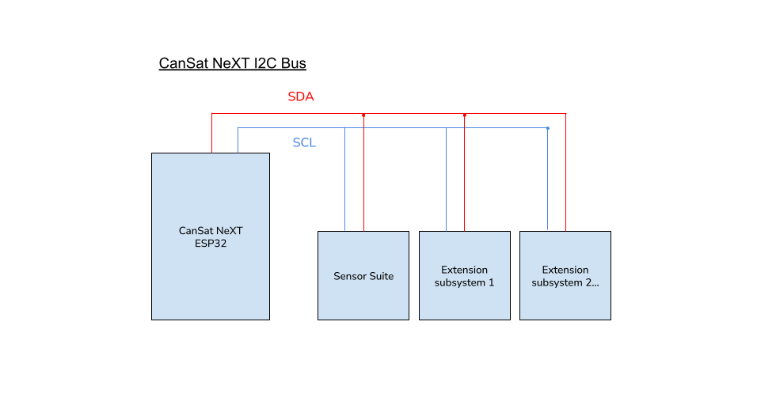

# Laiendusliides

Kohandatud seadmeid saab ehitada ja kasutada koos CanSatiga. Neid saab kasutada huvitavate projektide loomiseks, mille ideid leiate meie [Blogist](/blog).

CanSati laiendusliidesel on vaba UART-liin, kaks ADC-pinni ja 5 vaba digitaalset I/O-pinni. Lisaks on laiendusliidesel saadaval SPI ja I2C liinid, kuigi need on vastavalt SD-kaardi ja andurite komplektiga jagatud.

Kasutaja saab valida ka UART2 ja ADC pinni kasutamise digitaalse I/O-na, kui nende lahenduses pole vajalik jadakommunikatsioon või analoog-digitaalmuundamine.

| Pin number | Pin name | Use as      | Notes                     |
|------------|----------|-------------|---------------------------|
| 12         | GPIO12   | Digital I/O | Free                      |
| 15         | GPIO15   | Digital I/O | Free                      |
| 16         | GPIO16   | UART2 RX    | Free                      |
| 17         | GPIO17   | UART2 TX    | Free                      |
| 18         | SPI_CLK  | SPI CLK     | Co-use with SD card       |
| 19         | SPI_MISO | SPI MISO    | Co-use with SD card       |
| 21         | I2C_SDA  | I2C SDA     | Co-use with sensor suite  |
| 22         | I2C_SCL  | I2C SCL     | Co-use with sensor suite  |
| 23         | SPI_MOSI | SPI MOSI    | Co-use with SD card       |
| 25         | GPIO25   | Digital I/O | Free                      |
| 26         | GPIO26   | Digital I/O | Free                      |
| 27         | GPIO27   | Digital I/O | Free                      |
| 32         | GPIO32   | ADC         | Free                      |
| 33         | GPIO33   | ADC         | Free                      |

*Tabel: Laiendusliidese pinni otsingutabel. Pin name viitab teegi pinni nimele.*

# Kommunikatsioonivõimalused

CanSati teek ei sisalda kohandatud seadmete kommunikatsioonikihte. UART, I2C ja SPI kommunikatsiooniks CanSat NeXT ja teie kohandatud koormusseadme vahel vaadake Arduino vaikimisi [UART](https://docs.arduino.cc/learn/communication/uart/), [Wire](https://docs.arduino.cc/learn/communication/wire/) ja [SPI](https://docs.arduino.cc/learn/communication/spi/) teeke.

## UART

UART2 liin on hea alternatiiv, kuna see toimib eraldamata kommunikatsiooniliidesena laiendatud koormustele.

Andmete saatmiseks läbi UART-liini vaadake Arduino

```
       CanSat NeXT
          ESP32                          User's device
   +----------------+                 +----------------+
   |                |   TX (Transmit) |                |
   |       TX  o----|---------------->| RX  (Receive)  |
   |                |                 |                |
   |       RX  o<---|<----------------| TX             |
   |                |   GND (Ground)  |                |
   |       GND  o---|-----------------| GND            |
   +----------------+                 +----------------+
```
*Pilt: UART protokoll ASCII-s*


## I2C

I2C kasutamine on toetatud, kuid kasutaja peab arvestama, et liinil on veel üks alamsüsteem.

Mitme I2C orjaga peab kasutajakood määrama, millist I2C orja CanSat antud hetkel kasutab. See eristatakse orja aadressiga, mis on iga seadme jaoks ainulaadne kuueteistkümnendkood ja mille leiab alamsüsteemi seadme andmelehelt.

## SPI

SPI kasutamine on samuti toetatud, kuid kasutaja peab arvestama, et liinil on veel üks alamsüsteem.

SPI puhul tehakse orja eristamine kiibi valiku pinni määramise teel. Kasutaja peab pühendama ühe vaba GPIO pinni oma kohandatud laiendatud koormusseadme kiibi valikuks. SD-kaardi kiibi valiku pinni määratletakse ``CanSatPins.h`` teegifailis kui ``SD_CS``.



*Pilt: CanSat NeXT I2C buss, millel on mitu teisest, ehk "orja" alamsüsteemi. Selles kontekstis on andurite komplekt üks orja alamsüsteemidest.*


*Pilt: CanSat NeXT SPI bussi konfiguratsioon, kui on olemas kaks teisest, ehk "orja" alamsüsteemi. Selles kontekstis on SD-kaart üks orja alamsüsteemidest.*