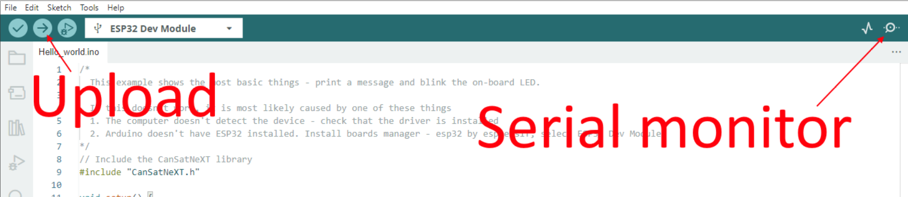

# Õppetund 1: Tere, maailm!

Esimene õppetund aitab sul alustada CanSat NeXT-iga, näidates, kuidas kirjutada ja käivitada oma esimene programm plaadil.

Pärast seda õppetundi on sul vajalikud tööriistad, et alustada tarkvara arendamist oma CanSat-i jaoks.

## Tööriistade paigaldamine

CanSat NeXT-i soovitatakse kasutada koos Arduino IDE-ga, seega alustame selle ja vajalike teekide ja plaatide paigaldamisega.

### Arduino IDE paigaldamine

Kui sa pole seda veel teinud, laadi alla ja paigalda Arduino IDE ametlikult veebilehelt https://www.arduino.cc/en/software.

### ESP32 toe lisamine

CanSat NeXT põhineb ESP32 mikrokontrolleril, mis ei kuulu Arduino IDE vaikimisi paigaldusse. Kui sa pole varem ESP32 mikrokontrollereid Arduinoga kasutanud, tuleb esmalt paigaldada plaadi tugi. Seda saab teha Arduino IDE-s menüüst *Tools->board->Board Manager* (või vajutades (Ctrl+Shift+B) ükskõik kus). Plaadihalduris otsi ESP32 ja paigalda esp32 Espressif-i poolt.

### CanSat NeXT teegi paigaldamine

CanSat NeXT teegi saab alla laadida Arduino IDE teegihaldurist menüüst *Sketch > Include Libraries > Manage Libraries*.


*Pildi allikas: Arduino Docs, https://docs.arduino.cc/software/ide-v1/tutorials/installing-libraries*

Teegihalduri otsinguribale kirjuta "CanSatNeXT" ja vali "Install". Kui IDE küsib, kas soovid paigaldada ka sõltuvused, klõpsa jah.

## Ühendamine arvutiga

Pärast CanSat NeXT tarkvarateegi paigaldamist saad CanSat NeXT-i oma arvutiga ühendada. Kui seda ei tuvastata, võib olla vaja esmalt paigaldada vajalikud draiverid. Draiverite paigaldamine toimub enamasti automaatselt, kuid mõnel arvutil tuleb see käsitsi teha. Draiverid leiab Silicon Labs veebilehelt: https://www.silabs.com/developers/usb-to-uart-bridge-vcp-drivers
Lisaks abi saamiseks ESP32 seadistamisel vaata järgmist juhendit: https://docs.espressif.com/projects/esp-idf/en/latest/esp32/get-started/establish-serial-connection.html

## Esimese programmi käivitamine

Nüüd kasutame äsja paigaldatud teeke, et alustada koodi käivitamist CanSat NeXT-il. Nagu traditsiooniks, alustame LED-i vilgutamise ja "Hello World!" kirjutamisega arvutisse.

### Õige pordi valimine

Pärast CanSat NeXT-i arvutiga ühendamist (ja toite sisselülitamist) pead valima õige pordi. Kui sa ei tea, milline on õige, lihtsalt eemalda seade ja vaata, milline port kaob.


Arduino IDE küsib nüüd seadme tüüpi. Vali ESP32 Dev Module.


### Näite valimine

CanSat NeXT teegis on mitmeid näitekoode, mis näitavad, kuidas kasutada erinevaid plaadi funktsioone. Neid näiteskeeme leiad menüüst File -> Examples -> CanSat NeXT. Vali "Hello_world".

Pärast uue skeemi avamist saad selle plaadile üles laadida, vajutades üleslaadimisnuppu.



Mõne aja pärast peaks plaadil olev LED hakkama vilkuma. Lisaks saadab seade sõnumi arvutisse. Seda saad näha, avades jadamonitori ja valides baudimääraks 115200.

Proovi ka vajutada plaadil olevat nuppu. See peaks protsessori lähtestama, teisisõnu, koodi algusest uuesti käivitama.

### Tere, maailm! selgitus

Vaatame, mis selles koodis tegelikult toimub, läbides seda rida-realt. Esiteks algab kood CanSat teegi **lisamisega**. See rida peaks olema peaaegu kõigi CanSat NeXT-i jaoks kirjutatud programmide alguses, kuna see ütleb kompilaatorile, et soovime kasutada CanSat NeXT teegi funktsioone.

```Cpp title="Include CanSat NeXT"
#include "CanSatNeXT.h"
```
Pärast seda liigub kood seadistusfunktsiooni. Seal on kaks käsku - esiteks, serial on liides, mida kasutame sõnumite saatmiseks arvutisse USB kaudu. Funktsioonikõne sees olev number, 115200, viitab baudimäärale, st kui palju ühtesid ja nulle saadetakse iga sekund. Järgmine käsk, `CanSatInit()`, on CanSat NeXT teegist ja see initsialiseerib kõik pardal olevad andurid ja muud funktsioonid. Sarnaselt `#include` käsuga, leidub see tavaliselt CanSat NeXT-i skeemides. Kõik, mida soovid käivitada ainult üks kord käivitamisel, peaks olema kaasatud seadistusfunktsiooni.

```Cpp title="Setup"
void setup() {
  // Alusta jadaliini andmete printimiseks terminali
  Serial.begin(115200);
  // Alusta kõiki CanSatNeXT pardasüsteeme.
  CanSatInit();
}
```

Pärast seadistust hakkab kood lõputult kordama loop-funktsiooni. Esiteks kirjutab programm väljundpinna LED kõrgeks, st sellel on pinge 3,3 volti. See lülitab sisse pardal oleva LED-i. Pärast 100 millisekundit lülitatakse selle väljundpinna pinge tagasi nulli. Nüüd ootab programm 400 ms ja saadab seejärel sõnumi arvutisse. Pärast sõnumi saatmist algab loop-funktsioon uuesti algusest.

```Cpp title="Loop"
void loop() {
  // Vilgutame LED-i
  digitalWrite(LED, HIGH);
  delay(100);
  digitalWrite(LED, LOW);
  delay(400);
  Serial.println("See on sõnum!");
}
```

Võid proovida ka muuta viivituse väärtusi või sõnumit, et näha, mis juhtub. Palju õnne, et oled nii kaugele jõudnud! Tööriistade seadistamine võib olla keeruline, kuid sellest punktist alates peaks see muutuma lõbusamaks.

---

Järgmises õppetunnis hakkame lugema andmeid pardal olevatelt anduritelt.

[Klõpsa siia, et minna teise õppetunni juurde!](./lesson2)