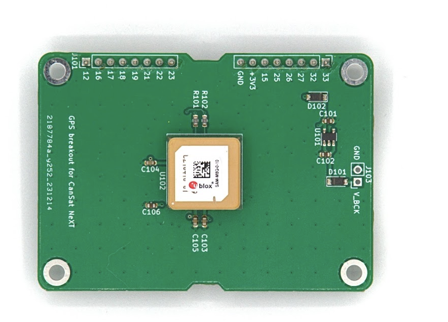

# CanSat NeXT GNSS-moduuli

CanSat NeXT GNSS-moduuli laajentaa CanSat NeXT:ä sijainnin seurannalla ja tarkalla reaaliaikaisella kellolla. Moduuli perustuu U-Blox SAM-M10Q GNSS-vastaanottimeen U-Bloxilta.

## Laitteisto

Moduuli yhdistää GNSS-vastaanottimen CanSat NeXT:iin UART:in kautta laajennuspinnissä. Laite käyttää laajennuspinnien 16 ja 17 UART RX:lle ja TX:lle, ja ottaa myös virtalähteen +3V3 linjasta laajennuspinnissä.

Oletuksena GNSS-moduulin varmuuskopiot ovat kytketty +3V3 linjaan. Vaikka tämä tekee moduulista helppokäyttöisen, se tarkoittaa, että moduulin on aina aloitettava alusta, kun se yrittää löytää kiinnityksen. Tämän lieventämiseksi on mahdollista tarjota ulkoinen virtalähde varmuusjännitelinjan kautta J103-päätteiden kautta. V_BCK-pinnille annettavan jännitteen tulisi olla 2-6,5 volttia, ja virrankulutus on vakio 65 mikroampeeria, vaikka päävirta katkaistaan. Varmuusjännitteellä GNSS-vastaanotin voi säilyttää kaikki asetukset, mutta myös kriittisesti almanakka- ja efemeriditiedot - mikä vähentää kiinnityksen saamisen aikaa noin 30 sekunnista 1-2 sekuntiin, jos laite ei ole liikkunut merkittävästi virtakatkojen välillä.

Monia muita GNSS-moduuleja on saatavilla yrityksiltä kuten Sparkfun ja Adafruit, muiden muassa. Nämä voidaan liittää CanSat NeXT:iin saman UART-liitännän kautta tai käyttämällä SPI:tä ja I2C:tä moduulista riippuen. CanSat NeXT -kirjasto tukee myös muita U-blox-moduuleja käyttäviä moduuleja. Kun etsit GNSS-moduuleja, yritä löytää sellainen, jossa perus-PCB on mahdollisimman suuri - useimmissa on liian pieni PCB, mikä heikentää niiden antennin suorituskykyä verrattuna suurempiin PCB:ihin. Mikä tahansa koko, joka on pienempi kuin 50x50 mm, alkaa heikentää suorituskykyä ja kykyä löytää ja ylläpitää kiinnitystä.

Lisätietoja GNSS-moduulista ja suuresta määrästä saatavilla olevia asetuksia ja ominaisuuksia löytyy GNSS-vastaanottimen tietolehdestä [U-Bloxin verkkosivuilta](https://www.u-blox.com/en/product/sam-m10q-module).

Moduulin laitteistointegraatio CanSat NeXT:iin on todella yksinkertainen - lisää vain etäisyyspalat ruuvinreikiin ja aseta varovasti liitinpinnit liitinsokkiin. Jos aiot tehdä monikerroksisen elektronisen pinon, varmista, että asetat GNSS:n ylimmäksi moduuliksi, jotta 

## Ohjelmisto

Helpoin tapa aloittaa CanSat NeXT GNSS:n käyttö on oma Arduino-kirjastomme, jonka löydät Arduino-kirjastonhallinnasta. Ohjeet kirjaston asentamiseen löytyvät [aloitusoppaasta](./../course/lesson1.md).

Kirjasto sisältää esimerkkejä siitä, miten lukea sijainti ja nykyinen aika, sekä miten lähettää tiedot CanSat NeXT:llä.

Yksi nopea huomautus asetuksista - moduulille on kerrottava, millaisessa ympäristössä sitä käytetään, jotta se voi parhaiten arvioida käyttäjän sijainnin. Tyypillisesti oletus on, että käyttäjä on maan tasolla, ja vaikka he saattavat liikkua, kiihtyvyys ei todennäköisesti ole kovin suuri. Tämä ei tietenkään päde CanSateihin, jotka saattavat olla rakettien laukaisemia tai osua maahan melko suurilla nopeuksilla. Siksi kirjasto asettaa oletuksena sijainnin laskettavaksi olettaen korkean dynaamisen ympäristön, mikä mahdollistaa kiinnityksen ylläpitämisen ainakin jonkin verran nopean kiihtyvyyden aikana, mutta tekee myös sijainnista maassa huomattavasti vähemmän tarkan. Jos sen sijaan korkea tarkkuus laskeutumisen jälkeen on toivottavampaa, voit alustaa GNSS-moduulin komennolla `GNSS_init(DYNAMIC_MODEL_GROUND)`, korvaten oletuksen `GNSS_init(DYNAMIC_MODEL_ROCKET)` = `GNSS_init()`. Lisäksi on olemassa `DYNAMIC_MODEL_AIRBORNE`, joka on hieman tarkempi kuin rakettimalli, mutta olettaa vain kohtuullista kiihtyvyyttä.

Tämä kirjasto priorisoi helppokäyttöisyyttä ja sisältää vain perustoimintoja, kuten sijainnin ja ajan saamisen GNSS:stä. Käyttäjille, jotka etsivät edistyneempiä GNSS-ominaisuuksia, erinomainen SparkFun_u-blox_GNSS_Arduino_Library saattaa olla parempi valinta.

## Kirjaston määrittely

Tässä ovat CanSat GNSS -kirjaston käytettävissä olevat komennot.

### GNSS_Init

| Funktio              | uint8_t GNSS_Init(uint8_t dynamic_model)                          |
|----------------------|--------------------------------------------------------------------|
| **Palautustyyppi**   | `uint8_t`                                                          |
| **Palautusarvo**     | Palauttaa 1, jos alustus onnistui, tai 0, jos tapahtui virhe.      |
| **Parametrit**       |                                                                    |
|                      | `uint8_t dynamic_model`                                           |
|                      | Tämä valitsee dynaamisen mallin tai ympäristön, jonka GNSS-moduuli olettaa. Mahdollisia valintoja ovat DYNAMIC_MODEL_GROUND, DYNAMIC_MODEL_AIRBORNE ja DYNAMIC_MODEL_ROCKET. |
| **Kuvaus**           | Tämä komento alustaa GNSS-moduulin, ja se tulisi kutsua setup-funktiossa. |

### readPosition

| Funktio              | uint8_t readPosition(float &x, float &y, float &z)          |
|----------------------|--------------------------------------------------------------------|
| **Palautustyyppi**   | `uint8_t`                                                          |
| **Palautusarvo**     | Palauttaa 0, jos mittaus onnistui.                                 |
| **Parametrit**       |                                                                    |
|                      | `float &latitude, float &longitude, float &altitude`                                    |
|                      | `float &x`: Osoite float-muuttujaan, johon tiedot tallennetaan.    |
| **Käytetty esimerkkiohjelmassa** | Kaikki                                                  |
| **Kuvaus**           | Tätä funktiota voidaan käyttää laitteen sijainnin lukemiseen koordinaatteina. Arvot ovat puoliksi satunnaisia ennen kiinnityksen saamista. Korkeus on metreinä merenpinnasta, vaikka se ei ole kovin tarkka. |

### getSIV

| Funktio              | uint8_t getSIV()                  |
|----------------------|--------------------------------------------------------------------|
| **Palautustyyppi**   | `uint8_t`                                                          |
| **Palautusarvo**     | Näkyvissä olevien satelliittien määrä |
| **Käytetty esimerkkiohjelmassa** | AdditionalFunctions                                          |
| **Kuvaus**           | Palauttaa näkyvissä olevien satelliittien määrän. Tyypillisesti arvot alle 3 osoittavat, ettei kiinnitystä ole. |

### getTime

| Funktio              | uint32_t getTime()                  |
|----------------------|--------------------------------------------------------------------|
| **Palautustyyppi**   | `uint32_t`                                                          |
| **Palautusarvo**     | Nykyinen epookkiaika |
| **Käytetty esimerkkiohjelmassa** | AdditionalFunctions                                          |
| **Kuvaus**           | Palauttaa nykyisen epookkiajan, kuten GNSS-satelliittien signaalit osoittavat. Toisin sanoen, tämä on sekuntien määrä, joka on kulunut torstaina 1. tammikuuta 1970 klo 00:00:00 UTC. |