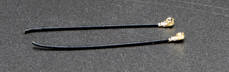
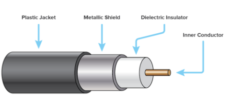

# Viestintä ja antennit

Tässä artikkelissa esitellään keskeiset käsitteet, joita tarvitaan langattomaan tiedonsiirtoon CanSat NeXT:llä. Ensin käsitellään viestintäjärjestelmää yleisellä tasolla, sitten esitellään erilaisia vaihtoehtoja antennin valintaan CanSat NeXT:n kanssa. Lopuksi artikkelin viimeinen osa esittelee yksinkertaisen ohjeen neljännesaallon monopoliantennin rakentamiseen sarjan mukana tulevista osista.

## Aloittaminen

CanSat NeXT on melkein valmis aloittamaan langattoman viestinnän suoraan laatikosta. Ainoa tarvittava asia on oikea ohjelmisto ja antenni sekä lähettimeen että vastaanottimeen. Ensimmäiseen liittyen katso tämän sivun ohjelmistomateriaalit. Jälkimmäiseen liittyen tämä sivu sisältää ohjeet ulkoisen antennin valintaan ja yksinkertaisen monopoliantennin rakentamiseen CanSat NeXT:n mukana toimitetuista materiaaleista.

Vaikka piirilevy on melko kestävä tällaisten asioiden suhteen ohjelmistotarkistusten ansiosta, sinun ei koskaan pitäisi yrittää lähettää mitään radiosta ilman antennia. Vaikka se on epätodennäköistä tämän järjestelmän alhaisten tehojen vuoksi, heijastunut radioaalto voi aiheuttaa todellista vahinkoa elektroniikalle.

## CanSat NeXT Viestintäjärjestelmä

CanSat NeXT käsittelee langatonta tiedonsiirtoa hieman eri tavalla kuin vanhemmat CanSat-paketit. Erillisen radiomoduulin sijaan CanSat NeXT käyttää MCU:n integroitua WiFi-radiota viestintään. WiFi-radiota käytetään normaalisti tiedonsiirtoon ESP32:n ja internetin välillä, mahdollistamaan ESP32:n käyttö yksinkertaisena palvelimena tai jopa yhdistämään ESP32 bluetooth-laitteeseen, mutta tietyillä älykkäillä TCP-IP-konfigurointikikoilla voimme mahdollistaa suoran vertaisviestinnän ESP32-laitteiden välillä. Järjestelmää kutsutaan nimellä ESP-NOW, ja sen kehittää ja ylläpitää EspressIf, joka on ESP32-laitteiston kehittäjä. Lisäksi on olemassa erityisiä matalan nopeuden viestintäjärjestelmiä, jotka lisäämällä energian määrää bittiä kohden merkittävästi lisäävät wifi-radion mahdollista kantamaa tavallisten muutaman kymmenen metrin yli.

ESP-NOW:n tiedonsiirtonopeus on merkittävästi nopeampi kuin mitä vanhalla radiolla olisi mahdollista. Jo pelkästään vähentämällä pakettien välistä aikaa esimerkkikoodissa CanSat NeXT pystyy lähettämään ~20 täyttä pakettia GS:lle sekunnissa. Teoreettisesti tiedonsiirtonopeus voi olla jopa 250 kbit/s pitkän kantaman tilassa, mutta tämän saavuttaminen ohjelmistossa voi olla vaikeaa. Tästä huolimatta esimerkiksi täysien kuvien lähettäminen kamerasta lennon aikana pitäisi olla täysin mahdollista oikealla ohjelmistolla.

Yksinkertaisilla neljännesaallon monopoliantenneilla (31 mm pätkä lankaa) molemmissa päissä CanSat NeXT pystyi lähettämään tietoa maaasemalle 1,3 km päästä, jolloin näköyhteys menetettiin. Kun testattiin dronella, kantama rajoittui noin 1 km:iin. On mahdollista, että drone häiritsi radiota tarpeeksi rajoittaakseen kantamaa jonkin verran. Kuitenkin paremmalla antennilla kantamaa voitaisiin lisätä vielä enemmän. Pieni yagi-antenni olisi teoreettisesti lisännyt toiminta-aluetta kymmenkertaiseksi.

On muutamia käytännön yksityiskohtia, jotka eroavat vanhemmasta radioviestintäjärjestelmästä. Ensinnäkin satelliittien "paritus" maaaseman vastaanottimiin tapahtuu Media Access Control (MAC) -osoitteilla, jotka asetetaan koodissa. WiFi-järjestelmä on tarpeeksi älykäs käsittelemään ajoitus-, törmäys- ja taajuusongelmat kulissien takana. Käyttäjän tarvitsee vain varmistaa, että GS kuuntelee MAC-osoitetta, jolla satelliitti lähettää.

Toiseksi radion taajuus on erilainen. WiFi-radio toimii 2,4 GHz:n taajuusalueella (keskitaajuus on 2,445 GHz), mikä tarkoittaa, että sekä etenemisominaisuudet että antennin suunnittelun vaatimukset ovat erilaiset kuin ennen. Signaali on jonkin verran herkempi sateelle ja näköyhteysongelmille, eikä se välttämättä pysty lähettämään joissakin tapauksissa, joissa vanha järjestelmä olisi toiminut.

Radiosignaalin aallonpituus on myös erilainen. Koska

$$\lambda = \frac{c}{f} \approx \frac{3*10^8 \text{ m/s}}{2.445 * 10^9 \text {Hz}} = 0.12261 \text{ m,}$$

neljännesaallon monopoliantennin tulisi olla pituudeltaan 0,03065 m tai 30,65 mm. Tämä pituus on myös merkitty CanSat NeXT:n piirilevylle, jotta kaapelin leikkaaminen olisi hieman helpompaa. Antenni tulisi leikata tarkasti, mutta noin ~0,5 mm tarkkuudella on vielä hyväksyttävää.

Neljännesaallon antenni tarjoaa riittävän RF-suorituskyvyn CanSat-kilpailuihin. Tästä huolimatta jotkut käyttäjät saattavat olla kiinnostuneita saamaan vielä paremman kantaman. Yksi mahdollinen parannuskohta on monopoliantennin pituus. Käytännössä neljännesaallon resonanssi ei välttämättä ole tarkalleen oikealla taajuudella, koska muut parametrit, kuten ympäristö, ympäröivät metallielementit tai maadoitetulla metallilla peitetty osa langasta, voivat vaikuttaa resonanssiin hieman. Antenni voitaisiin virittää käyttämällä vektoriverkkoanalysaattoria (VNA). Ajattelen, että minun pitäisi tehdä tämä jossain vaiheessa ja korjata materiaalit vastaavasti.

Kestävämpi ratkaisu olisi käyttää erilaista antennityyliä. 2,4 GHz:llä on paljon hauskoja antenni-ideoita internetissä. Näihin kuuluvat helix-antenni, yagi-antenni, pringles-antenni ja monet muut. Monet näistä, jos ne on hyvin rakennettu, ylittävät helposti yksinkertaisen monopolin suorituskyvyn. Jopa pelkkä dipoli olisi parannus yksinkertaiseen lankaan verrattuna.

Useimmissa ESP32-moduuleissa käytetty liitin on Hirose U.FL -liitin. Tämä on hyvälaatuinen miniatyyri RF-liitin, joka tarjoaa hyvän RF-suorituskyvyn heikoille signaaleille. Yksi ongelma tämän liittimen kanssa on kuitenkin se, että kaapeli on melko ohut, mikä tekee siitä hieman epäkäytännöllisen joissakin tapauksissa. Se johtaa myös suurempiin kuin toivottuihin RF-häviöihin, jos kaapeli on pitkä, kuten se saattaa olla käytettäessä ulkoista antennia. Näissä tapauksissa voitaisiin käyttää U.FL-SMA-sovituskaapelia. Katson, voisimmeko tarjota näitä verkkokaupassamme. Tämä mahdollistaisi tiimien käyttää tutumpaa SMA-liitintä. Tästä huolimatta on täysin mahdollista rakentaa hyviä antenneja pelkästään U.FL:ää käyttäen.

Toisin kuin SMA, U.FL luottaa mekaanisesti napsautettaviin kiinnitysominaisuuksiin pitääkseen liittimen paikallaan. Tämä on yleensä riittävää, mutta ylimääräisen turvallisuuden vuoksi on hyvä idea lisätä nippuside lisäturvaksi. CanSat NeXT:n piirilevyssä on antenniliittimen vieressä olevat aukot pienen nippusiteen kiinnittämiseksi. Ihanteellisesti kaapelin tueksi lisättäisiin 3D-tulostettu tai muuten rakennettu tukiholkki ennen nippusidettä. Tiedosto 3D-tulostetusta tuesta on saatavilla GitHub-sivulta.

## Antennivaihtoehdot

Antennin tehtävä on käytännössä muuntaa ohjaamattomat sähkömagneettiset aallot ohjatuiksi ja päinvastoin. Laitteen yksinkertaisen luonteen vuoksi on olemassa lukuisia vaihtoehtoja, joista valita antenni laitteellesi. Käytännön näkökulmasta antennin valinnassa on paljon vapautta ja melko paljon asioita, jotka on otettava huomioon. Sinun on harkittava ainakin

1. Antennin toimintataajuus (tulisi sisältää 2,45 GHz)
2. Antennin kaistanleveys (vähintään 35 MHz)
3. Antennin impedanssi (50 ohmia)
4. Liitin (U.FL tai voit käyttää sovittimia)
5. Fyysinen koko (Sopiiko se tölkkiin)
6. Kustannukset
7. Valmistusmenetelmät, jos teet antennin itse.
8. Antennin polarisaatio.

Antennin valinta voi tuntua ylivoimaiselta, ja usein se onkin, mutta tässä tapauksessa se on paljon helpompaa, koska käytämme itse asiassa Wi-Fi-radiota - voimme itse asiassa käyttää melkein mitä tahansa 2,4 GHz:n Wi-Fi-antennia järjestelmän kanssa. Useimmat niistä ovat kuitenkin liian suuria, ja ne käyttävät myös yleensä liittimiä, joita kutsutaan RP-SMA:ksi, eikä U.FL:ksi. Kuitenkin sopivalla sovittimella ne voivat olla hyviä valintoja käyttää maaaseman kanssa. On jopa saatavilla suunta-antennit, mikä tarkoittaa, että voit saada lisävahvistusta parantaaksesi radiolinkkiä.

Wi-Fi-antennit ovat vankka valinta, mutta niillä on yksi merkittävä haittapuoli - polarisaatio. Ne ovat melkein aina lineaarisesti polarisoituja, mikä tarkoittaa, että signaalin voimakkuus vaihtelee merkittävästi riippuen lähettimen ja vastaanottimen suunnasta. Pahimmissa tapauksissa antennien ollessa kohtisuorassa toisiinsa nähden signaali saattaa jopa hävitä kokonaan. Siksi vaihtoehtoinen vaihtoehto on käyttää drone-antennia, jotka ovat yleensä ympyräpolarisoituja. Käytännössä tämä tarkoittaa, että meillä on jonkin verran jatkuvia polarisaatiohäviöitä, mutta ne ovat vähemmän dramaattisia. Vaihtoehtoinen älykäs ratkaisu polarisaatio-ongelman kiertämiseksi on käyttää kahta vastaanotinta, joiden antennit on asennettu kohtisuoraan toisiinsa nähden. Tällä tavalla ainakin yksi niistä on aina sopivassa asennossa signaalin vastaanottamiseen.

Tietysti todellinen tekijä haluaa aina tehdä oman antenninsa. Jotkut mielenkiintoiset rakenteet, jotka soveltuvat DIY-valmistukseen, sisältävät helix-antennin, "pringles"-antennin, yagin, dipolin tai monopoliantennin. Verkossa on paljon ohjeita useimpien näiden rakentamiseen. Artikkelin viimeinen osa näyttää, kuinka voit tehdä oman monopoliantennin, joka soveltuu CanSat-kilpailuihin, CanSat NeXT:n mukana toimitetuista materiaaleista.

## Neljännesaallon monopoliantennin rakentaminen

Tässä artikkelin osassa kuvataan, kuinka rakentaa kohtuullisen tehokas neljännesaallon monopoliantenni sarjan mukana toimitetuista materiaaleista. Antennia kutsutaan näin, koska siinä on vain yksi napa (verrattuna dipoliin), ja sen pituus on neljännes siitä aallonpituudesta, jota lähetämme.

Koaksiaalikaapelin ja lämpökutistemuovin lisäksi tarvitset jonkinlaiset johdonkuorijat ja johtoleikkurit. Melkein minkä tyyppiset tahansa toimivat. Lisäksi tarvitset lämpölähteen lämpökutistemuoville, kuten kuumailmapuhaltimen, kolvin tai jopa sytkärin.

Aloita ensin leikkaamalla kaapeli suunnilleen puoliksi.

Seuraavaksi rakennamme varsinaisen antennin. Tämä osa tulisi tehdä mahdollisimman tarkasti. Noin 0,2 mm tarkkuudella toimii hyvin, mutta yritä saada se mahdollisimman lähelle oikeaa pituutta, sillä se auttaa suorituskyvyssä.

Koaksiaalikaapeli koostuu neljästä osasta - keskijohdin, dielektrinen, suojus ja ulkovaippa. Yleensä näitä kaapeleita käytetään radioaaltosignaalien siirtämiseen laitteiden välillä siten, että keskijohdossa olevat virrat tasapainottuvat suojuksessa olevien virtojen kanssa. Kuitenkin poistamalla suojusjohdin, keskijohdossa olevat virrat luovat antennin. Tämän paljaan alueen pituus määrittää antennin aallonpituuden tai toimintataajuuden, ja haluamme nyt sen vastaavan toimintataajuuttamme 2,445 GHz, joten meidän on poistettava suojus 30,65 mm:n pituudelta.

Kuori varovasti kaapelin ulkovaippa. Ihannetapauksessa yritä poistaa vain vaippa ja suojus halutulta pituudelta. Kuitenkin eristeen leikkaaminen ei ole katastrofi. Yleensä on helpompaa poistaa ulkovaippa osissa kuin kerralla. Lisäksi voi olla helpompaa ensin poistaa liikaa ja sitten leikata sisäjohdin oikeaan pituuteen kuin yrittää saada se täsmälleen oikeaksi ensimmäisellä yrittämällä.

Alla oleva kuva näyttää kuoritut kaapelit. Yritä tehdä se kuten ylempi, mutta alempi toimii myös - se voi vain olla herkempi kosteudelle. Jos suojuksesta jää roikkuvia osia, leikkaa ne varovasti pois. Varmista, ettei ole mahdollisuutta, että sisäjohdin ja suojus koskettavat toisiaan - jopa yksi säie tekisi antennista käyttökelvottoman.

Antennin toiminta on nyt täysin kunnossa, mutta se voi olla herkkä kosteudelle. Siksi haluamme nyt lisätä uuden vaipan tähän, ja sitä varten lämpökutistemuovi on tarkoitettu. Leikkaa kaksi palaa, hieman pidempiä kuin tekemäsi antenni, ja aseta se antennin päälle ja käytä lämpölähdettä kutistaaksesi se paikalleen. Ole varovainen, ettet polta lämpökutistemuovia, erityisesti jos käytät jotain muuta kuin kuumailmapuhallinta.

Tämän jälkeen antennit ovat valmiita. Maa-aseman puolella antenni on todennäköisesti kunnossa näin. Toisaalta, vaikka liitin on melko turvallinen, on hyvä idea tukea liitintä jotenkin CanSat-puolella. Erittäin kestävä tapa on käyttää 3D-tulostettua tukea ja nippusidettä, mutta monet muut menetelmät toimivat myös. Muista myös harkita, miten antenni sijoitetaan tölkin sisälle. Ihannetapauksessa sen tulisi olla paikassa, jossa lähetys ei ole estetty millään metalliosilla.

### Antennituki

Lopuksi tässä on step-tiedosto kuvassa näkyvästä tuesta. Voit tuoda tämän useimpiin CAD-ohjelmistoihin ja muokata sitä tai tulostaa sen 3D-tulostimella.

[Download step-file](./../../static/assets/3d-files/uFl-support.step)