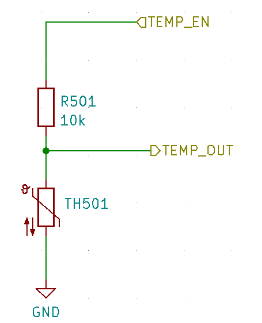

# Aluksella olevat anturit

Tässä artikkelissa esitellään CanSat NeXT -päälevyyn integroidut anturit. Anturien käyttöä käsitellään ohjelmistodokumentaatiossa, kun taas tämä artikkeli tarjoaa lisätietoa itse antureista.

CanSat NeXT -päälevyllä on kolme aluksella olevaa anturia. Nämä ovat IMU LSM6DS3, paineanturi LPS22HB ja LDR. Lisäksi levyssä on läpivientiaukko ulkoisen termistorin lisäämistä varten. Koska LPS22HB:llä on jo sekä paineen että lämpötilan mittausominaisuudet, se riittää teoriassa täyttämään CanSat-kilpailujen ensisijaiset tehtäväkriteerit yksinään. Kuitenkin, koska se mittaa sisäistä liitoslämpötilaa tai käytännössä PCB:n lämpötilaa kyseisellä kohdalla, se ei useimmissa kokoonpanoissa ole hyvä ilmakehän lämpötilan mittaus. Lisäksi paineanturin absoluuttista mittausta voidaan tukea IMU-kiihtyvyysmittarin lisätiedoilla. LDR on lisätty ensisijaisesti auttamaan opiskelijoita oppimaan analogisiin antureihin liittyviä käsitteitä, sillä vaste ärsykkeisiin on lähes välitön, kun taas termistorin lämpeneminen ja jäähtyminen vie aikaa. Tämä sanottuna, se voi myös tukea opiskelijoiden keksimiä luovia tehtäviä, aivan kuten IMU:n kiihtyvyysmittari ja gyroskooppi. Lisäksi CanSat NeXT kannustaa käyttämään lisäantureita laajennusliitännän kautta.

## Inertiaalianturi

IMU, LSM6DS3 STMicroelectronicsilta on SiP (system-in-package) -tyylinen MEMS-anturi, joka integroi kiihtyvyysmittarin, gyroskoopin ja lukuelektroniikan pieneen pakettiin. Anturi tukee SPI- ja I2C-sarjaliitäntöjä ja sisältää myös sisäisen lämpötila-anturin.

LSM6DS3:lla on vaihdettavat kiihtyvyyden mittausalueet ±2/±4/±8/±16 G ja kulmanopeuden mittausalueet ±125/±250/±500/±1000/±2000 deg/s. Suuremman alueen käyttö vähentää myös laitteen resoluutiota.

CanSat NeXT:ssä LSM6DS3:ta käytetään I2C-tilassa. I2C-osoite on 1101010b (0x6A), mutta seuraava versio lisää tuen laitteiston muokkaamiselle osoitteen muuttamiseksi 1101011b (0x6B), jos edistyneellä käyttäjällä on tarve käyttää alkuperäistä osoitetta johonkin muuhun.

Mittausalueet asetetaan oletusarvoisesti maksimiin kirjastossa, jotta saadaan talteen suurin osa tiedoista raketin väkivaltaisesta laukaisusta. Käyttäjä voi myös muokata tietojen alueita.

## Barometri

Paineanturi LPS22HB STMicroelectronicsilta on toinen SiP MEMS -laite, joka on suunniteltu mittaamaan painetta 260-1260 hPa. Alue, jolla se raportoi tietoja, on huomattavasti suurempi, mutta mittausten tarkkuus tämän alueen ulkopuolella on kyseenalainen. MEMS-paineanturit toimivat mittaamalla piezoresistiivisiä muutoksia anturin kalvossa. Koska lämpötila vaikuttaa myös piezoelementin resistanssiin, se on kompensoitava. Tämän mahdollistamiseksi sirulla on myös suhteellisen tarkka liitoslämpötila-anturi aivan piezoresistiivisen elementin vieressä. Tämä lämpötilamittaus voidaan myös lukea anturista, mutta on pidettävä mielessä, että se on mittaus sirun sisäisestä lämpötilasta, ei ympäröivän ilman lämpötilasta.

Samoin kuin IMU, LPS22HB:ta voidaan käyttää joko SPI- tai I2C-liitännän kautta. CanSat NeXT:ssä se on kytketty samaan I2C-liitäntään kuin IMU. LPS22HB:n I2C-osoite on 1011100b (0x5C), mutta lisäämme tuen sen muuttamiseksi 0x5D:ksi, jos halutaan.

## Analoginen-digitaalimuunnin

Tämä viittaa jännitteen mittaukseen analogRead()-komennolla.

ESP32:n 12-bittinen analoginen-digitaalimuunnin (ADC) on tunnetusti epälineaarinen. Tämä ei ole merkityksellistä useimmissa sovelluksissa, kuten käytettäessä sitä lämpötilan muutosten tai LDR:n resistanssin muutosten havaitsemiseen, mutta absoluuttisten mittausten tekeminen akun jännitteestä tai NTC-resistanssista voi olla hieman hankalaa. Yksi tapa kiertää tämä on huolellinen kalibrointi, joka tuottaisi riittävän tarkkoja tietoja esimerkiksi lämpötilalle. CanSat-kirjasto tarjoaa kuitenkin myös kalibroidun korjaustoiminnon. Toiminto toteuttaa kolmannen asteen polynomikorjauksen ADC:lle, korreloimalla ADC-lukeman todellisen ADC-nastassa olevan jännitteen kanssa. Korjaustoiminto on

$$V = -1.907217e \times 10^{-11} \times a^3 + 8.368612 \times 10^{-8} \times a^2 + 7.081732e \times 10^{-4} \times a + 0.1572375$$

Missä V on mitattu jännite ja a on 12-bittinen ADC-lukema analogRead():sta. Toiminto sisältyy kirjastoon ja sitä kutsutaan adcToVoltage. Tämän kaavan käyttäminen tekee ADC-lukemavirheestä alle 1 % jännitealueella 0.1 V - 3.2 V.

## Valovastus

CanSat NeXT -päälevyyn on myös integroitu LDR anturisarjaan. LDR on erityinen vastustyyppi, jossa resistanssi vaihtelee valaistuksen mukaan. Tarkat ominaisuudet voivat vaihdella, mutta käyttämämme LDR:n resistanssi on 5-10 kΩ 10 luxissa ja 300 kΩ pimeässä.

Tapa, jolla tätä käytetään CanSat NeXT:ssä, on, että MCU:sta syötetään 3.3 V jännite vertailuvastukseen. Tämä aiheuttaa jännitteen LDR_OUT:ssa olevan

$$V_{LDR} = V_{EN} \frac{R402}{R401+R402} $$.

Ja kun R402:n resistanssi muuttuu, myös jännite LDR_OUT:ssa muuttuu. Tämä jännite voidaan lukea ESP32 ADC:llä ja sitten korreloida LDR:n resistanssin kanssa. Käytännössä kuitenkin yleensä LDR:llä olemme kiinnostuneita muutoksesta pikemminkin kuin absoluuttisesta arvosta. Esimerkiksi yleensä riittää havaita suuri muutos jännitteessä, kun laite altistuu valolle raketista vapautumisen jälkeen. Kynnysarvot asetetaan yleensä kokeellisesti, eikä analyyttisesti laskemalla. Huomaa, että CanSat NeXT:ssä sinun on otettava käyttöön analogiset aluksella olevat anturit asettamalla MEAS_EN-nasta HIGH-tilaan. Tämä on esitetty esimerkkikoodeissa.

## Termistori

Ulkopuolisen termistorin lukemiseen käytetty piiri on hyvin samanlainen kuin LDR-lukupiiri. Täsmälleen sama logiikka pätee, että kun vertailuvastukseen syötetään jännite, jännite TEMP_OUT:ssa muuttuu seuraavasti

$$V_{TEMP} = V_{EN} \frac{TH501}{TH501+R501} $$.

Tässä tapauksessa olemme kuitenkin yleensä kiinnostuneita termistorin resistanssin absoluuttisesta arvosta. Siksi VoltageConversion on hyödyllinen, sillä se linearisoi ADC-lukemat ja laskee myös V_temp:n suoraan. Tällä tavalla käyttäjä voi laskea termistorin resistanssin koodissa. Arvo tulisi silti korreloida lämpötilan kanssa mittausten avulla, vaikka termistorin tietolehti saattaa myös sisältää vihjeitä siitä, miten laskea lämpötila resistanssista. Huomaa, että jos teet kaiken analyyttisesti, sinun tulisi myös ottaa huomioon R501:n resistanssin vaihtelu. Tämä tehdään helpoimmin mittaamalla resistanssi yleismittarilla, sen sijaan että oletetaan sen olevan 10 000 ohmia.

PCB:n vertailuvastus on suhteellisen vakaa lämpötila-alueella, mutta se muuttuu myös hieman. Jos halutaan erittäin tarkkoja lämpötilalukemia, tämä tulisi kompensoida. Paineanturin liitoslämpötilamittausta voidaan käyttää tähän. Tämä ei kuitenkaan ole välttämätöntä CanSat-kilpailuille. Kiinnostuneille valmistaja ilmoittaa R501:n lämpötilakertoimeksi 100 PPM/°C.

Vaikka barometrin lämpötila heijastaa enimmäkseen itse levyn lämpötilaa, termistori voidaan asentaa siten, että se reagoi lämpötilan muutoksiin levyn ulkopuolella, jopa tölkin ulkopuolella. Voit myös lisätä johtoja saadaksesi sen vielä kauemmas. Jos sitä käytetään, termistori voidaan juottaa sopivaan paikkaan CanSat NeXT -levyllä. Polarisaatiolla ei ole merkitystä, eli se voidaan asentaa kumpaan tahansa suuntaan.

