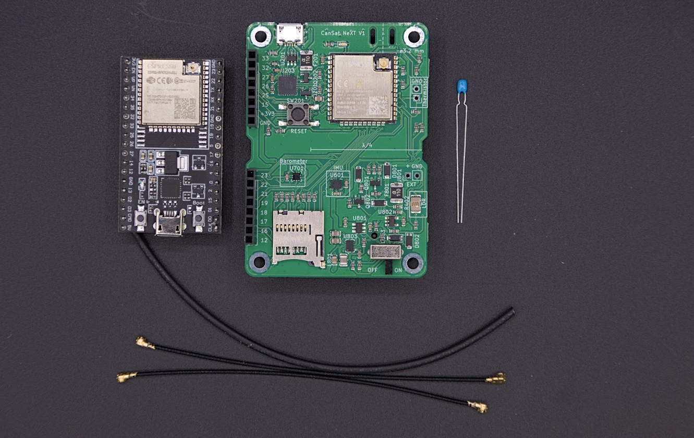

# CanSat NeXT -kurssi

## Tervetuloa CanSat NeXT:iin!

CanSat NeXT on uusi versio CanSat-paketista, joka yhdistää kaikki tarvittavat ominaisuudet onnistuneeseen CanSat-laukaisuun yhdelle piirilevylle, mahdollistaen ohjelmistokehityksen ja omien tehtävien aloittamisen välittömästi. CanSat NeXT ei kuitenkaan unohda toissijaista tehtävääsi, sillä voit liittää mitä tahansa antureita tai ulkoisia laitteita laajennusliittimiin. Voit ajatella CanSat NeXT:ä kuin Arduinoa, mutta anturit ja muut ominaisuudet ovat jo valmiiksi mukana.

## Pakettisi

Jos sinulla ei vielä ole CanSat NeXT -pakettia, voit hankkia sellaisen verkkokaupastamme: https://spacelabnextdoor.com/. Vaihtoehtoisesti CanSat-kilpailuihin ja -ohjelmiin osallistuvat koulut ovat yleensä oikeutettuja saamaan paketteja ESERO-verkoston kautta.

Paketti sisältää yhden CanSat-piirilevyn, jonka kanssa tulet työskentelemään eniten. Lisäksi mukana on toinen piirilevy, jota käytetään maa-aseman radiolähettimenä - sitä käytetään viestien välittämiseen tietokoneen ja CanSat:n välillä.

Vaikka CanSat NeXT:ssä on jo lämpömittari, paketti sisältää myös termistorin, joka voidaan juottaa piirilevylle mittaamaan lämpötilaa itse piirilevyn ulkopuolella.

Lopuksi paketti sisältää kaksi radiokaapelia, joita voidaan käyttää perusantennien rakentamiseen mahdollistamaan viestintä jopa kilometrin päähän. Vain yksi kaapeli on tarpeen, mutta on mukavaa, että on varakaapeli. Kutistesukka on mukana lisäämään säänkestävyyttä antenneille. Ohjeet antennin rakentamiseen löytyvät artikkelista [Viestintä ja antennit](./../CanSat-hardware/communication.md).

## Oppitunnit

Tämä sivu sisältää kasvavan määrän yksinkertaisia oppitunteja, joiden avulla pääset sujuvasti alkuun CanSat NeXT -pakettisi kanssa. Ensimmäinen oppitunti käsittelee tietokoneesi asettamista CanSat-ohjelmoinnin aloittamiseksi, ja seuraavat oppitunnit esittelevät CanSat NeXT:n erilaisia laitteisto-ominaisuuksia. Lisäksi meillä on blogi, jossa esitellään erilaisia CanSat NeXT:llä tehtyjä projekteja, jotka voivat olla mielenkiintoisia oman CanSat-tehtäväsi suunnittelussa.

[Napsauta tästä ensimmäiseen oppituntiin!](./lesson1).