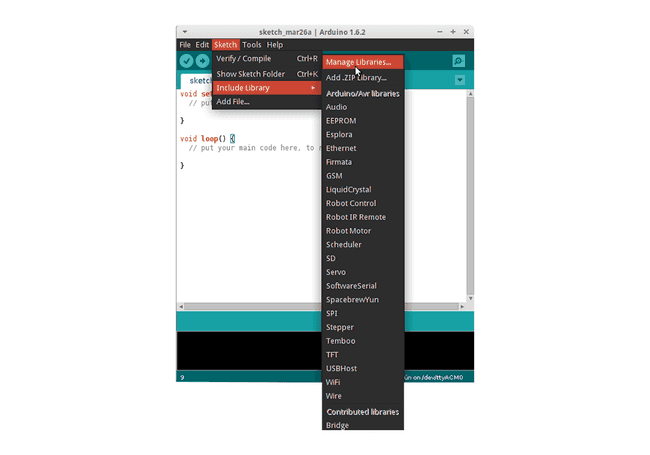
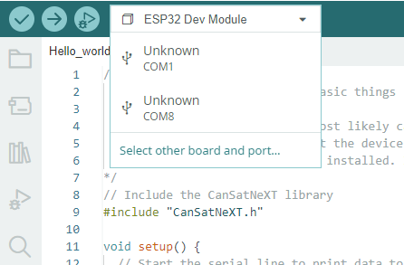

# Oppitunti 1: Hei maailma!

Tässä ensimmäisessä oppitunnissa pääset alkuun CanSat NeXT:n kanssa oppimalla, kuinka kirjoittaa ja suorittaa ensimmäinen ohjelmasi laitteella.

Tämän oppitunnin jälkeen sinulla on tarvittavat työkalut CanSat-ohjelmiston kehittämiseen.

## Työkalujen asentaminen

CanSat NeXT:tä suositellaan käytettäväksi Arduino IDE:n kanssa, joten aloitetaan asentamalla se sekä tarvittavat kirjastot ja laitteet.

### Asenna Arduino IDE

Jos et ole vielä tehnyt sitä, lataa ja asenna Arduino IDE viralliselta verkkosivustolta https://www.arduino.cc/en/software.

### Lisää ESP32-tuki

CanSat NeXT perustuu ESP32-mikrokontrolleriin, joka ei sisälly Arduino IDE:n oletusasennukseen. Jos et ole aiemmin käyttänyt ESP32-mikrokontrollereita Arduinon kanssa, laitetuki on ensin asennettava. Tämä voidaan tehdä Arduino IDE:ssä kohdasta *Tools->board->Board Manager* (tai painamalla (Ctrl+Shift+B) missä tahansa). Etsi Board Managerista ESP32 ja asenna esp32 by Espressif.

### Asenna CanSat NeXT -kirjasto

CanSat NeXT -kirjasto voidaan ladata Arduino IDE:n kirjastonhallinnasta kohdasta *Sketch > Include Libraries > Manage Libraries*.



*Kuvan lähde: Arduino Docs, https://docs.arduino.cc/software/ide-v1/tutorials/installing-libraries*

Kirjastonhallinnan hakupalkkiin kirjoita "CanSatNeXT" ja valitse "Install". Jos IDE kysyy, haluatko asentaa myös riippuvuudet, klikkaa kyllä.

## Yhdistäminen tietokoneeseen

Kun CanSat NeXT -ohjelmistokirjasto on asennettu, voit liittää CanSat NeXT:n tietokoneeseesi. Jos laitetta ei havaita, saatat joutua asentamaan tarvittavat ajurit ensin. Ajurien asennus tapahtuu automaattisesti useimmissa tapauksissa, mutta joissakin tietokoneissa se on tehtävä manuaalisesti. Ajurit löytyvät Silicon Labsin verkkosivustolta: https://www.silabs.com/developers/usb-to-uart-bridge-vcp-drivers
Lisäapua ESP32:n asennukseen löytyy seuraavasta oppaasta: https://docs.espressif.com/projects/esp-idf/en/latest/esp32/get-started/establish-serial-connection.html

## Ensimmäisen ohjelman suorittaminen

Nyt käytetään juuri asennettuja kirjastoja koodin suorittamiseen CanSat NeXT:llä. Kuten perinteisiin kuuluu, aloitetaan LEDin vilkuttamisella ja "Hello World!" -viestin kirjoittamisella tietokoneelle.

### Oikean portin valitseminen

Kun olet liittänyt CanSat NeXT:n tietokoneeseesi (ja kytkenyt virran päälle), sinun on valittava oikea portti. Jos et tiedä, mikä on oikea, irrota laite ja katso, mikä portti katoaa.



Arduino IDE kehottaa nyt valitsemaan laitetyypin. Valitse ESP32 Dev Module.


### Esimerkin valitseminen

CanSat NeXT -kirjastossa on useita esimerkkikoodeja, jotka näyttävät, kuinka käyttää laudan eri ominaisuuksia. Löydät nämä esimerkkiluonnokset kohdasta File -> Examples -> CanSat NeXT. Valitse "Hello_world".

Kun olet avannut uuden luonnoksen, voit ladata sen laitteeseen painamalla latauspainiketta.


Jonkin ajan kuluttua laudan LEDin pitäisi alkaa vilkkua. Lisäksi laite lähettää viestin tietokoneelle. Voit nähdä tämän avaamalla sarjamonitorin ja valitsemalla baudinopeudeksi 115200.

Kokeile myös painaa laudan painiketta. Sen pitäisi nollata prosessori eli toisin sanoen käynnistää koodi alusta.

### Hei maailma selitettynä

Katsotaanpa, mitä tässä koodissa oikeastaan tapahtuu käymällä se läpi rivi riviltä. Ensin koodi alkaa **sisällyttämällä** CanSat-kirjaston. Tämä rivi tulisi olla lähes kaikkien CanSat NeXT:lle kirjoitettujen ohjelmien alussa, sillä se kertoo kääntäjälle, että haluamme käyttää CanSat NeXT -kirjaston ominaisuuksia.

```Cpp title="Sisällytä CanSat NeXT"
#include "CanSatNeXT.h"
```
Tämän jälkeen koodi siirtyy setup-funktioon. Siellä on kaksi kutsua - ensin, sarjaliitäntä on rajapinta, jota käytämme viestien lähettämiseen tietokoneelle USB:n kautta. Funktion kutsun sisällä oleva numero, 115200, viittaa baudinopeuteen eli siihen, kuinka monta ykköstä ja nollaa lähetetään sekunnissa. Seuraava kutsu, `CanSatInit()`, on CanSat NeXT -kirjastosta ja se käynnistää kaikki laudan anturit ja muut ominaisuudet. Samoin kuin `#include`-komento, tämä löytyy yleensä CanSat NeXT:n luonnoksista. Kaikki, mitä haluat suorittaa vain kerran käynnistyksen yhteydessä, tulisi sisällyttää setup-funktioon.

```Cpp title="Setup"
void setup() {
  // Käynnistä sarjaliitäntä tulostamaan dataa terminaaliin
  Serial.begin(115200);
  // Käynnistä kaikki CanSatNeXT:n laudan järjestelmät.
  CanSatInit();
}
```

Setupin jälkeen koodi alkaa toistaa loop-funktiota loputtomasti. Ensin ohjelma asettaa lähtöpin LEDin korkeaksi, eli jännitteeksi 3,3 volttia. Tämä sytyttää laudan LEDin. 100 millisekunnin kuluttua jännite kyseisellä lähtöpinillä palautetaan nollaan. Nyt ohjelma odottaa 400 ms ja lähettää sitten viestin tietokoneelle. Kun viesti on lähetetty, loop-funktio alkaa alusta.

```Cpp title="Loop"
void loop() {
  // Vilkutetaan LEDiä
  digitalWrite(LED, HIGH);
  delay(100);
  digitalWrite(LED, LOW);
  delay(400);
  Serial.println("Tämä on viesti!");
}
```

Voit myös yrittää muuttaa viivearvoja tai viestiä nähdäksesi, mitä tapahtuu. Onnittelut, että pääsit näin pitkälle! Työkalujen asennus voi olla hankalaa, mutta tästä eteenpäin sen pitäisi olla hauskempaa.

---

Seuraavassa oppitunnissa aloitamme tietojen lukemisen laudan antureista.

[Napsauta tästä toiseen oppituntiin!](./lesson2)