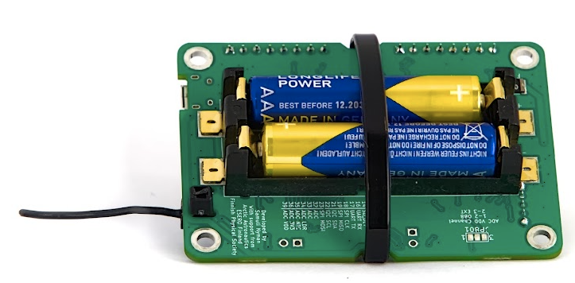

# Oppitunti 12: Valmiina laukaisuun?

Tässä viimeisessä oppitunnissa puhumme siitä, kuinka valmistella satelliitti, maa-asema ja tiimi laukaisua varten. Tämän oppitunnin jälkeen meillä on myös *katsaus* lentovalmiuden tarkistamiseksi, mutta tämä oppitunti keskittyy onnistuneen tehtävän mahdollisuuksien maksimoimiseen. Tässä oppitunnissa puhumme elektroniikan mekaanisesta ja sähköisestä valmistelusta, radioviestintäjärjestelmän tarkistamisesta ja lopuksi keskustelemme hyödyllisistä valmisteluvaiheista, jotka kannattaa tehdä hyvissä ajoin ennen varsinaista laukaisutapahtumaa.

Tämä oppitunti on jälleen hieman erilainen, sillä sen sijaan, että tarkastelisimme uusia ohjelmointikäsitteitä, keskustelemme siitä, kuinka parantaa laitteen luotettavuutta tehtävässä. Lisäksi, vaikka et todennäköisesti ole vielä valmis rakentamaan (tai määrittelemään) satelliittitehtävää, jos käyt nyt ensimmäistä kertaa kurssin läpi, on hyvä lukea tämän sivun materiaalit, harkita näitä näkökohtia laitetta ja tehtävää suunnitellessa ja palata niihin, kun valmistaudut laukaisuun.

## Mekaaniset näkökohdat

Ensinnäkin, kuten edellisessä oppitunnissa keskusteltiin, elektroniikan **pino** tulisi rakentaa niin, että se pysyy yhdessä jopa voimakkaassa tärinässä ja iskussa. Hyvä tapa suunnitella elektroniikka on käyttää koekytkentälevyjä, jotka pidetään yhdessä [etäisyyspalikoilla](https://spacelabnextdoor.com/electronics/27-cansat-next-rp-sma-ufl) ja kytketään sähköisesti joko liittimen kautta tai hyvin tuetulla kaapelilla. Lopuksi koko elektroniikkapino tulisi kiinnittää satelliitin runkoon siten, että se ei liiku ympäriinsä. Jäykkä kiinnitys ruuveilla on aina luotettava valinta (sanaleikki tarkoitettu), mutta se ei ole ainoa vaihtoehto. Yksi vaihtoehto voisi olla suunnitella järjestelmä hajoamaan iskussa, samanlaisesti kuin [törmäysvyöhyke](https://en.wikipedia.org/wiki/Crumple_zone). Vaihtoehtoisesti pehmustettu kiinnitysjärjestelmä kumilla, vaahtomuovilla tai vastaavalla järjestelmällä voisi vähentää elektroniikan kokemia rasituksia, mikä auttaa luomaan monikäyttöisiä järjestelmiä.

Tyypillisessä CanSatissa on joitain kohteita, jotka ovat erityisen alttiita ongelmille laukaisun aikana tai odotettua nopeammissa laskeutumisissa. Näitä ovat akut, SD-kortti ja antenni.

### Akun kiinnittäminen

CanSat NeXT:ssä piirilevy on suunniteltu siten, että sen ympärille voidaan kiinnittää nippuside, joka varmistaa, että akut pysyvät paikoillaan tärinässä. Muuten niillä on taipumus ponnahtaa ulos pistorasioista. Toinen huolenaihe akuista on, että jotkut akut ovat lyhyempiä kuin olisi ihanteellista akunpitimelle, ja on mahdollista, että erityisen voimakkaassa iskussa akun kontaktit taipuvat akkujen painon alla siten, että kontakti menetetään. Tämän lieventämiseksi kontakteja voidaan tukea lisäämällä pala nippusidettä, vaahtomuovia tai muuta täyteainetta jousikontaktien taakse. Vahingossa (ja tahallisesti) tehdyissä pudotustesteissä tämä on parantanut luotettavuutta, vaikka hyvin rakennettuihin CanSateihin integroidut CanSat NeXT:t ovat selviytyneet jopa 1000 metrin pudotuksista (ilman laskuvarjoa) jopa ilman näitä suojatoimenpiteitä. Vielä parempi tapa tukea akkuja on suunnitella tukirakenne suoraan CanSat-runkoon siten, että se kantaa akkujen painon iskussa akunpitimen sijaan.



### Antennikaapelin kiinnittäminen

Antenniliitin on U.Fl, joka on autoteollisuuden standardin mukainen liitintyyppi. Ne kestävät tärinää ja iskuja melko hyvin, vaikka niillä ei ole ulkoisia mekaanisia tukia. Luotettavuutta voidaan kuitenkin parantaa kiinnittämällä antenni pienillä nippusiteillä. CanSat NeXT -piirilevyssä on pieniä aukkoja antennin vieressä tätä tarkoitusta varten. Antennin pitämiseksi neutraalissa asennossa sille voidaan [tulostaa tuki](../CanSat-hardware/communication.md#building-a-quarter-wave-monopole-antenna).


### SD-kortin kiinnittäminen

SD-kortti voi ponnahtaa ulos pidikkeestä voimakkaissa iskuissa. Jälleen kerran, piirilevyt ovat selviytyneet pudotuksista ja lennoista, mutta luotettavuutta voidaan parantaa teippaamalla tai liimaamalla SD-kortti pidikkeeseen. Uudemmat CanSat NeXT -piirilevyt (≥1.02) on varustettu korkean turvallisuuden SD-korttipidikkeillä tämän ongelman lieventämiseksi.

## Viestintätesti

Yksi onnistuneen tehtävän tärkeimmistä yksityiskohdista on luotettavan radiolinkin varmistaminen. Lisätietoja antennien valinnasta ja/tai rakentamisesta löytyy dokumentaation [laitteisto-osasta](../CanSat-hardware/communication.md#antenna-options). Kuitenkin riippumatta valitusta antennista, testaus on olennainen osa mitä tahansa radiosysteemiä.

Oikea antennitestaus voi olla hankalaa ja vaatii erikoislaitteita, kuten [VNA:ita](https://en.wikipedia.org/wiki/Network_analyzer_(electrical)), mutta voimme tehdä toiminnallisen testin suoraan CanSat NeXT -sarjalla.

Ensiksi ohjelmoi satelliitti lähettämään dataa, esimerkiksi datalukema kerran sekunnissa. Sitten ohjelmoi maa-asema vastaanottamaan dataa ja tulostamaan **RSSI** (Vastaanotetun signaalin voimakkuusindikaattori) -arvot, kuten `getRSSI()`-funktio antaa, joka on osa CanSat NeXT -kirjastoa.

```Cpp title="Read RSSI"
#include "CanSatNeXT.h"

void setup() {
  Serial.begin(115200);
  GroundStationInit(28);
}

void loop() {}

void onDataReceived(String data)
{
  int rssi = getRSSI();
  Serial.print("RSSI: ");
  Serial.println(rssi);
}
```

Tämä arvo edustaa todellista sähköistä **tehoa**, jonka maa-asema vastaanottaa antenninsa kautta, kun se vastaanottaa viestin. Arvo ilmaistaan [desibelimilliwatteina](https://en.wikipedia.org/wiki/DBm). Tyypillinen lukema toimivalla antennilla molemmissa päissä, kun laitteet ovat samalla pöydällä, on -30 dBm (1000 nanowattia), ja sen pitäisi laskea nopeasti etäisyyden kasvaessa. Vapaassa tilassa se noudattaa suunnilleen käänteistä neliölakia, mutta ei tarkalleen johtuen kaikuista, fresnel-vyöhykkeistä ja muista epätäydellisyyksistä. CanSat NeXT:n oletusarvoisesti käyttämillä radioasetuksilla RSSI voidaan viedä noin -100 dBm:iin (0,1 pikowattia) ja silti osa datasta pääsee läpi.

Tämä vastaa yleensä noin kilometrin etäisyyttä käytettäessä monopoliantenneja, mutta voi olla paljon enemmän, jos maa-aseman antennilla on merkittävä [vahvistus](https://en.wikipedia.org/wiki/Gain_(antenna)), mikä lisää suoraan dBm-lukemaa.

## Tehotestit

On hyvä idea mitata satelliittisi virrankulutus yleismittarilla. Se on myös helppoa, poista vain yksi akuista ja pidä sitä manuaalisesti siten, että voit käyttää yleismittarin virranmittausta yhdistämään akun toisen pään ja akun kontaktin. Tämän lukeman pitäisi olla suuruusluokkaa 130-200 mA, jos CanSat NeXT -radio on aktiivinen eikä ulkoisia laitteita ole. Virrankulutus nousee, kun akut purkautuvat, koska enemmän virtaa tarvitaan pitämään jännite 3,3 voltissa laskevasta akkujännitteestä.

Tyypillisillä AAA-akuilla on noin 1200 mAh:n kapasiteetti, mikä tarkoittaa, että laitteen jatkuvan virrankulutuksen tulisi olla alle 300 mA, jotta akut kestävät koko tehtävän ajan. Tämä on myös syy, miksi on hyvä idea olla useita toimintatiloja, jos laitteessa on paljon virtaa kuluttavia laitteita, koska ne voidaan kytkeä päälle juuri ennen lentoa hyvän akun keston varmistamiseksi.

Vaikka matemaattinen lähestymistapa akun keston arvioimiseen on hyvä alku, on silti parasta tehdä todellinen mittaus akun kestosta hankkimalla uudet akut ja suorittamalla simuloitu tehtävä.

## Ilmailutestaus

Ilmailuteollisuudessa jokainen satelliitti käy läpi perusteellisen testauksen varmistaakseen, että se kestää laukaisun, avaruuden ja joskus uudelleensyöttämisen ankarat olosuhteet. Vaikka CanSatit toimivat hieman erilaisessa ympäristössä, voit silti mukauttaa joitain näistä testeistä parantaaksesi luotettavuutta. Alla on joitain yleisiä ilmailutestejä, joita käytetään CubeSateille ja pienille satelliiteille, sekä ideoita siitä, kuinka voit toteuttaa samanlaista testausta CanSatillesi.

### Tärinätestaus

Tärinätestiä käytetään pienissä satelliittijärjestelmissä kahdesta syystä. Ensisijainen syy on, että testi pyrkii tunnistamaan rakenteen resonanssitaajuudet varmistaakseen, että raketin tärinä ei ala resonoida satelliitin rakenteessa, mikä saattaa johtaa satelliittijärjestelmien vikaan. Toissijainen syy on myös merkityksellinen CanSat-järjestelmissä, joka on käsityön laadun varmistaminen ja järjestelmän selviytyminen raketin laukaisusta. Satelliittien tärinätestaus tehdään erikoistuneilla tärinätestipenkillä, mutta vaikutus voidaan simuloida myös luovemmilla ratkaisuilla. Yritä keksiä tapa todella ravistaa satelliittia (tai mieluiten sen varaosaa) ja katso, rikkoutuuko jokin. Kuinka sitä voitaisiin parantaa?

### Iskutesti

Tärinätestien serkku, iskutestit simuloivat räjähtävää vaihe-erottelua raketin laukaisun aikana. Iskujen kiihtyvyys voi olla jopa 100 G:tä, mikä voi helposti rikkoa järjestelmiä. Tämä voitaisiin simuloida pudotustestillä, mutta harkitse, kuinka tehdä se turvallisesti, jotta satelliitti, sinä tai lattia ei rikkoudu.

### Lämpötestaus

Lämpötestaus sisältää koko satelliitin altistamisen suunnitellun käyttöalueen äärimmäisyyksille ja myös nopean liikkumisen näiden lämpötilojen välillä. CanSat-kontekstissa tämä voisi tarkoittaa satelliitin testaamista pakastimessa, simuloiden laukaisua kylmänä päivänä, tai lievästi lämmitetyssä uunissa simuloiden kuumaa laukaisupäivää. Ole varovainen, että elektroniikka, muovit tai ihosi eivät altistu suoraan äärimmäisille lämpötiloille.

## Yleisiä hyviä ideoita

Tässä on joitain lisävinkkejä onnistuneen tehtävän varmistamiseksi. Nämä vaihtelevat teknisistä valmisteluista organisatorisiin käytäntöihin, jotka parantavat CanSatisi yleistä luotettavuutta. Voit ehdottaa uusia ideoita lisättäväksi tähän tavallisen kanavan kautta (samuli@kitsat.fi).

- Harkitse tarkistuslistan laatimista, jotta et unohda mitään juuri ennen laukaisua
- Testaa koko lentosekvenssi etukäteen simuloidussa lennossa
- Testaa satelliitti myös samanlaisissa ympäristöolosuhteissa kuin odotetaan lennolla. Varmista, että laskuvarjo on myös kunnossa odotettujen lämpötilojen kanssa.
- Pidä varaparistot, ja mieti, kuinka ne asennetaan tarvittaessa
- Pidä varmuuskopio SD-kortista, ne voivat joskus epäonnistua
- Pidä varmuuskopio tietokoneesta ja poista päivitykset käytöstä tietokoneessa ennen laukaisua.
- Pidä varanippusiteitä, ruuveja ja mitä tahansa muuta, mitä tarvitset satelliitin kokoamiseen
- Pidä käsillä joitain perustyökaluja purkamisen ja kokoamisen avuksi
- Pidä ylimääräisiä antenneja
- Voit myös käyttää useita maa-asemia samanaikaisesti, joita voidaan käyttää myös satelliitin paikantamiseen, erityisesti jos RSSI on saatavilla.
- Määritä selkeät roolit jokaiselle tiimin jäsenelle laukaisun, operaatioiden ja palautuksen aikana.

---

Tässä ovat oppitunnit toistaiseksi. Seuraavalla sivulla on lentovalmiuskatsaus, joka on käytäntö onnistuneiden tehtävien varmistamiseksi.

[Napsauta tästä lentovalmiuskatsaukseen!](./review2)