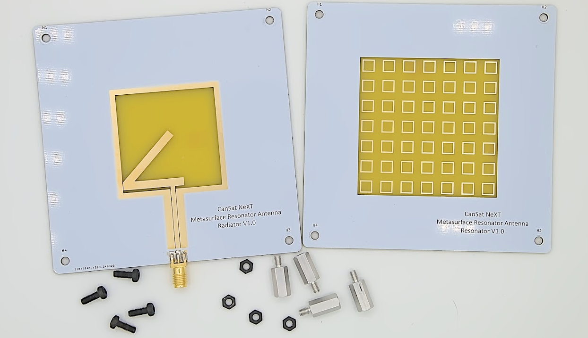

# Antenne Résonateur Métasurface

L'antenne résonateur métasurface CanSat NeXT est un module d'antenne externe, qui peut être utilisé à la station au sol pour augmenter la portée de communication et également rendre la communication plus fiable.

L'[antenne du kit](./../CanSat-hardware/communication#quarter-wave-antenna) de CanSat NeXT a été utilisée avec succès pour des missions CanSat où le CanSat a été lancé à une altitude de 1 kilomètre. Cependant, à ces distances, l'antenne monopole commence à être à la limite de la portée opérationnelle et peut également perdre le signal parfois en raison d'erreurs de polarisation résultant de la polarisation linéaire de l'antenne monopole. Le kit d'antenne résonateur métasurface est conçu pour permettre un fonctionnement plus fiable dans ce type de conditions extrêmes, et également permettre un fonctionnement avec des portées significativement plus longues.

L'antenne résonateur métasurface se compose de deux cartes. L'antenne principale se trouve sur la carte radiateur, où une antenne de type fente a été gravée dans le PCB. Cette carte à elle seule fournit environ 3 dBi de gain, et présente une [polarisation circulaire](https://en.wikipedia.org/wiki/Circular_polarization), ce qui signifie en pratique que la force du signal ne dépend plus de l'orientation de l'antenne du satellite. Cette carte peut donc être utilisée comme une antenne elle-même, si une *largeur de faisceau* plus large est souhaitable.

L'autre carte, d'où l'antenne tire son nom, est la caractéristique spéciale de ce kit d'antenne. Elle doit être placée à 10-15 mm de la première carte, et elle présente un réseau d'éléments résonateurs. Les éléments sont alimentés par l'antenne à fente en dessous d'eux, ce qui rend l'antenne plus *directive*. Avec cet ajout, le gain double pour atteindre 6 dBi.

L'image ci-dessous montre le *coefficient de réflexion* de l'antenne mesuré avec un analyseur de réseau vectoriel (VNA). Le graphique montre les fréquences auxquelles l'antenne est capable de transmettre de l'énergie. Bien que l'antenne ait de bonnes performances large bande, le graphique montre une bonne correspondance d'impédance dans la plage de fréquences opérationnelles de 2400-2490 MHz. Cela signifie qu'à ces fréquences, la plupart de la puissance est transmise sous forme d'ondes radio plutôt que d'être réfléchie. Les valeurs de réflexion les plus basses au centre de la bande sont d'environ -18,2 dB, ce qui signifie que seulement 1,51 % de la puissance a été réfléchie par l'antenne. Bien que plus difficile à mesurer, les simulations suggèrent qu'environ 3 % supplémentaires de la puissance de transmission est convertie en chaleur dans l'antenne elle-même, mais les 95,5 % restants - l'efficacité de rayonnement de l'antenne - sont rayonnés sous forme de rayonnement électromagnétique.

Comme mentionné précédemment, le gain de l'antenne est d'environ 6 dBi. Cela peut être encore augmenté avec l'utilisation d'un *réflecteur* derrière l'antenne, qui réfléchit les ondes radio vers l'antenne, améliorant ainsi la directivité. Bien qu'un disque parabolique ferait un réflecteur idéal, même un simple plan métallique plat peut être très utile pour augmenter les performances de l'antenne. Selon les simulations et les tests sur le terrain, un plan métallique - tel qu'une feuille d'acier - placé à 50-60 mm derrière l'antenne augmente le gain à environ 10 dBi. Le plan métallique doit mesurer au moins 200 x 200 mm - des plans plus grands devraient être meilleurs, mais seulement marginalement. Cependant, il ne devrait pas être beaucoup plus petit que cela. Le plan devrait idéalement être en métal solide, comme une feuille d'acier, mais même un treillis métallique fonctionnera, tant que les trous sont inférieurs à 1/10 de longueur d'onde (~1,2 cm) en taille.