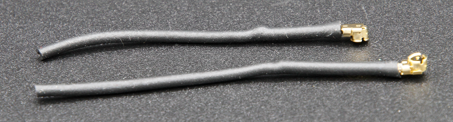

# Communication et Antennes

Cet article présente les concepts clés nécessaires pour la transmission de données sans fil avec CanSat NeXT. Tout d'abord, le système de communication est abordé de manière générale, puis différentes options sont présentées pour la sélection d'antennes lors de l'utilisation de CanSat NeXT. Enfin, la dernière partie de l'article propose un tutoriel simple pour construire une antenne monopôle quart d'onde à partir des pièces incluses dans le kit.

## Commencer

CanSat NeXT est presque prêt à commencer la communication sans fil dès sa sortie de la boîte. La seule chose nécessaire est le logiciel approprié et une antenne pour l'émetteur et le récepteur. Pour le premier, consultez les matériaux logiciels sur cette page. Pour le second, cette page inclut des instructions sur la façon de sélectionner une antenne externe et de construire une simple antenne monopôle à partir des matériaux inclus avec le CanSat NeXT.

Bien que la carte soit assez résistante à ces choses grâce aux vérifications logicielles, vous ne devriez jamais essayer de transmettre quoi que ce soit depuis une radio sans antenne. Bien que peu probable en raison des faibles puissances impliquées avec ce système, l'onde radio réfléchie peut causer des dommages réels à l'électronique.

## Système de Communication CanSat NeXT

CanSat NeXT gère le transfert de données sans fil un peu différemment des anciens kits CanSat. Au lieu d'un module radio séparé, CanSat NeXT utilise le WiFi-radio intégré du MCU pour la communication. Le WiFi-radio est normalement utilisé pour transférer des données entre un ESP32 et Internet, permettre l'utilisation de l'ESP32 comme un simple serveur, ou même connecter l'ESP32 à un appareil Bluetooth, mais avec certaines astuces de configuration TCP-IP intelligentes, nous pouvons permettre une communication directe de pair à pair entre les appareils ESP32. Le système s'appelle ESP-NOW, et il est développé et maintenu par EspressIf, qui sont les développeurs du matériel ESP32. De plus, il existe des schémas de communication à faible débit, qui en augmentant l'énergie par bit de la transmission, augmentent considérablement la portée possible du WiFi-radio au-delà des quelques dizaines de mètres habituels.

Le débit de données d'ESP-NOW est significativement plus rapide que ce qui serait possible avec l'ancienne radio. Même en diminuant simplement le temps entre les paquets dans le code d'exemple, CanSat NeXT est capable de transmettre environ 20 paquets complets à la station de base en une seconde. Théoriquement, le débit de données peut atteindre jusqu'à 250 kbit/s en mode longue portée, mais cela peut être difficile à réaliser dans le logiciel. Cela dit, la transmission par exemple d'images complètes d'une caméra pendant le vol devrait être tout à fait réalisable avec le bon logiciel.

Même avec de simples antennes monopôle quart d'onde (un fil de 31 mm) à chaque extrémité, CanSat NeXT a pu envoyer des données à la station de base depuis 1,3 km, à quel point la ligne de vue a été perdue. Lors des tests avec un drone, la portée était limitée à environ 1 km. Il est possible que le drone ait interféré avec la radio suffisamment pour limiter quelque peu la portée. Cependant, avec une meilleure antenne, la portée pourrait être encore augmentée. Une petite antenne yagi aurait théoriquement augmenté la portée opérationnelle de 10 fois.

Il y a quelques détails pratiques qui diffèrent de l'ancien système de communication radio. Tout d'abord, le "jumelage" des satellites aux récepteurs de la station de base se fait avec des adresses Media Access Control (MAC), qui sont définies dans le code. Le système WiFi est suffisamment intelligent pour gérer les problèmes de synchronisation, de collision et de fréquence en arrière-plan. L'utilisateur doit simplement s'assurer que la station de base écoute l'adresse MAC avec laquelle le satellite transmet.
Deuxièmement, la fréquence de la radio est différente. La radio WiFi fonctionne à la bande de 2,4 GHz (la fréquence centrale est de 2,445 GHz), ce qui signifie que les caractéristiques de propagation et les exigences de conception d'antenne sont différentes d'avant. Le signal est quelque peu plus sensible à la pluie et aux problèmes de ligne de vue, et pourrait ne pas être capable de transmettre dans certains cas où l'ancien système aurait fonctionné.

La longueur d'onde du signal radio est également différente. Puisque

$$\lambda = \frac{c}{f} \approx \frac{3*10^8 \text{ m/s}}{2.445 * 10^9 \text {Hz}} = 0.12261 \text{ m,}$$

une antenne monopôle quart d'onde devrait avoir une longueur de 0,03065 m ou 30,65 mm. Cette longueur est également marquée sur le PCB de CanSat NeXT pour faciliter la coupe du câble. L'antenne doit être coupée précisément, mais une marge de ~0,5 mm est acceptable.

Une antenne quart d'onde a des performances RF suffisantes pour les compétitions CanSat. Cela dit, il pourrait être intéressant pour certains utilisateurs d'obtenir une portée encore meilleure. Un possible point d'amélioration est la longueur de l'antenne monopôle. En pratique, la résonance quart d'onde pourrait ne pas être exactement à la bonne fréquence, car d'autres paramètres tels que l'environnement, les éléments métalliques environnants ou la partie du fil encore couverte de métal mis à la terre pourraient affecter un peu la résonance. L'antenne pourrait être ajustée à l'aide d'un analyseur de réseau vectoriel (VNA). Je pense que je devrais faire cela à un moment donné et corriger les matériaux en conséquence.

Une solution plus robuste serait d'utiliser un autre style d'antenne. À 2,4 GHz, il existe de nombreuses idées d'antennes amusantes sur Internet. Celles-ci incluent une antenne hélicoïdale, une antenne yagi, une antenne pringles, et bien d'autres. Beaucoup d'entre elles, si elles sont bien construites, surpasseront facilement le simple monopôle. Même une simple dipôle serait une amélioration par rapport à un simple fil.

Le connecteur utilisé sur la plupart des modules ESP32 est un connecteur Hirose U.FL. C'est un connecteur RF miniature de bonne qualité, qui offre de bonnes performances RF pour les signaux faibles. Un problème avec ce connecteur cependant est que le câble est assez fin, ce qui le rend un peu impratique dans certains cas. Il entraîne également des pertes RF plus importantes que souhaité si le câble est long, comme cela pourrait être le cas lors de l'utilisation d'une antenne externe. Dans ces cas, un câble adaptateur U.FL vers SMA pourrait être utilisé. Je vais voir si nous pourrions les fournir dans notre boutique en ligne. Cela permettrait aux équipes d'utiliser un connecteur SMA plus familier. Cela dit, il est tout à fait possible de construire de bonnes antennes en utilisant uniquement U.FL.

Contrairement au SMA cependant, le U.FL repose mécaniquement sur des caractéristiques de retenue à encliquetage pour maintenir le connecteur en place. Cela est généralement suffisant, cependant pour plus de sécurité, il est conseillé d'ajouter un serre-câble pour plus de sécurité. Le PCB de CanSat NeXT a des emplacements à côté du connecteur d'antenne pour accueillir un petit serre-câble. Idéalement, une gaine de support imprimée en 3D ou autrement construite serait ajoutée pour le câble avant le serre-câble. Un fichier pour le support imprimé en 3D est disponible sur la page GitHub.

## Options d'antenne

Une antenne est essentiellement un dispositif qui transforme les ondes électromagnétiques non guidées en ondes guidées, et vice versa. En raison de la nature simple du dispositif, il existe une multitude d'options parmi lesquelles choisir l'antenne pour votre appareil. D'un point de vue pratique, la sélection de l'antenne offre beaucoup de liberté, et de nombreux éléments à considérer. Vous devez au moins prendre en compte

1. La fréquence de fonctionnement de l'antenne (devrait inclure 2,45 GHz)
2. La bande passante de l'antenne (au moins 35 MHz)
3. L'impédance de l'antenne (50 ohms)
4. Le connecteur (U.FL ou vous pouvez utiliser des adaptateurs)
5. La taille physique (Est-ce que ça rentre dans la canette)
6. Le coût
7. Les méthodes de fabrication, si vous fabriquez l'antenne vous-même.
8. La polarisation de l'antenne.

La sélection d'une antenne peut sembler écrasante, et elle l'est souvent, cependant dans ce cas, elle est rendue beaucoup plus facile par le fait que nous utilisons en fait une radio Wi-Fi - nous pouvons en fait utiliser presque n'importe quelle antenne Wi-Fi 2,4 GHz avec le système. La plupart d'entre elles cependant sont trop grandes, et elles ont tendance à utiliser des connecteurs appelés RP-SMA, plutôt que U.FL. Cependant, avec un adaptateur approprié, elles peuvent être de bons choix à utiliser avec la station de base. Il existe même des antennes directives disponibles, ce qui signifie que vous pouvez obtenir un gain supplémentaire pour améliorer le lien radio.

Les antennes Wi-Fi sont un choix solide, cependant elles ont un inconvénient majeur - la polarisation. Elles sont presque toujours polarisées linéairement, ce qui signifie que la force du signal varie considérablement en fonction de l'orientation de l'émetteur et du récepteur. Dans les pires cas, les antennes étant perpendiculaires l'une à l'autre pourraient même voir le signal disparaître complètement. Par conséquent, une option alternative est d'utiliser des antennes de drone, qui ont tendance à être polarisées circulairement. En pratique, cela signifie que nous avons des pertes de polarisation constantes, mais elles sont moins dramatiques. Une solution alternative intelligente pour contourner le problème de polarisation est d'utiliser deux récepteurs, avec des antennes montées perpendiculairement l'une à l'autre. De cette façon, au moins l'une d'elles aura toujours une orientation appropriée pour recevoir le signal.

Bien sûr, un vrai bricoleur voudra toujours fabriquer sa propre antenne. Certaines constructions intéressantes qui conviennent à la fabrication DIY incluent une antenne hélicoïdale, une antenne "pringles", une antenne yagi, une dipôle, ou une antenne monopôle. Il existe de nombreuses instructions en ligne pour construire la plupart de celles-ci. La dernière partie de cet article montre comment fabriquer votre propre antenne monopôle, adaptée aux compétitions CanSat, à partir des matériaux expédiés avec CanSat NeXT.

## Construire une antenne monopôle quart d'onde

Cette section de l'article décrit comment construire une antenne monopôle quart d'onde raisonnablement efficace à partir des matériaux inclus dans le kit. L'antenne est appelée ainsi car elle n'a qu'un seul pôle (par rapport à une dipôle), et sa longueur est le quart de la longueur d'onde que nous transmettons.

En plus du câble coaxial et du morceau de gaine thermorétractable, vous aurez besoin de pinces à dénuder et de coupe-fils. Presque n'importe quel type fonctionnera. De plus, vous aurez besoin d'une source de chaleur pour la gaine thermorétractable, comme un pistolet à air chaud, un fer à souder ou même un briquet.

Tout d'abord, commencez par couper le câble en deux.

Ensuite, nous allons construire l'antenne proprement dite. Cette partie doit être réalisée aussi précisément que possible. Une précision de 0,2 mm environ fonctionnera bien, mais essayez de l'obtenir aussi proche que possible de la longueur correcte, car cela aidera à la performance.

Un câble coaxial se compose de quatre parties - un conducteur central, un diélectrique, un blindage et une gaine extérieure. Habituellement, ces câbles sont utilisés pour transmettre des signaux radiofréquences entre des appareils, de sorte que les courants sur le conducteur central sont équilibrés par ceux dans le blindage. Cependant, en retirant le conducteur de blindage, les courants sur le conducteur intérieur créeront une antenne. La longueur de cette zone exposée déterminera la longueur d'onde ou la fréquence de fonctionnement de l'antenne, et nous voulons maintenant qu'elle corresponde à notre fréquence de fonctionnement de 2,445 GHz, donc nous devons retirer le blindage sur une longueur de 30,65 mm.

Dénudez soigneusement la gaine extérieure du câble. Idéalement, essayez de retirer uniquement la gaine et le blindage sur la longueur souhaitée. Cependant, couper l'isolant n'est pas une catastrophe. Il est généralement plus facile de retirer la gaine extérieure par parties, plutôt que d'un seul coup. De plus, il peut être plus facile de retirer d'abord trop, puis de couper le conducteur intérieur à la bonne longueur, plutôt que d'essayer de l'obtenir exactement dès le premier essai.

L'image ci-dessous montre les câbles dénudés. Essayez de le faire comme celui du haut, mais celui du bas fonctionnera également - il pourrait simplement être plus sensible à l'humidité. S'il reste des morceaux de blindage pendants, coupez-les soigneusement. Assurez-vous qu'il n'y a aucune possibilité que le conducteur intérieur et le blindage se touchent - même un seul brin rendrait l'antenne inutilisable.

L'antenne est maintenant totalement fonctionnelle à ce stade, cependant elle peut être sensible à l'humidité. Par conséquent, nous voulons maintenant ajouter une nouvelle gaine à cela, c'est pour cela que la gaine thermorétractable est utilisée. Coupez deux morceaux, légèrement plus longs que l'antenne que vous avez fabriquée, et placez-les sur l'antenne et utilisez une source de chaleur pour les rétracter en place. Faites attention à ne pas brûler la gaine thermorétractable, surtout si vous utilisez autre chose qu'un pistolet à air chaud.

Après cela, les antennes sont prêtes. Du côté de la station de base, l'antenne est probablement bien comme ça. D'un autre côté, bien que le connecteur soit assez sécurisé, il est conseillé de soutenir le connecteur d'une manière ou d'une autre du côté CanSat. Une manière très robuste est d'utiliser un support imprimé en 3D et un serre-câble, cependant de nombreuses autres méthodes fonctionneront également. N'oubliez pas de considérer comment l'antenne sera placée à l'intérieur de la canette. Idéalement, elle devrait être dans un endroit où la transmission n'est pas bloquée par des pièces métalliques.

### Support d'antenne

Enfin, voici un fichier step du support montré dans l'image. Vous pouvez l'importer dans la plupart des logiciels de CAO, le modifier ou l'imprimer avec une imprimante 3D.

[Télécharger le fichier step](/assets/3d-files/uFl-support.step)