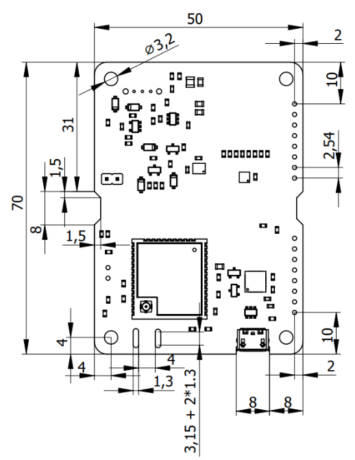

# Conception Mécanique

## Dimensions du PCB

La carte principale du CanSat NeXT est construite sur un PCB de 70 x 50 x 1,6 mm, avec l'électronique sur le côté supérieur et la batterie sur le côté inférieur. Le PCB a des points de montage à chaque coin, à 4 mm des côtés. Les points de montage ont un diamètre de 3,2 mm avec une zone de pad mise à la terre de 6,4 mm, et ils sont destinés à des vis ou entretoises M3. La zone de pad est également suffisamment grande pour accueillir un écrou M3. De plus, la carte a deux découpes trapézoïdales de 8 x 1,5 mm sur les côtés et une zone sans composants sur le côté supérieur au centre, afin qu'un serre-câble ou un autre support supplémentaire puisse être ajouté pour les batteries lors des opérations de vol. De même, deux fentes de 8 x 1,3 mm se trouvent à côté du connecteur d'antenne MCU afin que l'antenne puisse être fixée à la carte avec un petit serre-câble ou un morceau de ficelle. Le connecteur USB est légèrement intrusé dans la carte pour éviter toute extrusion. Une petite découpe est ajoutée pour accueillir certains câbles USB malgré l'intrusion. Les en-têtes d'extension sont des en-têtes femelles standard de 0,1 pouce (2,54 mm), et ils sont placés de sorte que le centre du trou de montage soit à 2 mm du bord long de la carte. L'en-tête le plus proche du bord court est à 10 mm de celui-ci. L'épaisseur du PCB est de 1,6 mm, et la hauteur des batteries par rapport à la carte est d'environ 13,5 mm. Les en-têtes mesurent environ 7,2 mm de haut. Cela rend la hauteur du volume de fermeture d'environ 22,3 mm. De plus, si des entretoises sont utilisées pour empiler des cartes compatibles ensemble, les entretoises, les entretoises ou tout autre système de montage mécanique doivent séparer les cartes d'au moins 7,5 mm. Lors de l'utilisation d'en-têtes de broches standard, la séparation recommandée des cartes est de 12 mm.

Ci-dessous, vous pouvez télécharger un fichier .step de la carte perforée, qui peut être utilisé pour ajouter le PCB dans une conception CAO pour référence, ou même comme point de départ pour une carte modifiée.

[Télécharger le fichier step](/assets/3d-files/cansat.step)

## Concevoir un PCB Personnalisé

Si vous souhaitez porter votre conception électronique au niveau supérieur, vous devriez envisager de créer un PCB personnalisé pour l'électronique. KiCAD est un excellent logiciel gratuit qui peut être utilisé pour concevoir des PCBs, et les faire fabriquer est étonnamment abordable.

Voici des ressources pour commencer avec KiCAD : https://docs.kicad.org/#_getting_started

Voici un modèle KiCAD pour commencer votre propre carte de circuit compatible CanSat : [Télécharger le modèle KiCAD](/assets/kicad/Breakout-template.zip)