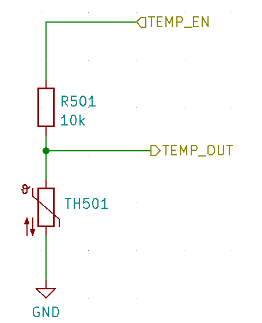

# Capteurs Embarqués

Cet article présente les capteurs intégrés à la carte principale du CanSat NeXT. L'utilisation des capteurs est couverte dans la documentation logicielle, tandis que cet article fournit plus d'informations sur les capteurs eux-mêmes.

Il y a trois capteurs embarqués sur la carte principale du CanSat NeXT. Ce sont l'IMU LSM6DS3, le capteur de pression LPS22HB et le LDR. De plus, la carte dispose d'un emplacement traversant pour ajouter une thermistance externe. Comme le LPS22HB possède déjà des capacités de mesure de pression et de température, il suffit théoriquement à remplir les critères de mission primaire des compétitions CanSat à lui seul. Cependant, comme il mesure la température de jonction interne, ou essentiellement la température du PCB à cet endroit, ce n'est pas une bonne mesure de la température atmosphérique dans la plupart des configurations. De plus, la mesure absolue du capteur de pression peut être soutenue par les données supplémentaires de l'accéléromètre IMU. Le LDR a été ajouté avant tout pour aider les étudiants à apprendre les concepts concernant les capteurs analogiques car la réponse aux stimuli est presque instantanée, tandis qu'une thermistance prend du temps à chauffer et à refroidir. Cela dit, il peut également soutenir les missions créatives que les étudiants proposeront, tout comme l'accéléromètre et le gyroscope des IMU. En outre, en plus du capteur embarqué, le CanSat NeXT encourage l'utilisation de capteurs supplémentaires via l'interface d'extension.

## Unité de Mesure Inertielle {#IMU}

L'IMU, LSM6DS3 de STMicroelectronics est un dispositif capteur MEMS de type SiP (system-in-package), intégrant un accéléromètre, un gyroscope et l'électronique de lecture dans un petit boîtier. Le capteur prend en charge les interfaces série SPI et I2C, et inclut également un capteur de température interne.

Le LSM6DS3 a des plages de mesure d'accélération commutables de ±2/±4/±8/±16 G et des plages de mesure de vitesse angulaire de ±125/±250/±500/±1000/±2000 deg/s. L'utilisation d'une plage plus élevée diminue également la résolution de l'appareil.

Dans le CanSat NeXT, le LSM6DS3 est utilisé en mode I2C. L'adresse I2C est 1101010b (0x6A), mais la prochaine version ajoutera la prise en charge de la modification du matériel pour changer l'adresse en 1101011b (0x6B) si un utilisateur avancé a besoin d'utiliser l'adresse d'origine pour autre chose.

Les plages de mesure seront réglées au maximum par défaut dans la bibliothèque afin de capturer la plupart des données du lancement de fusée violent. Les plages de données sont également modifiables par l'utilisateur.

## Baromètre {#barometer}

Le capteur de pression LPS22HB de STMicroelectronics est un autre dispositif MEMS de type SiP, conçu pour la mesure de pression de 260 à 1260 hPa. La plage dans laquelle il rapporte les données est significativement plus large, mais la précision des mesures en dehors de cette plage est discutable. Les capteurs de pression MEMS fonctionnent en mesurant les changements piézorésistifs dans le diaphragme du capteur. Comme la température affecte également la résistance de l'élément piézo, elle doit être compensée. Pour permettre cela, la puce dispose également d'un capteur de température de jonction relativement précis juste à côté de l'élément piézorésistif. Cette mesure de température peut également être lue à partir du capteur, mais il faut garder à l'esprit qu'il s'agit d'une mesure de la température interne de la puce, et non de l'air environnant.

Similaire à l'IMU, le LPS22HB peut également être communiqué via une interface SPI ou I2C. Dans le CanSat NeXT, il est connecté à la même interface I2C que l'IMU. L'adresse I2C du LPS22HB est 1011100b (0x5C), mais nous ajouterons la prise en charge pour la changer en 0x5D si désiré.

## Convertisseur Analogique-Numérique

Cela se réfère à la mesure de tension en utilisant la commande analogRead().

Le convertisseur analogique-numérique (ADC) 12 bits dans l'ESP32 est notoirement non linéaire. Cela n'a pas d'importance pour la plupart des applications, comme l'utiliser pour détecter les changements de température ou les changements de résistance du LDR, cependant faire des mesures absolues de la tension de la batterie ou de la résistance NTC peut être un peu délicat. Une façon de contourner cela est une calibration minutieuse, qui permettrait d'obtenir des données suffisamment précises pour la température par exemple. Cependant, la bibliothèque CanSat fournit également une fonction de correction calibrée. La fonction implémente une correction polynomiale de troisième ordre pour l'ADC, corrélant la lecture de l'ADC avec la tension réelle présente sur la broche ADC. La fonction de correction est

$$V = -1.907217e \times 10^{-11} \times a^3 + 8.368612 \times 10^{-8} \times a^2 + 7.081732e \times 10^{-4} \times a + 0.1572375$$

Où V est la tension mesurée et a est la lecture ADC 12 bits de analogRead(). La fonction est incluse dans la bibliothèque, et est appelée adcToVoltage. L'utilisation de cette formule rend l'erreur de lecture de l'ADC inférieure à 1% dans une plage de tension de 0.1 V à 3.2 V.

## Résistance Dépendante de la Lumière

La carte principale CanSat NeXT intègre également un LDR dans l'ensemble des capteurs. Le LDR est un type spécial de résistance, en ce sens que la résistance varie avec l'illumination. Les caractéristiques exactes peuvent varier, mais avec le LDR que nous utilisons actuellement, la résistance est de 5-10 kΩ à 10 lux, et de 300 kΩ dans l'obscurité.

La façon dont cela est utilisé dans le CanSat NeXT, est qu'une tension de 3.3 V est appliquée à une résistance de comparaison depuis le MCU. Cela provoque la tension à LDR_OUT d'être

$$V_{LDR} = V_{EN} \frac{R402}{R401+R402} $$.

Et comme la résistance R402 change, la tension à LDR_OUT changera également. Cette tension peut être lue avec l'ADC de l'ESP32, puis corrélée à la résistance du LDR. En pratique cependant, généralement avec les LDR, nous sommes intéressés par le changement plutôt que par la valeur absolue. Par exemple, il suffit généralement de détecter un grand changement de tension lorsque l'appareil est exposé à la lumière après avoir été déployé depuis la fusée, par exemple. Les valeurs seuils sont généralement définies expérimentalement, plutôt que calculées analytiquement. Notez que dans le CanSat NeXT, vous devez activer les capteurs analogiques embarqués en écrivant la broche MEAS_EN à HIGH. Cela est montré dans les codes d'exemple.

## Thermistance

Le circuit utilisé pour lire la thermistance externe est très similaire au circuit de lecture du LDR. La même logique s'applique, que lorsqu'une tension est appliquée à la résistance de comparaison, la tension à TEMP_OUT change selon

$$V_{TEMP} = V_{EN} \frac{TH501}{TH501+R501} $$.

Dans ce cas cependant, nous sommes généralement intéressés par la valeur absolue de la résistance de la thermistance. Par conséquent, la Conversion de Tension est utile, car elle linéarise les lectures de l'ADC et calcule également directement le V_temp. De cette façon, l'utilisateur peut calculer la résistance de la thermistance dans le code. La valeur doit encore être corrélée avec la température à l'aide de mesures, bien que la fiche technique de la thermistance puisse également inclure des indices sur la façon de calculer la température à partir de la résistance. Notez que si vous faites tout analytiquement, vous devez également prendre en compte la variance de résistance de R501. Cela se fait le plus facilement en mesurant la résistance avec un multimètre, au lieu de supposer qu'elle est de 10 000 ohms.

La résistance de comparaison sur le PCB est relativement stable sur une plage de température, cependant elle change également légèrement. Si des lectures de température très précises sont souhaitées, cela devrait être compensé. La mesure de température de jonction du capteur de pression peut être utilisée pour cela. Cela dit, ce n'est certainement pas nécessaire pour les compétitions CanSat. Pour ceux qui sont intéressés, le coefficient thermique de R501 est rapporté par le fabricant à 100 PPM/°C.

Alors que la température du baromètre reflète principalement la température de la carte elle-même, la thermistance peut être montée de manière à réagir aux changements de température en dehors de la carte, voire en dehors de la canette. Vous pouvez également ajouter des fils pour l'éloigner encore plus. Si elle sera utilisée, la thermistance peut être soudée à l'emplacement approprié sur la carte CanSat NeXT. La polarisation n'a pas d'importance, c'est-à-dire qu'elle peut être montée dans les deux sens.

